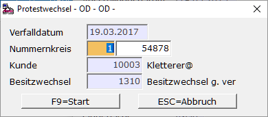

# Wechselprotest durch Nichteinlösen

<!-- source: https://amic.de/hilfe/wechselprotestdurchnichteinlse.htm -->

Ist der Bezogene am Verfalltag nicht in der Lage, die Wechselsumme zu bezahlen, dann wird der Wechselbesitzer **Protest mangels Zahlung** erheben. Der Besitzwechsel wird zum Protestwechsel. Jetzt kann der Wechselbesitzer beliebig jeden früheren Vorbesitzer des Wechsels zur Zahlung der Wechselsumme verpflichten. Handelt es sich um weitergereichte Wechsel, die sich auf dem Obligokonto befinden, kann die entsprechende Bankbuchung (Rückbelastung der Bank) auf zwei Arten durchgeführt werden. Nicht weitergereichte Wechsel können nur über "Wechsel bearbeiten" zum Protestwechsel werden (siehe Möglichkeit 2).

Möglichkeit 1:

Hauptmenü \> Finanzbuchhaltung \> Erfassung \> Belegerfassung

Direktsprung **[FIBE]**

Belegart Zahlungsverkehr Bank anwählen und Buchung erfassen, wobei als Gegenkonto das Wechselobligokonto angegeben werden muss. Da diese Konten als Wechselkonto gekennzeichnet sind, werden bei Eingabe des Gegenkontos die weitergereichten Wechsel in einem Auswahlbildschirm aufgelistet. Nach Auswahl werden der Betrag und das S/H-Kennzeichen richtig vorbelegt.

**Buchung:** 

Besitzwechselobligo 10.000,00  
an  
Bank 10.000,00

Möglichkeit 2:

Hauptmenü \> Finanzbuchhaltung \> Mahn-/Zahl-/Zinswesen \> Wechselbuchhaltung > Wechsel bearbeiten

Direktsprung **[WEB]**

In der Anwendung **Wechsel bearbeiten** kann der Verfall automatisch gebucht werden. Hierbei geht man wie folgt vor: Wechsel markieren und ***Ändern* F5**. Der Wechsel wird angezeigt. Mit **SF7 *Protestwechsel*** und **F9 *Start.***

In beiden Fällen erfolgt die Buchung mit dem Verfalldatum und setzt die Auszifferung zurück. Die Rückbuchung wird sodann mit der alten Wechselbuchung ausgeziffert. Dadurch wird sichergestellt, das die vom Wechsel abgedeckten Forderungen bzw. Verbindlichkeiten wieder offen sind.

Danach entsteht je nach Wechselart eine Buchung

**Besitzwechsel:**  
Kunde 10.000,00  
an  
Besitzwechsel 10.000,00

oder **Schuldwechsel:**

Schuldwechsel 10.000,00  
an  
Lieferant 10.000,00

Diese Buchung wird dann mit dem ursprünglichen Wechsel ausgeziffert.
