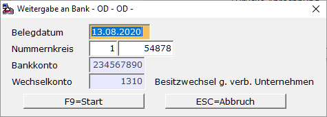

# Weitergabe an Bank zur Refinanzierung (nur bei Besitzwechsel)

<!-- source: https://amic.de/hilfe/weitergabeanbankzurrefinanzier.htm -->

Der Inhaber des Besitzwechsels gibt den Wechsel zur vorzeitigen Diskontierung (Einlösung) einer Bank. Die Bank zahlt nicht die volle Wechselsumme aus, sondern zieht Diskont und Spesen ab. Dabei gibt es 2 Abwicklungsmöglichkeiten dieser Obligoverbuchung. Der Buchungssatz lautet in beiden Fällen:

***Bank an Besitzwechselobligo***

Möglichkeit 1:

Hauptmenü \> Finanzbuchhaltung \> Erfassung \> Belegerfassung

Direktsprung **[FIBE]**

Belegart Zahlungsverkehr Bank anwählen und Buchung erfassen. Die Buchung erfolgt, wenn die Gutschrift auf dem Bankauszug steht. Da Besitzwechselobligo als Wechselkonto gekennzeichnet ist, werden bei Eingabe des Obligokontos die zur Refinanzierung fähigen Wechsel in einem Auswahlbildschirm aufgelistet. Nach Auswahl werden der Betrag und das **S/H**\-Kennzeichen richtig vorbelegt.

Möglichkeit 2:

Hauptmenü \> Finanzbuchhaltung \> Mahn-/Zahl-/Zinswesen \> Wechselbuchhaltung > Wechsel bearbeiten

Direktsprung **[WEB]**

Im Bereich **Wechsel bearbeiten** kann die Belastung der Bank gebucht werden. Hierbei geht man wie folgt vor:

Wechsel markieren und ***Ändern* F5.** Der Wechsel wird angezeigt. Mit **F8 *Refinanzieren*** und **F9 *Start***.

Als Bankkonto wird das Verrechnungskonto aus dem Hausbankenstamm herangezogen. Das Wechselkonto ist das im Hausbankenstamm hinterlegte Obligokonto. Ist dies nicht eingetragen, so wird das Wechselkonto aus dem Hausbankenstamm herangezogen.
