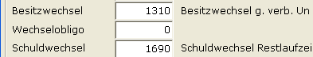

# Wechselkennzeichen im Hausbankenstamm

<!-- source: https://amic.de/hilfe/wechselkennzeichenimhausbanken.htm -->

Hauptmenü \> Finanzbuchhaltung \> Stammdaten \> Hausbanken

Direktsprung **[bnkh]**

Im Hausbankenstamm müssen das Wechselkonto, das Wechselobligokonto und das Schuldwechselkonto eingerichtet werden.  
Das Wechselkonto enthält alle erhaltenen Wechsel, das Obligokonto alle an die Hausbank weitergereichten Wechsel bis zum Verfall, und das Schuldwechselkonto enthält alle selbst ausgegebenen Wechsel!

