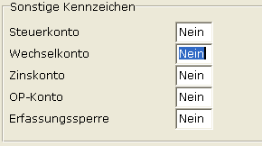

# Wechselkennzeichen im Sachkontenstamm

<!-- source: https://amic.de/hilfe/wechselkennzeichenimsachkonten.htm -->

Hauptmenü \> Finanzbuchhaltung \> Stammdaten \> Sachkonten

Direktsprung **[SKS]**

Im Sachkontenstamm gibt es das Feld **Wechselkonto** das auf **"JA"** gestellt werden muss. Wechselkonten **müssen** im Sachkontenstamm als Wechselkonto gekennzeichnet werden! Von diesem Kennzeichen hängt ab, wie diese Konten in der Belegerfassung interpretiert werden.

In der Basisdatenbank sind davon folgende Konten betroffen:

Besitzwechsel Kontonummer 1370

Besitzwechselobligo Kontonummer 1371

Schuldwechsel Kontonummer 1660

