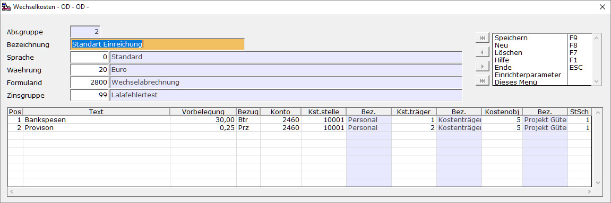

# Wechselkosten

<!-- source: https://amic.de/hilfe/wechselkosten.htm -->

Hauptmenü \> Mahn-/Zahl-/Zinswesen \> Wechselbuchhaltung \> Wechselkosten

Direktsprung **[WEKO]**

| | Beschreibung |
| --- | --- |
| Abr. Gruppe | Laufende Nummer  |
| Bezeichnung | Ausführliche Bezeichnung  |
| Sprache | Auswahl mit **F3** aus vorher eingerichteten Sprachen  |
| Formularid | Auswahl mit **F3** aus vorher eingerichteten Wechselformularen  |
| Zinsgruppe | Auswahl mit **F3** aus vorher eingerichteten Zinsgruppen  |
| Pos | Laufende Nummer der Position.  |
| Text | Text der Position  |
| Vorbelegung | Betrag in Buchwährung oder Prozent  |
| Bezug | Kann **Betr** sein, wenn es sich bei der Vorbelegung um einen festen Betrag handelt oder **PRZ** wenn unter Vorbelegung die Prozentzahl steht, mit der später gerechnet werden soll.  |
| Konto | Auswahl mit **F3** aus dem [Sachkontenstamm](../stammdaten_der_fibu/sachkonten.md) um den Betrag auf ein Sachkonto verbuchen zu können  |
| Kostenstelle | Auswahl mit **F3** aus den Kostenstellen um den Betrag auf eine [Kostenstelle](../kostenrechnung/kostenstellen.md) verbuchen zu können  |
| Kostenträger | Steht der SPA „Kostenträgerrechnung angeschlossen“ auf **Ja**, dann erscheint diese Spalte. Dort können die eingerichteten [Kostenträger](../kostenrechnung/kostentraeger.md) mit **F3** ausgewählt werden.  |
| Kostenobjekt | Mit einer gültigen Kostenobjekt-Lizenz können hier die [Kostenobjekte](../kostenrechnung/kostenobjekte/index.md) erfasst werden.  |
| StSchl | Auswahl mit **F3** aus vorher eingerichteten Steuerschlüsseln um evtl. den Betrag um die gesetzliche Umsatzsteuer zu erhöhen  |
