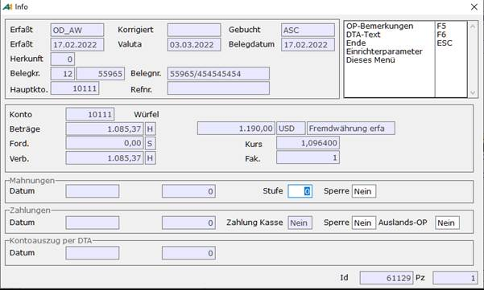

# Allgemeiner Ablauf

<!-- source: https://amic.de/hilfe/allgemeinerablauf.htm -->

Der Auslandszahlungsverkehr läuft genau wie der Inlandszahlungsverkehr ab, also Zahlungsvorschläge erstellen dort ist unter Regulierung der Wert "**Zahlungsausgang Ausland**" einzutragen-, Zahlungsvorschläge bearbeiten und freigeben, Zahlungen bearbeiten. Es werden für den Auslandszahlungsverkehr jedoch nur die OP's herangezogen, die als Auslandszahlung gekennzeichnet sind. Dies kann man manuell überall dort machen, wo man sich OP-Infos (**Shift F8**) ansehen kann (z.B. in der OP-Verwaltung).

Für Kunden, die als Auslandskunden erfasst sind, werden die OP's grundsätzlich als Auslands-OP gekennzeichnet. Akonto-Zahlungen, die über "[Zahlungen erstellen](../zahlungen_erstellen.md)" erfasst werden, werden für Auslandskunden als Auslandszahlungen gekennzeichnet.
