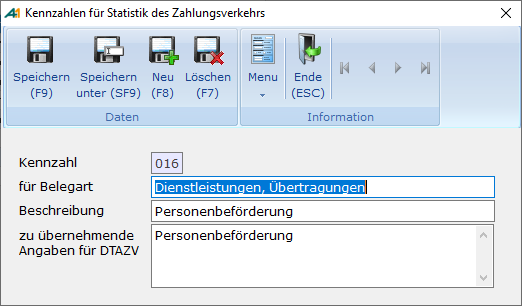
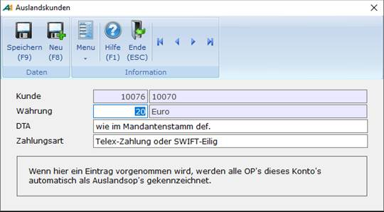

# Stammdaten des Auslandszahlungsverkehrs

<!-- source: https://amic.de/hilfe/stammdatendesauslandszahlungsv.htm -->

Neben den allgemeinen Stammdaten des Zahlungsverkehrs sind für den Auslandszahlungsverkehr folgende Stammdaten zu pflegen bzw. zu überprüfen.

### Bankenstamm

Hauptmenü > Finanzbuchhaltung > Stammdaten > [Bankenstamm](../stammdaten_zahlungsverkehr/bankenstamm.md)

Direktsprung **[BNK]**.

Im Bankenstamm müssen die Felder **Staat** und **Swift/BIC** gepflegt werden. Der Staat ist eine im Staatstamm geführte Nummer. Die Swift/BIC (Bank Identifier Code) ist die Internationale Banknummer entsprechend der Bankleitzahl in Deutschland mit 8 oder 11 Stellen. Diese Kennung setzt sich wie folgt zusammen:

- Bank code : 4 Stellen Alphazeichen frei gewählt (Bundesbank z.B. MARK)
- country code : 2 Stellen Alphazeichen, ISO-Code des Landes (in Deutschland also DE)
- location code: 2 Stellen alphanumerisch zur Ortsangabe (z.B. FF für Frankfurt)
- branch code: Wahlweise 3 Stellen alphanumerisch zur Bezeichnung von Filialen

Die im Bankenstamm existierende Funktion "**Banken aktualisieren**" trägt den BIC nach. Sollte der BIC für Auslandsbanken nicht bekannt sein, erfragen Sie diese beim Zahlungsempfänger. Bei Auslandsbanken existiert für gewöhnlich keine Bankleitzahl. Da die Bankleitzahl jedoch als Schlüssel dient, muss hier ein erdachter Wert eingetragen werden.

### Währungsstamm

Hauptmenü > Finanzbuchhaltung > Stammdaten > [Währungsstamm](../../stammdaten_der_fibu/waehrungsstammdaten/waehrungsstamm/index.md)

Direktsprung **[WAE]**

Die dreistellige ISO-Währungsbezeichnung muss eingetragen sein. Von der "International Standardization Organisation" wird eine aus drei Buchstaben bestehende Kennung für die verschiedenen internationalen Währungen festgesetzt.  
Die beiden ersten Buchstaben stehen für das Länderkürzel (beispielsweise DE für Deutschland, NL für Niederlande, IT für Italien, etc.) und der dritte Buchstabe für die Landeswährung (M für Mark, G für Gulden, L für Lira, etc.), woraus sich z. B. für Deutschland DEM, für Holland NLG und für Italien ITL zusammensetzt. 

### Staatstamm

Hauptmenü > Stammdatenpflege > Allgemeine Stammdaten > Staatstamm

Direktsprung **[STAAT]**

Der zweistellige ISO-CODE sowie die Kurzbezeichnung laut Länderverzeichnis für Zahlungsbilanzstatistik müssen gepflegt werden. Hat man den ISO-CODE bereits gepflegt, kann man die Daten der neu hinzugekommenen Kurzbezeichnung nachtragen lassen .

### Hausbankenstamm

Hauptmenü > Finanzbuchhaltung > Stammdaten > [Hausbanken](../stammdaten_zahlungsverkehr/hausbanken.md)

Direktsprung **[BNKH]**

In **Währung** muss jetzt die Währung in der das Konto geführt wird, eingetragen werden. Die Felder **Auftraggeber DTA, AuslandsDTA Name, AuslandsDTA Str., AuslandsDTA Ort** und **Ansprechpartner** müssen gepflegt werde. Mit der Angabe einer Telefonnummer beim Ansprechpartner ermöglicht man der Deutschen Bundesbank, Rückfragen schnell zu klären

### Kennzahlen für DTAZV

Hauptmenü > Mahn-,Zahl-, Zinswesen > Stammdaten > Kennzahlen für DTAZV

Direktsprung **[FIZVK]**

Im Auslandszahlungsverkehr wird für die Meldedatensätze "Dienstleistung/Kapitaltransaktion" eine Kennzahl verlangt. Diese Kennzahl ist hier zu pflegen.

Für die Kennzahl gilt das Leistungsverzeichnis (Anlage LV zur AWV) sowie das Verzeichnis über die erweiterten Kennzahlen.

Hinweise finden Sie in der Homepage der Deutschen Bundesbank (www.Bundesbank.DE ->Meldewesen ->Außenwirtschaft -> Schlüsselverzeichnisse _ Spezielles Verzeichnis ausgewählter Kennzahlen für die Statistik des Zahlungsverkehrs mit fremden Wirtschaftsgebieten für ausgehende Zahlungen im DTAZV).

Die Kennzahlen werden nach **Belegart** ( Dienstleistung oder Kapitaltransaktion ) unterschieden. **Beschreibung** ist eine textliche Erläuterung der Bedeutung. Unter **Zu übernehmende Angaben für DTAZV** kann man eine Vorbelegung für die in den Meldedatensätzen anzugebenden näheren Angaben machen.

### Auslandskunden

Hauptmenü > Stammdaten > Konstanten Kundenstamm > [Auslandskunden](../../../kunden_und_lieferanten/konstanten_bearbeitung/auslandskunden.md)

Direktsprung **[KUA]**

Hier werden die Kunden erfasst, bei denen die OP's sofort als Auslands-OP gekennzeichnet werden sollen.

Die hier hinterlegte Zahlungsart wird als Vorbelegung für den Auslands-OP herangezogen.

### Kundenbank

Hauptmenü > Stammdaten > Kunden-/Lieferanten > Kundenstamm bzw. Lieferantenstamm

Direktsprung <strong>[KU]</strong> bzw. **[LF]**

Um den Zahlungsverkehr innerhalb der EU schneller und effizienter darstellen zu können, hat das Europäische Komitee für Banken Standardisierung ECBS eine einheitliche, standardisierte Schreibweise für Kontonummern entwickelt. Und diese den europäischen Kreditinstituten zur Einführung bei Ihren Kunden empfohlen: die "International Bank Account Number“, kurz **IBAN.**

Diese IBAN kann bis zu 34 Stellen haben und wird aus Bankleitzahl und Kontonummer errechnet. Existiert keine IBAN für diesen Auslandskunden, so muss bei der IBAN die zu verwendende Kontonummer hinterlegt werden.
