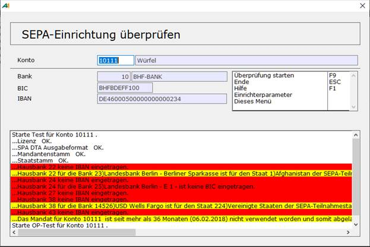

# SEPA-Einrichtung überprüfen

<!-- source: https://amic.de/hilfe/_SEPAEINRICHTUNG.htm -->

Hauptmenü > OP-Verwaltung > OP-Bearbeitung > OP-Verwaltung > Funktion SEPA Einrichtung prüfen

Direktsprung **[SEPAT]**

Da SEPA Teilweise parallel zum DTA-Verfahren laufen muss, ist es von vielen Umständen abhängig, wann das SEPA-Verfahren und wann das DTA-Verfahren angewendet wird. Da es aufwendig ist, immer alle Punkt (Steuerparameter, Einrichtung Bankenstamm, Einrichtung Kundenbank usw.) zu kontrollieren, wurde eine Funktion geschaffen, die diese Daten überprüft. Sie versucht die Fragestellung zu beantworten: „Warum werden die OP’S dieses Kunden nicht zum Zahlungseingang/-ausgang SEPA herangezogen?“.

Als einzige optionale Eingabemöglichkeit existiert die Kontonummer. Wird keine Kontonummer angegeben, dann werden nur Steuerparameter, Mandantenstamm, Staatstamm und der Bankenstamm überprüft. Gibt man ein Konto an, erfolgt noch die Überprüfung der Kundenbank und der OP´s des Kunden. Es wird dabei nur die Bank überprüft, die auch beim automatischen Zahlungsverkehr verwendet werden würde.

Die OP’s werden daraufhin getestet, ob sie evtl. gesperrt sind oder für den Auslandszahlungsverkehr gekennzeichnet sind. Es werden nur die OP’S aufgelistet, die ein Problem haben.

Fehler werden rot markiert und Warnungen gelb. Bei der Prüfung der Version wird die Version 2.7 bis zum 01.Februar noch als Warnung ausgegeben, danach als Fehler. Dieser Fehler führt jedoch nicht dazu, dass die Datei nicht erstellt wird. Es können von Bank zu Bank und je nach Übertragungssoftware noch unterschiedliche Versionen zugelassen sein.

Mit STRG+E lässt sich das Ergebnis in Excel laden.
