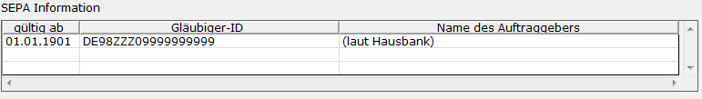

# SEPA-Kennzeichen im Mandantenstamm

<!-- source: https://amic.de/hilfe/sepakennzeichenimmandantenstam.htm -->

Hauptmenü > Administration > Firmenkonstanten > Mandantenstamm

Direktsprung **[MND]** 

Neu hinzugekommen ist eine Gläubiger-Identifikationsnummer oder kurz Gläubiger-Id. Diese wird nur für das SEPA-Lastschriftverfahren benötigt. Für Deutschland übernimmt die Deutsche Bundesbank die Ausgabe der Gläubiger-Identifikationsnummer in Abstimmung mit dem Zentralen Kreditausschuss. Nähere Informationen findet man auf der Internetseite der [Deutschen Bundesbank](http://www.bundesbank.de/).

Da bei einer Änderung der Gläubiger-ID oder des Namens des Auftraggebers bei der SEPA-Lastschrift die alten Werte einmalig mit Übermittel werden müssen, können die Werte einem Gültigkeitsdatum zugeordnet werden. Der Name des Auftraggebers wurde bisher aus den Hausbanken gezogen, daher steht in der ersten Zeile automatisch der Hinweis „(laut Hausbank)“. Wird eine weitere Zeile mit neuer Gläubiger-ID eingetragen oder wird die erste Gläubiger-ID erfasst, so wird der hier hinterlegte Name verwendet. Es ist **nicht** möglich hier „(laut Hausbank)“ einzutragen um dem System mitzuteilen, dass der Auftraggeber aus den Stammdaten der Hausbank gezogen werden soll.

Ist eine Zeile einmal gespeichert, kann das Gültigkeitsdatum nicht mehr geändert werden. Man muss dann die Zeile löschen (Strg+Shift+Entfernen) und neu erfassen. Ist eine Gläubiger-ID einmal verwendet worden, so kann die Zeile weder geändert noch gelöscht werden.

Die Gläubiger-ID baut sich folgendermaßen auf:

\# 1+2: ISO Ländercode

\# 3+4: Prüfziffer

\# 5-7 Gläubiger-Geschäftscode oder "ZZZ"

\# 8-35 landspezifische Identifizierung

Die Gläubiger-ID wird mit einem Prüfziffernverfahren auf korrekten Aufbau getestet. Sollte die Prüfung fehlschlagen, wird die Meldung „Die Prüfziffernberechnung ergibt, dass die Gläubiger-ID nicht korrekt ist.“ ausgegeben. Man kann jedoch die Gläubiger-ID trotzdem speichern.
