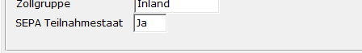

# SEPA-Kennzeichen im Staatstamm

<!-- source: https://amic.de/hilfe/sepakennzeichenimstaatstamm.htm -->

Hauptmenü > Stammdatenpflege > Allgemeine Stammdaten > Staatstamm

Direktsprung **[STAAT]**

Im Staatstamm wurde ein neues Kennzeichen eingeführt.

Dieses besagt, ob der Staat am SEPA-Verfahren teilnimmt oder nicht. Dieses Kennzeichen wird einmal automatisch für die 32 bisher am SEPA-Verfahren teilnehmenden Länder gesetzt. Voraussetzung für dieses automatische Update ist, dass der ISO-Code korrekt gepflegt ist.

Beim Zusammenstellen der Zahlungen bzw. der Zahlungsvorschläge wird für alle Banken mit einem Staat bei dem „SEPA Teilnahmestaat“ auf **Ja** steht, ein Kennzeichen in den Zahlungsvorgängen gesetzt, dass hier das SEPA-Verfahren anzuwenden ist. Eine Änderung des Kennzeichens bewirkt sofort eine Anpassung der Zahlungsvorschläge. Freigegebene Zahlungen werden nicht mehr verändert.

**Hinweis:** *Will man das SEPA-Verfahren vorläufig lediglich für ausländische Lieferanten bzw. genauer: Lieferanten deren Bank im Ausland sitzt durchführen, so kann man das Kennzeichen „SEPA Teilnahmestaat“ für Deutschland auf Nein stellen. Dies ist eventuell deswegen hilfreich, weil es unter Umständen sehr lange dauern kann, bevor man von allen Lieferanten die IBAN-Nummern hat.*
