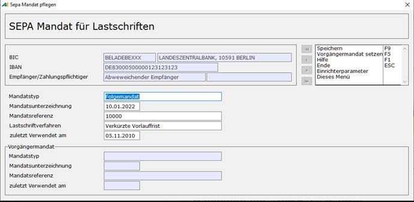

# SEPA-Mandat für Lastschriften

<!-- source: https://amic.de/hilfe/sepamandatfrlastschriften.htm -->

Hauptmenü > Stammdatenpflege > Konstanten Kundenstamm > Kundenbanken

Direktsprung **[KUBA]**

Man erreicht diesen Erfassungsschirm, indem man zuerst die Bank im Ändern-Modus **F5** aufruft und dort die Funktion „***Mandat verwalten***“ **F5** auswählt oder mit der Maus in die Spalte **Mandat** klickt.

Voraussetzung für den Einzug einer SEPA-Lastschrift ist das Vorliegen eines gültigen Mandats, das über die heute aus dem deutschen Lastschriftverfahren bekannte Einzugsermächtigung hinausgeht. Außer der Ermächtigung des Lastschriftgläubigers zum Einzug enthält das Mandat auch eine Weisung zur Bezahlung an die Bank des Zahlungspflichtigen. Das Mandat muss in Papierform oder in elektronischer Form erteilt werden und wird bei Einreichung einer SEPA-Lastschrift im Datensatz an die zahlende Bank mit übermittelt.

  <table>
    <tbody>
      <tr>
        <td></td>
        <td>
          
<strong>Beschreibung</strong>

        </td>
      </tr>
      <tr>
        <td>
          
Mandatstyp

        </td>
        <td>
          
Es sind folgende Mandatstypen möglich:

          <ul>
            <li><b>Einzelmandat</b> : Dieses Mandat gilt nur für eine Lastschrift  </li>
            <li><b>Erstmandat</b>: Dies ist das erste Mandat. Erhält man ein neues Mandat, weil sich Bank, Kontonummer oder ähnliches geändert hat, so ist dies ein  </li>
            <li><b>Folgemandat</b>: Gibt man Folgemandat an, so öffnet sich eine F3-Auswahl, in der man das Vorgängermandat auswählen muss.<b></b></li>
          </ul>
        </td>
      </tr>
      <tr>
        <td>
          
Mandatsunterzeichnung

        </td>
        <td>
          
Tag der Unterzeichnung. Er wird zur Identifizierung des Mandats mit an die Bank gesendet.

          
Sofern eine Einzugsermächtigung als SEPA-Basis-Lastschriftmandat genutzt wird, ist dieses Feld mit dem Datum der Unterrichtung des Zahlers über den Wechsel vom Einzug per Einzugsermächtigungslastschrift auf den Einzug per SEPA-Basislastschrift zu belegen. Dieses Datum muss zwischen dem <b><u>9. Juli 2012</u></b> und mindestens fünf Geschäftstage vor der Fälligkeit der ersten SEPA-Basislastschrift (als Erstlastschrift) liegen.

        </td>
      </tr>
      <tr>
        <td>
          
Mandatsreferenz

        </td>
        <td>
          
Mandatsidentifikation. Sie wird beim SEPA-Lastschriftverfahren mit an die Bank gesendet.

        </td>
      </tr>
      <tr>
        <td>
          
Lastschriftverfahren

        </td>
        <td>
          
Bei Verwendung des SEPA-Verfahrens wird nicht mehr zwischen Einzugsermächtigung und Lastschrift unterschieden, sondern zwischen <b>Basislastschrift, Basislastschrift mit verkürzter Vorlauffrist</b> und <b>Firmenlastschrift</b>, die jedoch ähnlich der Einzugsermächtigung und der Abbuchung sind. Hat man für Kunden, die bereits das SEPA-Lastschriftverfahren verwenden, die Zahlungsart nicht entsprechend angepasst, wird automatisch Basislastschrift als DTA-Typ angenommen.

          
Als Vorbelegung bei Neuanlage erscheint <b>Basislastschrift mit verkürzter Vorlauffrist. </b>Dies kann unter Einrichterparametern geändert werden.

          
Bei der <b>Basislastschrift mit verkürzter Vorlauffrist</b> (Eillastschrift) handelt es sich um ein im November 2013 deutschlandweit eingeführtes Verfahren, bei dem die Frist (für Einmal-, Erst- und Folgelastschriften) sich auf einen Banktag verkürzt.  

          <table>
            <tbody>
              <tr>
                <th><b>Hinweis</b>:</th>
                <th><i>Die <b>Basislastschrift mit verkürzter Vorlauffrist</b> wird erst ab Version 2.7 oder höher unterstützt!</i> <i>Ab Version 3.0 (November 2016) haben <b>Basislastschrift</b> und <b>Basislastschrift mit verkürzter Laufzeit</b> dieselbe Bedeutung. Die Vorlauffrist beträgt dann bei beiden nur noch einen Banktag.</i> <i></i>&nbsp;</th>
              </tr>
              <tr>
                <td><b>Hinweis</b>:</td>
                <td><i>Bevor die Version geändert wird, muss geklärt werden, ob die Übertragungssoftware sowie die Hausbank die neue Version bereits unterstütz.</i><b></b> <b></b>&nbsp;</td>
              </tr>
            </tbody>
          </table>
        </td>
      </tr>
      <tr>
        <td>
          
Zuletzt verwendet am

        </td>
        <td>
          
Wann ein Mandat das letzte Mal verwendet wurde, wird hier angezeigt.

        </td>
      </tr>
    </tbody>
  </table>

Das Mandat ist nur so lange änderbar, bis es einmal verwendet wurde. Danach kann es nicht mehr geändert werden. Sollte eine Änderung notwendig sein, so muss eine weitere Bankverbindung - ggf. mit denselben Kontodaten – eingerichtet werden und ein Folgemandat erfasst werden.

**Hinweis:** *Wird binnen 36 Monaten seit letztem Einzug keine Folgelastschrift vom Zahlungsempfänger eingereicht, verfällt das Mandat. Sollen nach Ablauf dieser Frist erneut SEPA-Lastschriften eingezogen werden, muss ein neues SEPA-Lastschriftmandat vom Zahlungspflichtigen eingeholt werden. Um sich Rechtzeitig um abgelaufene Mandate kümmern zu können, existiert in der Anwendung „Kundenbanken“ (Direktsprung **[KUBA]**) eine Variant „Abgelaufene Mandate“. Dort kann man sich die Mandate anzeigen lassen, die in einer bestimmten Frist ablaufen oder abgelaufen sind. In der Standardvariante „Kundenbanken“ werden abgelaufene Mandate farblich hervorgehoben.*
