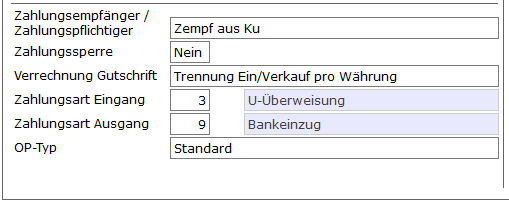

# Kunden/-Lieferantenstamm

<!-- source: https://amic.de/hilfe/kundenlieferantenstamm.htm -->

Hauptmenü > Stammdatenpflege > Kunden/Lieferanten > Kundenstamm

Direktsprung **[KU]**, **[KUKO]**.oder **[LF]**

Im [Kunden-/Lieferantenstamm](../../../kunden_und_lieferanten/kunden_und_lieferantenstamm/fibu_merkmale.md#Kundenstamm_Zahlungsverkehr) findet man die für den Zahlungsverkehr benötigten Felder auf dem Reiter „Fibu-Merkmale“.  
  
    

| | Beschreibung |
| --- | --- |
| **Zahlungsempfänger/ Zahlungspflichtiger**  | Beim automatischne Zahlungsverkehr wird der Name des Zahlungspflichtigen bzw. des Zahlungsempfängers benötig. Hierbei gilt folgende Regel.   4) Ist in der Kundenbank ein Empfänger eingetragen, so wird dieser verwendet und sofort in den Zahlungsvorschlägen vermerkt. 5) Ist der Empfänger in den Kundenbanken leer, dann wird dieses Feld verwendet. Die Bestimmung erfolgt erst beim DTA. 6) Ist dieses Feld Leer, dann wird die Kundenbezeichnung verwendet.  |
| **Zahlsperre**  | Mit **Ja** ist der Kunde für Zahlungen gesperrt.  |
| Verrechnung Gutschriften  | Für die Erstellung von Zahlvorschlägen kann mit diesem Kennzeichen bestimmt werden, ob debitorische und kreditorische Vorgänge miteinander verrechnet werden sollen: <ul><li>Keine Verrechnung: Es erfolgt auch dann eine Zahlung, wenn der Kunde einen negativen Saldo hat</li><li>Alle Belegarten: Es wird nur der Saldo zur Zahlung gestellt</li><li>Trennung Ein- und Verkauf: Es wird der Saldo aus den Einkäufen zur Zahlung gestellt &nbsp;</li></ul> |
| Zahlungsart Eingang (Debitor)  | Die Standardzahlungsart, wenn der Kunde bezahlt: <ul><li>Scheck</li><li>Datenträgeraustausch  Die Zahlungsart kann bei der Vorgangserfassung für den konkreten Vorgang überschrieben werden. &nbsp;</li></ul> |
| Zahlungsart Ausgang (Kreditor)  | Die Standardzahlungsart, wenn an den Kreditor bezahlt wird: <ul><li>Scheck</li><li>Datenträgeraustausch  Die Zahlungsart kann bei der Vorgangserfassung für den konkreten Vorgang überschrieben werden. &nbsp;</li></ul> |
| OP-Typ | Der OP-Typ hat drei Ausprägungen <ul><li>Standard hat keine Besonderheiten.</li><li>OP-Raffung bei Kokoreerstellung:&nbsp; Bei der Erstellung des Kokores werden alle offenen Posten, die in dem Kokore aufgelistet werden, zu einem Restposten zusammengefasst. Als Auszifferungsdatum wird das Kontoblattdatum und als Belegdatum das Datum, welches bei „Bis Belegdatum“ eingegeben wurde, verwendet.</li><li>Automatik bei DTA-Import gesperrt: Im Modul e-Clearing wird dieser Kunde nicht automatisch ausgeziffert. &nbsp;</li></ul> |
