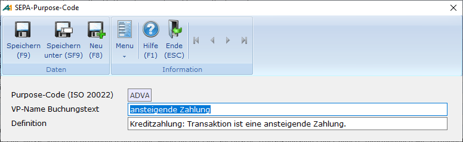

# SEPA-Purpose- Code

<!-- source: https://amic.de/hilfe/sepapurposecode.htm -->

Hauptmenü > Mahn-, Zahl-, Zinswesen > Stammdaten > SEPA-Purpose-Code

Direktsprung **[PURPOSE]**.

Der Purpose-Code entspricht dem aus dem DTA-Verfahren bekannten Textschlüssel, um Überweisungen und Lastschriften automatisiert klassifizieren zu können. Zahler und Zahlungsempfänger sowie die an der Zahlungsabwicklung beteiligten Zahlungsdienstleister können anhand eines Purpose Code Zahlungen (z. B. Gehaltszahlungen) automatisiert identifizieren und bspw. die Information zur automatisierten Berechnung von Kontoführungsentgelten oder Einräumung von Dispositionskrediten nutzen. Regelmäßige Zahlungen, wie Gehälter oder vermögenswirksame Leistungen, sollten daher immer unter Belegung von Purpose Code ausgeführt werden.

Es dürfen nur Purpose-Codes erfasst bzw. verwendet werden, welche laut SEPA-Regelwerk bei SEPA-Überweisungen gemäß ISO 20022 verwendet werden dürfen.

**Verwendet wird vom Programm lediglich der Purpose-Code. Die beiden zusätzlichen Textzeilen dienen der Information.**
