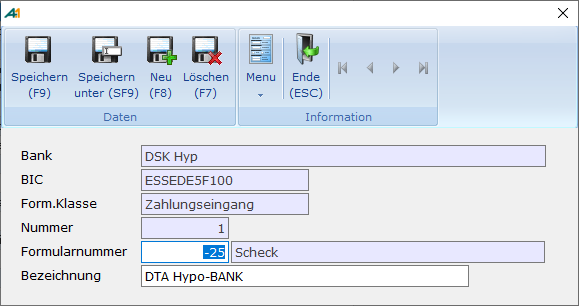

# Zahlungsformulare

<!-- source: https://amic.de/hilfe/zahlungsformulare.htm -->

Hauptmenü > Mahn-, Zahl-, Zinswesen > Stammdaten > Zahlungsformulare

Direktsprung **[FIZAF]**.

Je Formularklasse – Zahlungsausgang oder Zahlungseingang – und Bank kann es unterschiedliche Formulare geben, wenn z.B. die Banken unterschiedliche Ansprüche stellen. Hier wird nun die Verbindung zwischen der Formularklasse, der Formulareinrichtung und der Bank hergestellt.

| | Beschreibung |
| --- | --- |
| **Bank**  | Erfassung der Bank, für die das Formular bestimmt ist. Es kann hier direkt die Bezeichnung oder die Bankleitzahl erfasst werden. Bei der Freigabe der [Zahlungsvorschläge](../zahlungsvorschlaege_bearbeiten.md#Freigabe) wird die Hausbank abgefragt. Die dort eingetragene Bank bestimmt dann das Formular. Sind mehreren Formulare eingerichtet, werden diese dort noch einmal abgefragt.  |
| **Formularklasse**  | Zahlungseingang oder Zahlungsausgang.  |
| **Nummer**  | Laufende Nummer des Formulars in der Klasse. Man kann also pro Bank mehrere Formulare hinterlegen, falls dies nötig ist.  |
| **Formularnummer**  | Das Formular, das ausgedruckt werden soll. Die Gestaltung des Formulars erfolgt im Formulareinrichter und muss vor dieser Einrichtung geschehen. Hier können Formulare des Typs Scheck (Formulartyp 201) hinterlegt werden.  |
| **Bezeichnung**  | Allgemeine Bezeichnung für dieses Formular. Ist der Steuerungsparameter 34 "Mehrsprachigkeit aktiv“ in A.eins gesetzt, so hat man auf diesem Feld die Möglichkeit mit F3 [sprachabhängige Bezeichnungen](../../../firmenstamm/a_eins_sprache/sprachabhaengige_bezeichnung_in_den_stammdaten.md) zu pflegen.  |
