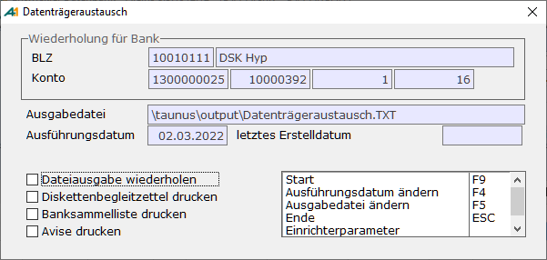

# DTA-Archiv

<!-- source: https://amic.de/hilfe/dtaarchiv.htm -->

Hauptmenü > Mahn-,Zahl-, Zinswesen > Zahlungsverkehr > DTA-Archiv

Direktsprung **[DTA]**

Beim Erstellen einer DTA-Datei werden die Daten in ein Archiv gestellt, um es zu ermöglichen, den Datenträgeraustausch zu wiederholen, ohne den gesamten Zahlungsvorgang zu wiederholen. In der Bereichsauswahl kann man auswählen, für welchen DTA-Bereich man die Ausgabe wiederholen möchte. Es wird unterschieden zwischen DTA, DTINT, DTA-Kasse, Auslandszahlungsverkehr und SEPA-Überweisung.

Vor dem Start des DTA's muss ausgewählt werden, welche Bereiche wiederholt werden sollen.

Man kann angeben, wann diese hier zwischengespeicherten Daten wieder aus dem System entfernt werden sollen. Dazu muss man unter Optionen (Direktsprung **[OPT]**) die Option DTA_Archivwochen setzen. Trägt man hier eine 0 ein, werden die Daten nicht automatisch gelöscht. Ansonsten wird nach jedem DTA-Lauf geprüft, ob noch „alte“ Daten vorhanden sind und diese werden dann nach Ablauf der eingestellten Wochen - ab Erstelldatum der Ausgabedatei - gelöscht. Dies betrifft immer nur Daten, für die eine Ausgabedatei erstellt worden ist. Die anderen Daten werden von dieser Routine nicht berührt. Diese müssen ggf. manuell mit der Funktion „DTA-Archiveintrag löschen“ entfernt werden.

Die Funktion „***Ausführungsdatum ändern***“ **F4** steht für die DTA-Verfahren des Inlandszahlungsverkehrs in Deutschland und der über eine Datenbankfunktion gesteuerten Dateierstellung zur Verfügung. Bei der Änderung des Datums werden die Einschränkungen - nicht vor dem Erstelldatum und maximal 15 Tage nach dem Erstelldatum – geprüft. Außerdem werden Samstage und Sonntage als Ausführdatum nicht zugelassen.
