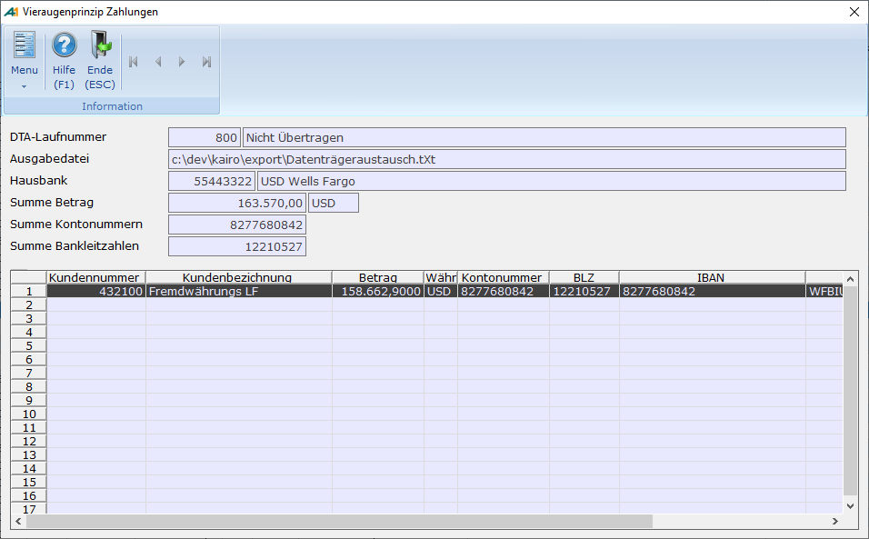

# Vieraugenprinzip beim DTA Verfahren

<!-- source: https://amic.de/hilfe/vieraugenprinzipbeimdtaverfahr.htm -->

Hauptmenü > Mahn-,Zahl-, Zinswesen > Zahlungsverkehr > Zahlungen bearbeiten > Variante „Zahlungen nach DTA-Laufnr. Vieraugen“

Direktsprung **[ZHB]**

Gerade im Zahlungsverkehr kann es wünschenswert sein, dass es eine Trennung zwischen den Bedienern gibt, die einen Zahlungsauftrag erstellen und denen die den Auftrag prüfen und dann an die Bank geben. Um das zu gewährleisten sind folgende Einrichtungsschritte notwendig:

1) Die Bediener, welche die Zahlungen erstellen, müssen in einer anderen Bedienerklasse sein als die Bediener, die die Zahlungen kontrollieren und freigeben.

2) Der [Steuerparameter 716](../../../firmenstamm/steuerparameter/optionen_finanzwesen/vieraugenprinzip_zahlungen_spa_716.md) „Vieraugenprinzip beim DTA Verfahren“ muss angeschaltet werden. Dieser Steuerparameter sorgt dafür, dass die Variante „Zahlungen nach DTA-Laufnr. Vieraugen“ aktiviert wird, und beim Erstellen des Datenträgeraustausch die Ausgabedatei nicht geschrieben wird und auch der Explorer – unabhängig von den Einstellungen in den Einrichterparametern – nicht geöffnet wird.

   Die Funktion „Übernahme in die Primanota“ steht bei gesetztem Steuerparameter nur in der Variante „Zahlungen nach DTA-Laufnr. Vieraugen“ zur Verfügung. Dort werden nur Zahlungen an die Primanota übertragen, deren Status „Übertragen“ ist.

3) Der Druck der Banksammelliste, des Diskettenbegleitzettels und der Avisen werden weiterhin beim Erstellen abgefragt.

4) Folgende Nachlauffunktionen, die in den Einrichterparametern der Erstellungsmaske eingestellt werden können, werden beim Zusammenstellen der Daten weiterhin ausgeführt und können z.B. dazu genutzt werden, um die Anwender aus der Kontroll-Bedienerklasse per Mail automatisch zu informieren. Zu beachten ist, dass die Datei, die mit /FILE= an das Skript übergeben wird, nicht existiert:

   a. VBS-Skript ausführen.

   b. VBA-Skript ausführen.

   c. SQL-Prozedur ausführen.

   d. Crystal Report ausführen.

5) Mithilfe des Schutzsystems „Zugriffsrechte Varianten“ (Direktsprung **[ZUGV]**) muss die Variante „Zahlungen nach DTA-Laufnr. Vieraugen“ für die Kontroll-Bedienerklasse erlaubt sein, alle anderen Varianten müssen für diese Bedienerklasse gesperrt sein.

Ist alles so weit eingerichtet, können die Zahlungen wie gewohnt erstellt werden. Ein Anwender aus der Kontroll-Bedienerklasse kann anschließend die Zahlung prüfen, die DTA-Datei erstellen und transportieren. Dafür muss die Funktion ***Transfer starten*** **F9** in der Variante „Zahlungen nach DTA-Laufnr. Vieraugen“ ausgeführt werden.

Diese Maske enthält genau wie die Maske für das Erstellen des DTA’s [Einrichterparameter](../../../firmenstamm/einrichterparameter/vieraugenprinzip_zahlungsverkehr_epa_zahlungen_vieraugenprin.md), in denen man Skripte angeben kann, die nach erfolgter Übertragung (Funktion „***Zahlung übertragen***“ **F9**) ausgeführt werden.

Auf der sich öffnenden Maske stehen folgende Funktionen zur Verfügung:

| **Funktion** | **Beschreibung** |
| --- | --- |
| Verzeichnis ändern | Der Speicherort der DTA-Datei kann geändert werden. Bei Betätigung wird dieses Feld freigegeben. Mit F3 kann man den Dateiauswahldialog aufrufen. Die Änderung wird zwischengespeichert und jedes Mal wieder vorgeschlagen.   **Achtung**: 1) *Die Dateiausgabe ist für Daten, die per Datenbankprozedur erstellt werden, relativ zum Datenbankserver*. 2) *Für die Verfahren ohne private Datenbankprozedur arbeiten (SEPA,DTA,DTINT) wird weiterhin die unter* “Prozedur zur Anpassung des Dateinamens“ *hinterlegte Prozedur aufgerufen(*[Siehe DTA](./dta.md)*).*  |
| Zahlung übertragen | Diese Funktion steht nur für noch nicht übertragene Dateien zur Verfügung. Die DTA-Datei wird auf das ausgewählte Verzeichnis neu geschrieben und je nach Einstellung in den Einrichterparametern im Explorer angezeigt oder per VBA / VBS Script übertragen.  |
| Übertragung zurücksetzten | Diese Funktion steht dann zur Verfügung, wenn die Daten bereits als übertragen gekennzeichnet wurden. Es wird der Eintrag aus der Tabelle Vieraugenprinzip_zahlungen gelöscht und die Übertragung kann noch einmal gestartet werden. Aus sicherheitstechnischen Gründen sollte diese Funktion nur für eine bestimmte Bedienerklasse zugänglich sein.  |
| Rücksetzung beantragen | Hier wird eine Mail an die Bediener der in den Einrichterparametern hinterlegten Bedienerklasse gesendet. Für den Mail-Versand wird die Prozedur aus dem [Einrichterparameter](../../../firmenstamm/einrichterparameter/vieraugenprinzip_zahlungsverkehr_epa_zahlungen_vieraugenprin.md) „Prozedur zum Beantragen des Rücksetzens der Zahlungsnummer“ verwendet. Vorbelegt ist hier die Standard Prozedur „ZahlungRueckBeantragen“. Diese kann durch eine private Prozedur ersetzt werden.   Als Eingangs Parameter werden die Zahlungsnummer, Bedienerklasse und der SMTP Server übergeben. Als Ergebnis liefert die Prozedur den Mailstatus zurück. <ul><li>0 für Mail-Versand hat funktioniert.</li><li>1 für Mail-Versand hat nicht funktioniert &nbsp; &nbsp;</li></ul> <pre><code>create procedure ZahlungRueckBeantragen(&#10; in in_Zahlungsnummer integer&#10; ,in in_Bedienerklasse integer&#10; ,in in_SMTP_Server char(255)&#10; )&#10; Result(&#10; MailStatus integer&#10; )&#10;Begin&#10; declare dc_ErrorMsg long varchar;&#10; declare dc_SQLCODE integer;&#10; declare dc_SQLSTATE char(10);&#10; declare dc_MailAdresse char(255);&#10; declare dc_BodyText char(1024);&#10; declare dc_status integer;&#10; declare dc_SenderName char(255);&#10; declare dc_SenderMail char(255);&#10; DECLARE dc_err_notfound exception for sqlstate value '02000';&#10; &#10; declare BediKlass cursor for&#10; select Bedienermailadr from Bedienerstamm where Bedienerklasse = in_Bedienerklasse;&#10; &#10; select Bedienername, Bedienermailadr into dc_SenderName, dc_SenderMail from Bedienerstamm where bedienerkurz=USER;&#10; set dc_BodyText = amic_func_sprachtexte('a','b','Hallo') &#124;&#124; ', &lt;br&gt;' &#124;&#124;&#10; amic_func_sprachtexte('a','b','ich bitte um die Zurücksetzung des Übertragungskennzeichens für die Zahlung %s.',-1 ,in_Zahlungsnummer)&#10; &#124;&#124; '&lt;br&gt;' &#124;&#124;&#10; amic_func_sprachtexte('a','b','Mit freundlichen Grüßen')&#10; &#124;&#124; '&lt;br&gt;' &#124;&#124; dc_SenderName&#10; ;&#10; open BediKlass with hold;&#10; Crsr: loop&#10; fetch next BediKlass into dc_MailAdresse;&#10; if sqlstate &lt;&gt; dc_err_notfound then&#10; call xp_startsmtp( dc_SenderMail, in_SMTP_Server ,25);&#10; dc_status = call xp_sendmail( recipient= dc_MailAdresse,&#10; subject= 'Zahlung ' &#124;&#124; in_Zahlungsnummer,&#10; "message"='&lt;html&gt;&lt;body&gt;' &#124;&#124; dc_BodyText &#124;&#124; '&lt;/body&gt;&lt;/html&gt;',&#10; content_type = 'text/html');&#10; call xp_stopsmtp();&#10; else&#10; leave Crsr;&#10; end if;&#10; end loop Crsr;&#10; close BediKlass;&#10; select dc_status as MailStatus from dummy;&#10; exception&#10; when others then&#10; SELECT ERRORMSG() ,SQLCODE ,SQLSTATE INTO dc_ErrorMsg ,dc_SQLCODE ,dc_SQLSTATE;&#10; CALL AMIC_FEHLERPROT( 20, amic_func_sprachtexte('a', 'b', 'Prozedur', -1)&#10; ,amic_func_sprachtexte('a','b','Beim Ausführen der Prozedur "%s" ist ein Fehler aufgetreten.', -1, 'ZahlungRueckBeantragen')&#10; &#124;&#124; '\n'&#10; &#124;&#124; amic_func_sprachtexte&#10; ('a'&#10; ,'b'&#10; ,'Parameter (%s): %s', -1, 'in_Zahlungsnummer', in_Zahlungsnummer&#10; )&#10; &#124;&#124; '\n'&#10; &#124;&#124; amic_func_sprachtexte&#10; ('a'&#10; ,'b'&#10; ,'Parameter (%s): %s', -1, 'in_Bedienerklasse', in_Bedienerklasse&#10; )&#10; &#124;&#124; '\n'&#10; &#124;&#124; 'SQLCODE: ' &#124;&#124; dc_SQLCODE&#10; &#124;&#124; ' [' &#124;&#124; dc_SQLSTATE &#124;&#124; ']'&#10; &#124;&#124; '\n'&#10; &#124;&#124; dc_ErrorMsg&#10; ,-10171&#10; );&#10; select 1 as MailStatus from dummy;&#10;End;</code></pre> |
