# Genereller Ablauf der Kontokorrentzinsen

<!-- source: https://amic.de/hilfe/generellerablaufderkontokorren.htm -->

Kontokorrentzinsen werden durch Verzinsung des fälligen Saldos errechnet – nicht durch Verzinsung der offenen Posten. Der fällige Saldo ergibt sich anhand des Valuta/Fälligkeitsdatums. Dieses Datum ergibt sich bei Warenwirtschafts-Belegen oder Finanzbuchhaltungs-Belegen durch die im Kundenstamm hinterlegte Zahlungsbedingung bzw. durch manuelle Eingabe. Bei den Belegarten, für die keine Zahlungsbedingung vorgesehen ist (Zahlungen, Scheckeinreicher, Sonstige Belege) kann ebenfalls ein Wertstellungsdatum erfasst werden. Vorbelegt wird dieses Datum mit dem Belegdatum. Man kann diese Vorbelegung aber mit Hilfe eines Einrichtungsparameters ändern: **Belegdatum + nnn Tage = Valutadatum**. Dann wird zu dem Belegdatum jeweils diese Anzahl Tage hinzugerechnet und als Fälligkeits-/Wertstellungsdatum vorgeschlagen

Es gibt in der Belegerfassung noch einen weiteren Einrichtungsparameter, der für das Fälligkeits-/Wertstellungsdatum wichtig ist: **Valutadatum gegenüber Belegdatum prüfen**. Dieser Parameter bewirkt, dass geprüft wird, ob das Fälligkeitsdatum nicht kleiner als das Belegdatum eingegeben wird. Er kann drei Ausprägungen haben:

- Ignorieren: Es findet kein Test mit dem Belegdatum statt.
- Fehler: Der Test führt dazu, dass eine Fehlermeldung ausgegeben wird und ein Weiterarbeiten erst nach korrekter Eingabe des Datums möglich ist.
- Warnung: Es wird gegebenenfalls eine Warnung ausgegeben, dass das Fälligkeitsdatum kleiner als das Belegdatum ist, ein Weiterarbeiten ist trotzdem möglich.

Die Abwicklung der Zinsen findet in zwei Stufen statt.

- Errechnen der Zinsen als Zinsvorschläge
- Weiterbearbeitung dieser Vorschläge (Übernahme in die Primanota, Drucken, ...)

**Zinsvorschläge erstellen**

Hauptmenü \> Mahn-/Zahl-/Zinswesen \> Zinswesen \> Zinsvorschläge erstellen

Direktsprung **[ZIV]**

In dem Menü der Finanzbuchhaltung findet man den Punkt Zinswesen. Dort ist der Punkt Zinsvorschläge erstellen zu finden. Er ist auch über den Direktsprung ZIV oder direkt unter „Zinsabrechnung bearbeiten“ zu erreichen.

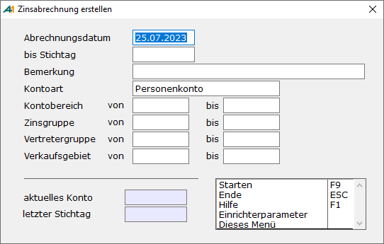

| | Beschreibung |
| --- | --- |
| Abrechnungsdatum  | Dies ist der Tag an dem die Zinsabrechnung erstellt wird. Es wird mit dem Tagesdatum vorbelegt. Dieses Datum wird später das Belegdatum der automatisch generierten Zinsbelege.  |
| Bis Stichtag  | Dies ist das Datum, bis zu dessen Ende die Zinsberechnung läuft. Es werden dann alle Belege mit einem Fälligkeits-/Wertstellungsdatum kleiner oder gleich dem Stichtag herangezogen, die als „noch zu verzinsen“ gekennzeichnet sind. Auch Belege, die in einer Früheren Zinsperiode liegen, jedoch aus irgendeinem Grund nicht verzinst wurden werden mit herangezogen.  |
| Bemerkung  | Hier kann eine Bemerkung zu der Zinsliste hinterlegt werden.  |
| Kontoart  | Man kann die Zinsberechnung sowohl für Personenkonten als auch für Sachkonten durchführen. Welche Kontoart bearbeitet werden soll wird hier eingestellt.  |
| Kontobereich von…bis  | Man kann hier den Kontenbereich eingrenzen oder auch nur ein einzelnes Konto auswählen. |
| Zinsgruppe von…bis  | Über die Eingrenzung der Zinsgruppe können Kundenbereiche getrennt bearbeitet werden. Man kann z.B. schon von vornherein Kunden und Lieferanten mit anderen Zinsgruppen versehen und könnte hier eine Trennung erreichen. Achtung: 0 ist keine gültige Zinsgruppe. Für Konten, bei denen diese Zinsgruppe hinterlegt ist, werden keine Zinsen berechnet.  |
| Vertretergruppe von…bis | Dies ist eine Eingrenzungsmöglichkeit nach der im Kundenstamm eingetragenen Vertretergruppe.  |
| Verkaufsgebiet von...bis | Dies ist eine Eingrenzungsmöglichkeit nach dem im Kundenstamm eingetragenen Verkaufsgebiet.  |

Unter Einrichterparameter gibt es drei Optionen

- **Zinssaldo vor Neuerstellung testen**  
Man hat hier drei Einstellungsmöglichkeiten:

1. Ignorieren: Es findet kein Test stat.

2. Fehler: Wenn sich der „Zinssaldo laut Belegen“ von dem „Zinssaldo laut letzter Abrechnung“ unterscheidet, ist eine Erstellung einer neuen Abrechnung nicht möglich.

3. Warnung: Es wird gegebenenfalls auf eine Abweichung des Saldos hingewiesen. Der Anwender kann sich dann noch entscheiden, ob er die Zinsen berechnen lassen möchte oder nicht. Dies ist die neue Standardeinstellung.

- **Alte Zinsrechnung überprüfen**  
Diese Option wird nur ausgewertet, wenn „Version zurückstellen“ auf „Nein“ steht. Steht diese Option auf „Ja“, so werden beim Zinslauf automatisch alle alten Zinsabrechnungen dieses Kalenderjahres, die der Auswahl entsprechen nachgerechnet. Dabei wird der Eröffnungssaldo der ersten Zinsabrechnung inklusive aller Nachbuchungen als Eröffnung herangezogen und anschließend alle Zinsabrechnungen nachgerechnet. Nachträgliche Buchungen, die bisher nur in der folgenden Zinsabrechnung berücksichtigt wurden, werden beim „Nachrechnen“ der korrekten Periode zugewiesen. Das Ergebnis wird in den Feldern ZINSABRSOLLZRECALC, ZINSABRHABENZRECALC, ZINSABRSTARTSALDORECALC, ZINSABRSALDORECALC festgehalten.  
 Es steht auf dieser Maske dann auch eine weitere Funktion „Nachrechnen SF9“ zur Verfügung, die die Zinsabrechnungen nachrechnet, ohne eine neue Zinsabrechnung zu erstellen.  
    

- **Auch gelöschte Personenkonten verarbeiten?**  
Gelöschte Personenkonten werden ab Version 7.2-März nicht mehr zur Zinsabrechnung herangezogen. Sollte dieses Verhalten nicht gewünscht sein, so kann man mit diesem Einrichterparameter dafür sorgen, dass auch wieder für bereits als gelöscht markierte Personenkonten Zinsabrechnungen erstellt werden.  
    

Mit **F9** wird die Errechnung der Zinsen gestartet. Im Feld „aktuelles Konto“ kann man erkennen, welches Konto zurzeit in Bearbeitung ist. Bei jedem Lauf wird die Listennummer automatisch um 1 höhergezählt. Ist der Zinslauf durchgeführt worden, ist es möglich, dass ein Fenster mit Fehlermeldungen erscheint. Diese Meldungen können sein:  
    

- Zinsgruppe ???? ungültig für Konto ????  
Für das Konto ist eine Zinsgruppe eingetragen, die nicht existiert. Eine Zinsabrechnung wird für dieses Konto nicht erstellt.  
    

- Für Konto ???? existieren noch ungebuchte Belege!  
Da für dieses Konto noch nicht alle Belege verbucht wurden, wird für dieses Konto keine Zinsabrechnung erstellt.

- Kein Zinssatz für Konto / Gruppe / Liste ???? (Valutadatum? >nn.nn.nnnn&lt; )  
Es wurde für die im Konto ???? eingetragene Zinsgruppe kein gültiger Zinssatz gefunden. Eine mögliche Ursache ist, dass das Fälligkeitsdatum kleiner ist als das Datum, ab dem der Zinssatz gültig ist. Für dieses Konto wird dann keine Zinsabrechnung erstellt.  
    

- Bereichsüberschneidung Konto/Liste ????? ( nn.nn.nnnn > nn.nn.nnnn)  
Für dieses Konto existiert bereits eine Zinsabrechnung, deren Stichtag größer ist als der hier angegebene.  
    

**Zinsvorschläge (DRUCK)**

Hauptmenü \> Mahn-/Zahl-/Zinswesen \> Zinswesen \> Zinsvorschlagsliste

Direktsprung **[ZID]**

Für errechnete Zinsen lässt sich eine ausführliche Kontrollliste drucken. Folgende Eingrenzungen sind möglich:

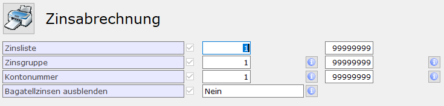

Bagatellzinsen ausblenden bedeutet, dass die Konten, deren Zinssaldo unterhalb der in den Stammdaten der Personenkonten eingetragenen Bagatellzinsen nicht mit auf der Liste erscheinen.

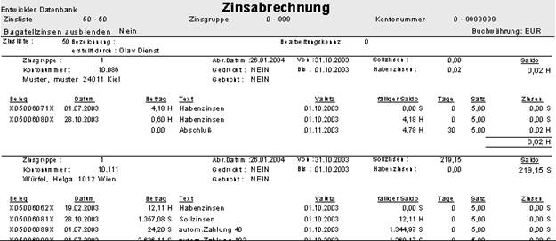

Zur Einrichtung des Formulars siehe „[Zinsabrechnung über Zinsformulare drucken](./zinsabrechnung_ueber_zinsformulare_formulartyp_203_drucken.md)“.

**Zinsabrechnung bearbeiten**

Hauptmenü \> Mahn-/Zahl-/Zinswesen \> Zinswesen \> Zinsabrechnung bearbeiten

Direktsprung **[ZIB]**

Dies ist der zentrale Punkt zum Bearbeiten der Zinsvorschläge bzw. der Zinsabrechnungen. Es stehen hier diverse Funktionen zum Bearbeiten der Zinsen zur Verfügung. Es ist zu beachten, dass es jeweils nur sinnvoll ist, die jeweils letzte Abrechnung eines Kontos zu bearbeiten, da der Abschlusssaldo der Zinsabrechnungen als Eröffnungssaldo für die folgenden Abrechnungen verwendet wird.

- ***Vorschläge erstellen***.  
Auch hier können die Zinsvorschläge erstellt werden. [Siehe oben](./genereller_ablauf_der_kontokorrentzinsen.md#ZInsvroschlaegeerstellen).  
    

- ***Übernahme in die Primanota***.  
Hier werden für die errechneten Zinsen Belege erstellt. Wie die Belege im Endeffekt aussehen hängt von den Einstellungen in den Stammdaten ab (s.o.). Es entstehen Ausgangsrechnungen für Sollzinsen und Ausgangsgutschriften für Habenzinsen. Für Zinsbeträge, die unterhalb der Bagatellzinsen liegen werden keine Belege erstellt. In den Varianten „Ungebuchte Abrechnungen“, „Ungedruckte Abrechnungen“ und „Zinsabrechnungen“ werden die Zinsen, die unter die Bagatellgrenze fallen, gelb eingefärbt.  
    
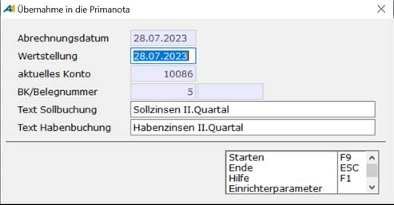

| | Beschreibung |
| --- | --- |
| Abrechnungsdatum | Zeigt das Datum der aktuell angewählten Abrechnung an. Dies wird das Belegdatum der entstehenden Zinsbuchungen. Die Periode wird anhand dieses Datums bestimmt. Wenn die Periode in dem Datum nicht offen oder bereits geschlossen ist, werden Zinsen nicht gebucht.  |
| Wertstellung | Hier wird das Datum eingegeben, zu dem die Zinsen fällig sind.   |
| aktuelles Konto | Anzeige des gerade bearbeiteten Kontos   |
| BK/Belegnummer   | Hier kann der Nummernkreis eingegeben werden. Es wird der Nummernkreis vorgeschlagen der unter „Fibu-Vorgangszuordnung NKF“ für Ausgangsrechnung mit der Erfassungsform „automatisch„ eingetragen ist. Ob man den Nummernkreis ändern kann, wird auch dort hinterlegt.   |
| Text Sollbuchung | Dieser Text wird beim Beleg in der Hauptzeile verwendet. Er kann abgeändert werden, z.B. „Sollzinsen I. Quartal“ und wird beim nächsten Buchen so wieder vorgeschlagen.   |
| Text Habenbuchung | Dieser Text wird beim Beleg in der Hauptzeile verwendet. Er kann abgeändert werden, z.B. „Guthabenzinsen I. Quartal“ und wird beim nächsten Buchen so wieder vorgeschlagen.   |

    
Neben diesen Einstellungen existiert auch noch ein Einrichterparameter „Beleg darf nicht geändert werden?“. Hier kann man für die entstehenden Belege eine Bearbeitungssperre setzen, so dass man diese später in der Primanota nicht mehr – oder nur eingeschränkt – ändern kann. Diese Sperre kann später in der [Einzelbeleganzeige](../op_verwaltung/einzelbeleganzeige.md) wieder gelöscht werden.  
    

- ***Buchung stornieren***  
Gelegentlich kann es vorkommen, dass Zinsabrechnungen erneut erstellt werden sollen, da z.B. einige Belege noch nicht erfasst worden waren. Sind die Zinsen jedoch bereits gebucht gewesen, lässt sich die Zinsabrechnung nicht wieder zurücksetzen, man erhält die Meldung: „**Konto/Liste nnnn/nnnn nicht zurückgesetzt, da Zinsen bereits gebucht wurden!**“. Damit dies jedoch möglich wird, gibt es die Funktion „***Buchung stornieren***“. Es wird zu dem Zinsbeleg ein Stornobeleg erstellt, der auch automatisch mit dem Zinsbeleg ausgeziffert wird. Die ausgewählte Zinsabrechnung bekommt anschließend den Status „nicht gebucht“ und kann dann zurückgesetzt werden.  
    
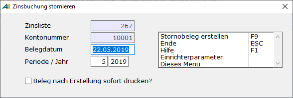  
    

| | Beschreibung |
| --- | --- |
| Belegdatum | Belegdatum des Stornobelegs.   |
| Periode / Jahr | Welcher Periode soll der Stornobeleg zugeordnet werden?  |
| Beleg nach Erstellung sofort drucken? | Hier kann eingestellt werden, dass der Stornobeleg sofort im Anschluss gedruckt wird. Es existiert ein gleichnamiger Einrichterparamter. Setzt man diesen auf **Ja**, so ist der Haken automatisch gesetzt und kann nicht geändert werden.   |

- ***Löschen bzw. zurücksetzen***  
Zinsvorschläge bzw. Zinsabrechnungen können gelöscht und/oder zurückgesetzt werden. Es ist dabei streng darauf zu achten, was man erreichen möchte. In beiden Fällen wird die Zinsliste gelöscht, aber nur in dem Fall „Zurücksetzen“ werden die in der Zinsliste verarbeiteten Belege wieder freigegeben, um erneut verarbeitet werden zu können. Bereits verbuchte Belege können nicht zurückgesetzt werden (siehe Zinsbuchung stornieren). Es erscheint beim Menüpunkt „Löschen“ folgende Sicherheitsabfrage.  
    
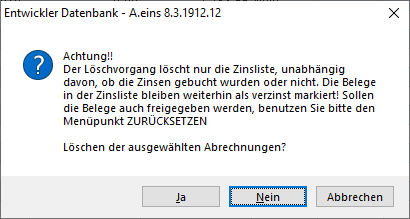  
**  
Achtung:**  
*Es kann immer nur die letzte Zinsabrechnung eines Kunden gelöscht oder zurückgesetzt werden, da der Zinssaldo im anderen Fall bereits fortgeschrieben wurde.  
*  

- ***Wiederherstellen***  
Sollte es vorgekommen sein, dass man Zinsabrechnungen gelöscht hat, anstatt sie zurückzusetzen, gibt es hier den Punkt „***Wiederherstellen***“. Er stellt die Zinsabrechnung nicht wieder her, sondern setzt die betroffenen Belege auf den Status „nicht verzinst“, so dass sie bei der nächsten Zinsabrechnung wieder herangezogen werden. Es ist dann so, als ob man gleich „***Zurücksetzen***“ gewählt hätte.  
Man kann den Status ganzer Zinslisten bzw. den eines einzelnen Kontos ändern. Es erscheint dazu ein Bildschirm, in dem eine Kontonummer abgefragt wird. Wird keine Kontonummer angegeben, erscheint folgende Abfrage:

    
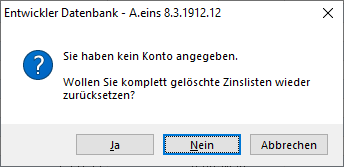  
    
Wird diese Abfrage mit **Ja** beantwortet, so wird die letzte gelöschte Zinsliste vom Status gelöscht auf den Status zurückgesetzt geändert.  
    

- ***Anzeige***  
Die Einzelpositionen der Zinsabrechnung des Kontos werden angezeigt.  
    
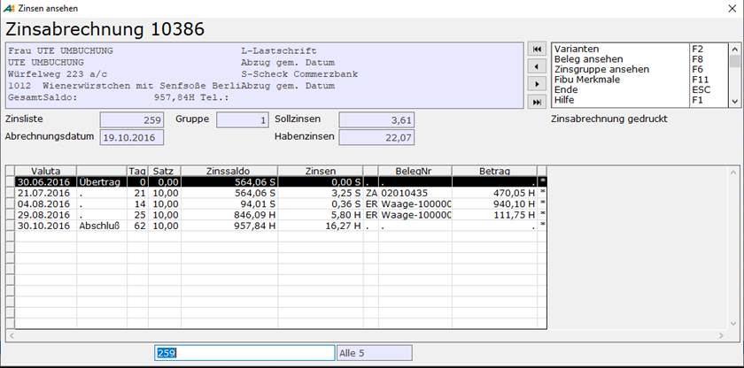  
    
Übertrag, Abschluss, Änderung des Zinssatzes sowie manuelle Änderung des Zinssaldos im Abrechnungszeitraum werden in separate Zeilen angezeigt.  
    

- ***Kalkulatorisch***  
Mit diesem Programmteil können kalkulatorische Zinsen am Bildschirm ermittelt werden, die seit der letzten Zinsabrechnung bis zu einem bestimmten Datum aufgelaufen sind. Eine praktische Anwendung wäre der Telefonkontakt mit einem säumigen Kunden. Als Grundlage für die Berechnung werden die Werte so wie sie in den Stammdaten (Zinssatz, Zinsbasis) hinterlegt sind verwendet.  
    
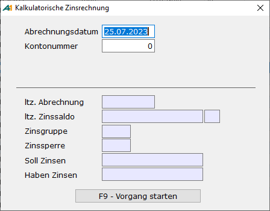  
    
    

| | Beschreibung |
| --- | --- |
| Abrechnungsdatum   | Stichtag, zu dem die Zinsen berechnet werden.   |
| Kontonummer   | Für welches Konto sollen die Zinsen berechnet werden.   |

    
Nach Eingabe des Datums und der Kontonummer kann die Berechnung mit **F9** gestartet werden. Es werden dann die zum Abrechnungsdatum fälligen Zinsen angezeigt.  
    

- ***Abrechnung drucken***  
Die Abrechnung kann über Formulare des Typs „203 Zinsabrechnung“ gedruckt werden.  
    
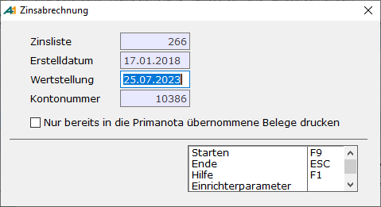  
    
    

| | Beschreibung |
| --- | --- |
| Wertstellung   | Dieses Datum kann im Formular als Feld „Wertstellung“ ausgegeben werden.   |
| Nur bereits in die Primanota übernommene Belege drucken   | Es werden nur Abrechnungen gedruckt, die auch gebucht worden sind. Dadurch kann u.a. verhindert werden, dass versehentlich Bagatellzinsen, die nicht gebucht werden, mit gedruckt werden. Für diese Einstellung existiert gleichzeitig eine Einrichterparameter „Nur bereits in die Primanota übernommene Belege drucken“, der bei der Einstellung **Ja** bewirkt, dass der Haken gesetzt ist und nicht geändert werden kann.   |

Die Zinsabrechnung kann auch als Mailanhang verschickt werden.

- ***Zinssaldo ändern***  
Im Normalfall ist es nicht nötig ist, den Zinssaldo zu ändern.  
    
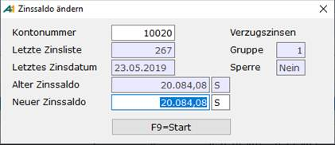  
    
Nach Eingabe der Kontonummer werden die Daten der letzten Zinsabrechnung zu diesem Konto angezeigt. Man kann danach einen anderen Zinssaldo eingeben, der dann in dieser Liste vermerkt wird. Wenn man sich anschließend diese Zinsabrechnung ansieht, erscheint eine weitere Zeile, die diese Änderung ausweist:  
    
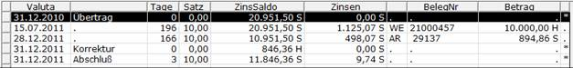  
    

- ***Zinsabschlag Stammdaten***  
Stammdaten für eventuell zu berechnenden [Zinsabschlag](./stammdaten_zinswesen/zinsabschlag.md).
