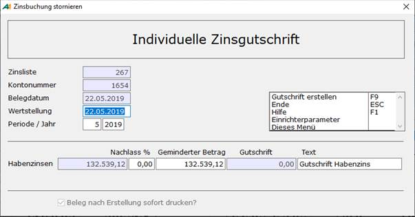
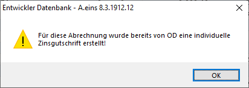
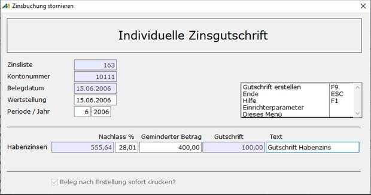

# Individuelle Zinsgutschrift

<!-- source: https://amic.de/hilfe/individuellezinsgutschrift.htm -->

Hauptmenü \> Mahn-/Zahl-/Zinswesen \> Zinswesen \> Zinsabrechnung bearbeiten \> Variante **Individuelle Zinsgutschrift**

Direktsprung **[ZIB]**

In der Praxis werden nach Versand und Buchung der Zinsabrechnung häufig mit den betroffenen Kunden Vereinbarungen getroffen, die wie folgt lauten:

- 75% der Zinsen werden berechnet, 25% werden erlassen.
- Von den ursprünglichen errechneten Zinsen in Höhe von 724,13 € sind nur 500 € zu zahlen.

A.eins unterstützt diese individuellen Gutschriften. Dafür existiert in der Anwendung „**Zinsabrechnung bearbeiten**“ die Variante „**individuelle Zinsgutschrift**“. Hier werden alle gebuchten Zinsen aufgelistet, von denen jeweils eine ausgewählt werden kann. Wenn man dann die Funktion auslöst, erscheint folgender Bildschirm.

Zinsliste, Kontonummer und Belegdatum werden aus der Zinsabrechnung vorbelegt. Das Wertstellungsdatum wird, wie beim Buchen der Zinsabrechnung, mit dem Belegdatum vorbelegt und kann geändert werden. Jahr und Periode werden über das Belegdatum bestimmt.

Je nachdem, ob es sich bei den gebuchten Zinsen um Soll- und/oder Habenzinsen handelt erscheint eine bzw. zwei Zeilen, in denen man die Abweichung angeben kann.

Das blaue Feld rechts vom Text „Habenzinsen“ enthält den tatsächlich gebuchten Betrag. Daneben kann man entweder den prozentuellen Nachlass oder den geminderten Betrag sowie den Text der Buchung eingeben. Im Feld Gutschrift erscheint dann die tatsächliche Gutschrift. Wenn man dann ***Gutschrift erstelle***n **F9** auswählt, werden die hier eingegebenen Daten in der Tabelle Zinsabrechnung hinterlegt. In dem Beispiel wird dann eine Gutschrift über 55,64 € erstellt. Dieser Beleg kann dann in der Belegerfassung/Primanota ggf. noch geändert werden. Bei einer Gutschrift auf Sollzinsen wird ein Beleg vom Typen „AG“ Ausgangsgutschrift erstellt, bei Habenzinsen ist der Typ „AR“ Ausgangsrechnung. Eine eventuell berechnete Zinsabschlagssteuer wird entsprechend berichtigt.

Individuelle Zinsgutschriften können zu jeder Zinsabrechnung beliebig oft erstellt werden. Ist jedoch schon eine Zinsabrechnung erstellt worden, so erscheint die Warnung

und der zuletzt verwendete Prozentsatz und Betrag wird vorbelegt. Es wird dann auch nur die über die Differenz zwischen der letzten Gutschrift und der neuen Gutschrift ein Beleg erstellt. Gibt man also im obigen Beispiel ein zweites Mal eine Gutschrift mit einem geminderten Betrag von 400,00 € ein, so erscheint im Feld Gutschrift dann auch nur die Differenz zum vorherigen „geminderten Betrag. Es wird dann in diesem Beispiel ein Beleg über 100,00 € erstellt.

Hat man bei „Beleg nach Erstellung sofort drucken“ den Haken gesetzt, so wird danach sofort der Druck für diesen Beleg ausgeführt. Für diesen Druck wird ein Formular vom Typen 600 „Belegdruck Finanzbuchhaltung“ verwendet.

Es existiert ein Einrichterparameter „Beleg nach Erstellung sofort drucken“. Setzt man diesen auf **Ja**, so ist der Haken gesetzt und lässt sich nicht vom Benutzer ändern.

**ACHTUNG:**

*Es ist nicht möglich, den Zinsbetrag wieder zu erhöhen.*
