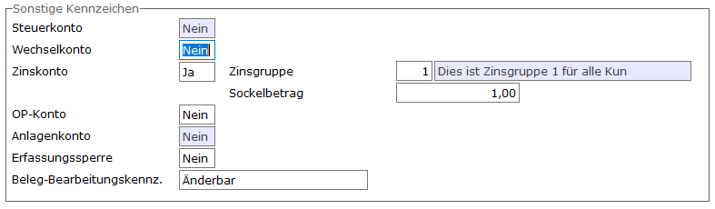

# Zinsmerkmale im Sachkontenstamm

<!-- source: https://amic.de/hilfe/zinsmerkmaleimsachkontenstamm.htm -->

Hauptmenü > Finanzbuchhaltung > Stammdaten > Sachkonten > Register „Weitere Optionen“

Direktsprung **[SKS]**

Im Sachkontenstamm gibt es " auf dem Register "Weitere Optionen" in dem Bereich "Sonstige Kennzeichen" das Feld Zinskonto. Wird dieses auf "JA" gestellt, werden die Felder, in denen die Zinsgruppe und der Sockelbetrag eingegeben werden können, freigeschaltet.
