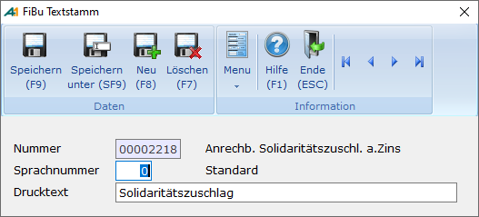

# Steuerbescheinigung Kapitalertragssteuer

<!-- source: https://amic.de/hilfe/steuerbescheinigungkapitalertr.htm -->

Hauptmenü \> Mahn-/Zahl-/Zinswesen \> Zinswesen \> Zinsabrechnung bearbeiten \> Variante **Steuerbescheinigung Kapitalertragssteuer**

Direktsprung **[ZIB]**

Der Zinsabschlag ist eine spezielle Form der Kapitalertragssteuer. Für die einbehaltene Kapitalertragsteuer kann eine Bescheinigung gedruckt werden. Dazu müssen die Stammdaten für [Zinsgruppen](./stammdaten_zinswesen/zinsgruppen.md) und [Zinsabschlag](./stammdaten_zinswesen/zinsabschlag.md) eingerichtet sein und die entsprechenden Zinsen gebucht sein. Die so entstandenen Belege findet man dann in der Variante **Steuerbescheinigung Kapitalertragsteuer** der Anwendung **Zinsen bearbeiten** wieder. Dort kann dann mit der Funktion ***Steuerbescheinigung drucken*** der Formulardruck aufgerufen werden. Für den Druck wird ein Formular vom Typen 600 „Belegdruck Finanzbuchhaltung“ verwendet. Es wird ein Beispielformular (Formularnummer -1200) mit ausgeliefert. In diesem Formular wird für die Texte eine spezielle Druckposition verwendet (ID_FIBU_DRUCKTEXT). Diese bezieht ihren Text für einzelne Konten über die Textvorbelegung (Direktsprung **[FITXT]**). Dort können in der Variante **Kontotexte** Texte für Sachkonten hinterlegt werden, die dann beim Druck der Steuerbescheinigung herangezogen werden.

Ist kein Text hinterlegt, so wird der Text verwendet, der im Beleg zu diesem Konto steht.
