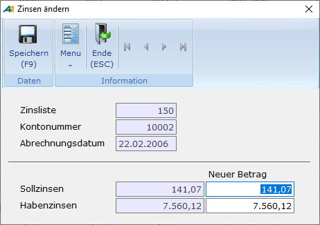

# Zinsen ändern

<!-- source: https://amic.de/hilfe/zinsenndern.htm -->

Hauptmenü \> Mahn-/Zahl-/Zinswesen \> Zinswesen \> Zinsabrechnung bearbeiten \> Variante **Zinsen ändern**

Direktsprung **[ZIB]**

Es ist möglich, die von A.eins berechneten Zinsen vor der Übernahme in die Primanota zu ändern. Dafür steht in der Auswahlliste „Zinsabrechnung bearbeiten“ die (versteckte) Variante „**Zinsen ändern**“ zur Verfügung. Dabei können sowohl die Soll- als auch die Habenzinsen verändert werden.

Diese Zinsen werden in der Zinsabrechnung unter ZinsAbrSollZins bzw. ZinsAbrHabenZins ausgegeben. Die von A.eins errechneten Zinsbeträge können parallel als ZinsAbrSollZinsOrig bzw. ZinsAbrHabenZinsOrig angedruckt werden. Wurden die Zinsen manuell geändert, ist ein Nachweis über die einzelnen Positionen natürlich nicht mehr sinnvoll.
