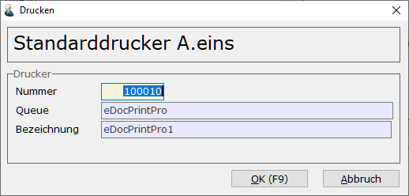

# Druckerzuordnung

<!-- source: https://amic.de/hilfe/_druckerzuordnungdrz.htm -->

Hauptmenü > Administration > Drucker > Druckerzuordnung

oder Direktsprung **[DRZ]**

Je Bediener ist die Zuordnung eines Standarddruckers für den Ausdruck im ASCII-Format erforderlich. Ist ein Bediener neu angelegt, wird er beim Start aufgefordert, eine Druckerzuordnung vorzunehmen. Auf dem zugeordneten Drucker erfolgt dann im Standardfall der Ausdruck. Dies wird jedoch durch Eintragungen in den Vorgangsdruckklassen **[VRGD]** übersteuert. Näheres dazu findet sich u. a. im Kundenstamm.

 

Mit **F3** kann aus den eingerichteten Druckern ausgewählt werden.

### Wichtig:

Soll mit dem Laserdrucker gearbeitet werden, ist darauf zu achten, dass in den Formularen **[FRM]** mit ***Ändern*** **F5** die Länge von 72 auf 64 geändert wird. Sollen Auswahllisten (**F4**) gedruckt werden, ist pro Bediener **[BD]** das Formular 112 unter Form. Kurzliste einzutragen!
