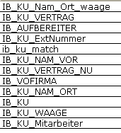
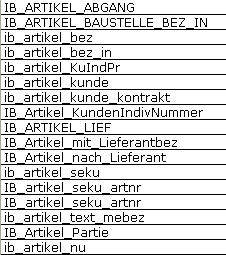
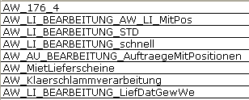
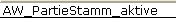
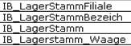

# Bedienerstamm: Pfleger

<!-- source: https://amic.de/hilfe/_kundenindividuellesq.htm -->

Dieser Pfleger dient zur Änderung und Erstellung von Bedienern

### Kopfdaten:

<div class="table-wrapper">
  <table>
    <tbody>
      <tr>
        <td colspan="2">
          <p><strong>Kopfdaten</strong></p>
        </td>
      </tr>
      <tr>
        <td>
          <p>Nummer</p>
        </td>
        <td>
          <p>Bedienernummer. Diese wird händisch vergeben und muss eindeutig sein.</p>
        </td>
      </tr>
      <tr>
        <td>
          <p>Kurzname</p>
        </td>
        <td>
          <p>Eindeutiger Login–Name beim Programmstart.</p>
        </td>
      </tr>
      <tr>
        <td>
          <p>Status</p>
        </td>
        <td>
          <p><b>Aktiv</b>: Bediener ist im Bedienerstamm und in der Datenbank angelegt. Mit diesem Bediener ist&nbsp; eine A.eins-Anmeldung möglich.</p>
          <p><b>Inaktiv</b>: Bediener ist im Bedienerstamm und in der Datenbank angelegt. Jedoch ist eine A.eins-Anmeldung nicht möglich.</p>
          <p><b>Gelöscht</b>: Bediener ist nur noch im Bedienerstamm aber nicht mehr in der Datenbank. Eine A.eins-Anmeldung ist nicht möglich.</p>
          <p><b>Neu</b>: Neuanlage des Bedieners. Nach dem Speichern wird dieser auf aktiv gesetzt.</p>
        </td>
      </tr>
    </tbody>
  </table>
</div>

### Register:

<details>
<summary>Allgemein</summary>

<div class="table-wrapper">
  <table>
    <tbody>
      <tr>
        <td colspan="2">
          <p><strong>Allgemein</strong></p>
        </td>
      </tr>
      <tr>
        <td>
          <p>Bedienerklasse</p>
        </td>
        <td>
          <p><strong>F3</strong> Zuordnung einer übergeordneten Abteilung; der Bediener erhält damit die Rechte der <a href="../bedienerklassen/bedienerklasse_pfleger.md">Bedienerklasse</a>.</p>
        </td>
      </tr>
      <tr>
        <td>
          <p>Betriebsstätte</p>
        </td>
        <td>
          <p>Betriebsstätte des Bedieners, so wie er auf Listen und Ausdrucken erscheint.</p>
        </td>
      </tr>
      <tr>
        <td>
          <p>Name</p>
        </td>
        <td>
          <p>Name des Bedieners.</p>
        </td>
      </tr>
      <tr>
        <td>
          <p>Name extern</p>
        </td>
        <td>
          <p>Für Listen, Ausdrucke, etc.</p>
        </td>
      </tr>
      <tr>
        <td>
          <p>Windows Login</p>
        </td>
        <td>
          <p>Ein in einem Windows Umfeld gestartetes A.eins fragt bisher immer noch einmal Bedienername und Kennwort ab, obwohl ja schon bei der Windows Anmeldung alle notwendigen Sicherheitsüberprüfungen abgewickelt worden sind.</p>
          <p>Durch das einfache Setzen der Feldes „Windows Login“ innerhalb des Bedienerstammes auf den Windows – Kontonamen (also den Windows Anmeldenamen) des entsprechenden Bedieners kann jetzt erreicht werden, dass dieser angemeldete Windows Bediener direkt auf den entsprechenden A.eins Bediener innerhalb von A.eins angemeldet wird, wenn A.eins gestartet wird. Es gibt nur eine 1 zu 1 Zuordnung zwischen einem Windows Benutzer und einem A.eins Bediener.</p>
          <p>Bei dieser Verwendung der Windows Authentifizierung wird A.eins sofort durchgestartet. Die A.eins Anmeldung müssen Sie in jedem Fall dann beibehalten, wenn unter ein und derselben Windows Anmeldung unterschiedliche Bediener tätig werden sollen.</p>
          <p>Ist der <a href="../../../steuerparameter/optionen_global/name_sicherheit_login_aktivieren_spa_769.md">SPA 769</a> „Name Sicherheit Login aktivieren“ auf <b>Ja</b> dann gilt zusätzlich, dass A.eins nach Einrichtung eines Bedieners mit angegebenem „Windows Login“ nun auch keinem Bediener ohne eingetragenen Namen Zugang zum System gewährt.</p>
          <p>Die Bedienerklasse des Bedieners bestimmt die Filialzugehörigkeit, damit ist es möglich über den „Windows Login“ den gleichen Windows-Kontonamen verschiedenen Aeins-Benutzern in verschiedenen Filialen zuzuordnen.</p>
          <p>Anwender in Nicht-Replikationsumgebungen oder Teil-Replikationen, die das Filialwesen anders als in Voll-Replikationen vorgesehen nutzen und trotzdem das über „Windows Login“ erreichbare AUTOLOGIN nutzen wollen, müssen den Aeins-Parameter FILIALLOGIN=FALSE setzen.</p>
        </td>
      </tr>
      <tr>
        <td>
          <p>Systemadmin</p>
        </td>
        <td>
          <p>Systemadministrator (Ja/Nein). Wird hier <b>Ja</b> eingetragen, erhält der Nutzer in entsprechenden Bereichen angepasste Rechte.</p>
        </td>
      </tr>
      <tr>
        <td>
          <p>Sperre</p>
        </td>
        <td>
          <p>Bedienersperre (Ja/Nein). Wird hier <b>Ja </b>eingetragen, so bleibt der Benutzer zwar im System, kann sich aber nicht mehr an A.eins anmelden.</p>
        </td>
      </tr>
      <tr>
        <td>
          <p>Protokollkontr.</p>
        </td>
        <td>
          <p>Der Bediener ist für die Kontrolle der Fehlerprotokolle zuständig (Ja/Nein). Es erfolgt ein Hinweis beim Einloggen des Bedieners.</p>
        </td>
      </tr>
      <tr>
        <td>
          <p>Newsvorlage</p>
        </td>
        <td>
          <p>Gibt an, ob die <a href="../../../../zusatzprogramme/newsticker.md">News</a> angezeigt werden oder nicht:</p>
        </td>
      </tr>
      <tr>
        <td>
          <p>Ausw.Listenadmin</p>
        </td>
        <td>
          <p>Steht hier ein „Ja“, so kann der Bediener die Anzeige in den Auswahllisten anpassen. Dazu gehört die Sortierung, Feldauswahl, Größe und Reihenfolge der Felder sowie die Farbdarstellung. Weiterhin werden diesen Bedienern auch Fehler in privaten Auswahllisten und der F3-Auswahl angezeigt.</p>
        </td>
      </tr>
      <tr>
        <td>
          <p>Ausw.Strg fest</p>
        </td>
        <td>
          <p>Dadurch, dass die Bedienung der Auswahlliste auf das unter Windows übliche Verfahren umgestellt wurde (z.B. mehrere Markieren durch Strg + Markieren) ist die einhändige Bedienung fast unmöglich. Wenn man hier ein <b>Ja </b>einträgt, so wird angenommen, dass die Steuerungstaste (Strg) immer gedrückt ist.</p>
        </td>
      </tr>
      <tr>
        <td>
          <p>Klassenadministr.</p>
        </td>
        <td></td>
      </tr>
      <tr>
        <td>
          <p>Ausw.Einstieg</p>
        </td>
        <td>
          <p>Standard Vorbelegung des Einstiegsverhalten bei Auswahllisten. Diese Einstellung wird verwendet, wenn die Auswahlliste das erste mal ausgewählt wird.</p>
        </td>
      </tr>
      <tr>
        <td>
          <p>Version F3-Auswahl</p>
        </td>
        <td>
          <p>Hie kann pro Bediener eingestellt werden, welche Variante der F3-Auswahl verwendet werden soll. Es existieren drei Auswahlmöglichkeiten:</p>
          <ul>
            <li>Standard Programmvorgabe. Diese kann eine der beiden folgenden sein:</li>
            <li>Feste Fensterdefinition , neues Design. Diese Einstellung entspricht der dokumentierten F3-Auswahl.</li>
            <li>Verschiebbare F3-Auswahl, altes Design.</li>
          </ul>
          <p>Mit dem A.eins-Startparameter ITEMBOX=FALSE wird die Standard-Programmvorgabe auf „Verscheibbare F3-Auswahl gesetzt. Ansonsten ist der Standard die neue Version der Itembox.<br><br></p>
        </td>
      </tr>
      <tr>
        <td>
          <p>Großer Font</p>
        </td>
        <td>
          <p>Ist unter Desktopeigenschaften ein großer Font eingestellt kann es passieren, dass die Auswahlliste nur zur Hälfte dargestellt wird. Wird hier ein <b>Ja </b>eingestellt, so wird eine spezielle Maske für die Auswahlliste verwendet, die die größere Schrift berücksichtigt.</p>
        </td>
      </tr>
      <tr>
        <td>
          <p>Form. Kurzliste</p>
        </td>
        <td>
          <p>wird hier kein Eintrag vorgenommen (0) wird standardmäßig das Formular 111 für den Ausdruck der Auswahllisten <strong>F4</strong> benutzt.</p>
          <p><b>Wichtig:</b> Je Bediener muss die korrekte Seitenlänge für den verwendeten Drucker eingestellt werden.</p>
        </td>
      </tr>
      <tr>
        <td>
          <p>Sprache</p>
        </td>
        <td>
          <p>Auswahl der <a href="../../../a_eins_sprache/index.md">Sprache</a> in der A.eins für diesen Anwender erscheinen soll. Diese Sprache wird von AMIC gepflegt und man kann sie mit <strong>F3</strong> auswählen. Die Sprachen Englisch, Dänisch, Niederländisch und Französisch sind Lizenzpflichtig. Wenn eine dieser Sprachen das erste Mal ausgewählt wird, so muss man die Aktivierung bestätigen. Es wird erst dann die aktuelle Sprache eingespielt und der Benutzer kann ohne Lizenz für 60 Tage diese Sprache nutzen. Danach muss die Lizenz erworben werden.</p>
          <p>Ohne Aktivierung wird die Spracheinstellung ignoriert.<br><br></p>
        </td>
      </tr>
      <tr>
        <td>
          <p>Sprache der Dokumentation</p>
        </td>
        <td>
          <p>Auswahl der Sprache in der die Hilfe für diesen Anwender erscheinen soll. Ist hier eine andere Sprache als Deutsch hinterlegt, so wird geprüft, ob die entsprechende Hilfedatei existiert. Ist dies nicht der Fall, so wird versucht, die englische Hilfe zu lesen, ansonsten die deutsche.</p>
        </td>
      </tr>
      <tr>
        <td>
          <p>Mail Typ</p>
        </td>
        <td>
          <p>Auswahl des Mail-Typs</p>
        </td>
      </tr>
      <tr>
        <td>
          <p>Mail Adresse</p>
        </td>
        <td>
          <p>Eingabe der Mail-Adresse</p>
        </td>
      </tr>
      <tr>
        <td>
          <p>Mail Postfach</p>
        </td>
        <td>
          <p>Eingabe des Mail Postfaches</p>
        </td>
      </tr>
      <tr>
        <td>
          <p>Per.Kennzeichen</p>
        </td>
        <td>
          <p>Eingabe des persönlichen Kennzeichens</p>
        </td>
      </tr>
    </tbody>
  </table>
</div>

</details>

<details>
<summary>Portal</summary>

Diese Funktion wird in A.eins nicht mehr genutzt, sondern nur noch supportet. Bei Fragen wenden sie sich bitte an den Amic-Support.

</details>

<details>
<summary>Farben</summary>

<div class="table-wrapper">
  <table>
    <tbody>
      <tr>
        <td colspan="2">
          <p><strong>Farben</strong></p>
        </td>
      </tr>
      <tr>
        <td>
          <p>Hauptmenü Hintergrund</p>
        </td>
        <td>
          <p>Farbeinstellung (Eingabe RGB-Code oder Auswahl mit <strong>F3</strong>)</p>
        </td>
      </tr>
      <tr>
        <td>
          <p>Hauptmenü Schrift</p>
        </td>
        <td>
          <p>Farbeinstellung (Eingabe RGB-Code oder Auswahl mit <strong>F3</strong>)</p>
        </td>
      </tr>
      <tr>
        <td>
          <p>Auswahlmenü Hintergrund</p>
        </td>
        <td>
          <p>Farbeinstellung (Eingabe RGB-Code oder Auswahl mit <strong>F3</strong>)</p>
        </td>
      </tr>
      <tr>
        <td>
          <p>Auswahlmenü Schrift</p>
        </td>
        <td>
          <p>Farbeinstellung (Eingabe RGB-Code oder Auswahl mit <strong>F3</strong>)</p>
        </td>
      </tr>
      <tr>
        <td>
          <p>Titel Hintergrund</p>
        </td>
        <td>
          <p>Farbeinstellung (Eingabe RGB-Code oder Auswahl mit <strong>F3</strong>)</p>
        </td>
      </tr>
      <tr>
        <td>
          <p>Titel Schrift</p>
        </td>
        <td>
          <p>Farbeinstellung (Eingabe RGB-Code oder Auswahl mit <strong>F3</strong>)</p>
        </td>
      </tr>
      <tr>
        <td>
          <p>Statusleiste Hintergrund</p>
        </td>
        <td>
          <p>Farbeinstellung (Eingabe RGB-Code oder Auswahl mit <strong>F3</strong>)</p>
        </td>
      </tr>
      <tr>
        <td>
          <p>Statusleiste Schrift</p>
        </td>
        <td>
          <p>Farbeinstellung (Eingabe RGB-Code oder Auswahl mit <strong>F3</strong>)</p>
        </td>
      </tr>
      <tr>
        <td>
          <p>F3-Auswahl(Itembox) Hintergrund</p>
        </td>
        <td>
          <p>Farbeinstellung (Eingabe RGB-Code oder Auswahl mit <strong>F3</strong>)</p>
        </td>
      </tr>
      <tr>
        <td>
          <p>Aktuelles Eingabefeld einfärben</p>
        </td>
        <td>
          <p>Auswahl, ob das aktuelle Eingabefeld, dass den Focus hat, eingefärbt dargestellt wird (Ja/Nein).&nbsp; Standardfarbe ist gelb (250/255/177) kann jedoch individuell angepasst werden.</p>
          <p>(Eingabe RGB-Code oder Auswahl mit <strong>F3</strong>)</p>
        </td>
      </tr>
      <tr>
        <td>
          <p>Auf AMIC Farben zurücksetzen</p>
        </td>
        <td>
          <p>Standard Farben einstellen (Ja/Nein)</p>
        </td>
      </tr>
      <tr>
        <td>
          <p>Farben für alle Bediener übernehmen</p>
        </td>
        <td>
          <p>Übernahme der Farbeinstellungen für alle Bediener (Ja/Nein)</p>
          <p>Dieses Feld ist deaktiviert, wenn bisher noch keine Bediener für die aktuelle Betriebsstätte (Filialnummer im Mandantenstamm) eingerichtet wurden. Standardeinstellung ist „Nein“.</p>
        </td>
      </tr>
    </tbody>
  </table>
</div>

</details>

<details>
<summary>Toolbar</summary>

Hier können der Toolbar die Funktionen aus den eigenen Favoriten aus dem Hauptmenü zugeordnet werden. In der Spalte Id wird die Funktionsident eingegeben. Mit **F3** können die Funktionen ausgewählt werden. Hat man keine Favoriten eingerichtet, erscheinen hier natürlich keine Daten. In der Bitmap muss eine Bitmap mit Pfadangabe stehen. Diese Bitmap sollte eine Größe von ca. 16\*16 Pixeln nicht überschreiten.

</details>

<details>
<summary>Formulararchiv</summary>

| Formulararchiv |
| --- |
| Hier kann man festlegen welche Formulare im Formulararchiv ein Bediener einer bestimmten Bedienerklasse einsehen darf. Die Formulare im Formulararchiv sind nach Bedienerklassen geschützt.<br>Im Standard sind allen Bedienerklassen erst mal alle Bedienerklassen zugeordnet. Man kann für die Bedienerklasse eines Bedieners im Register Formulararchiv bestimmte Bedienerklassen abwählen. |

</details>

<details>
<summary>Büro</summary>

| Büro | Beschreibung |
| --- | --- |
| **Telefonieeinrichtung** | <br> |
| MSN-Anschluss Telefonanlage | <br> |

</details>

 

<details>
<summary>Internet</summary>

| Internet | Beschreibung |
| --- | --- |
| Signatur-Datei | Dateiname der Datei mit einem PK12-Schlüssel zur Signierung von PDF-Dateien.<br> |

</details>

 

<details>
<summary>Versand</summary>

Hier können für den Bediener Versandstandards hinterlegt werden mehr dazu unter: [Mailversand](../../../../zusatzprogramme/mailversand_allgemein/index.md)

</details>

<details>
<summary>Erfasser</summary>

| Erfasser | Beschreibung |
| --- | --- |
| Standarderfasser | Hier kann ein Standarderfasser eingestellt werden, der beim Einloggen des Bedieners automatisch eingeloggt wird.<br> |
| Bediener-Erfasser-Zuordnung | Jedem Bediener müssen seine Erfasser explizit zugewiesen werden. Dabei kann ein Erfasser auch mehreren Bedienern zugewiesen werden.<br> |

</details>

 

<details>
<summary>Waage</summary>

Auf dieser Registerkarte kann dem Bediener mehrere Kombinationen vom Terminal (Waagenprofil) und Prozesse (Waagenvorlage) zugeordnet werden. Dies hat den Vorteil, dass nicht für jeden Standort mehrere private Funktionen erstellt werden müssen. Durch die Funktion [Wiegen](../../../../waagenanbindung/waagenanbindung_online_waage/funktionen_in_der_auswahlliste/wiegen_f5.md) in der [Hofliste](../../../../waagenanbindung/waagenanbindung_online_waage/index.md) wird eine Auswahlmaske angezeigt, welche die hier hinterlegten Kombinationen anzeigt.

Es ist nicht mögliche eine Kombination von [Terminal](../../../../waagenanbindung/waagenterminals/maske_waagenprofil/index.md) und [Prozesse](../../../../waagenanbindung/waagenanbindung_online_waage/prozess_einrichten/index.md) mehrfach zu hinterlegen. Es können aber unterschiedlichen [Prozessen](../../../../waagenanbindung/waagenanbindung_online_waage/prozess_einrichten/index.md) mehrere [Terminal](../../../../waagenanbindung/waagenterminals/maske_waagenprofil/index.md) zugeordnet werden.

Es können insgesamt dreißig Kombinationen für den [Wareneingang](../../../../waagenanbindung/waagenanbindung_online_waage/funktionen_in_der_auswahlliste/wareneingang_wiegung_rohwareneingang_f6_sf6.md), [Warenausgang](../../../../waagenanbindung/waagenanbindung_online_waage/funktionen_in_der_auswahlliste/warenausgang_wiegung_rohwarenausgang_f7_cf7.md), [Lagerumbuchung](../../../../vorgangsabwicklung/vorgangsbearbeitung_allgemein/vorgangsklassen_in_a_eins/lagerumbuchung.md) und [Lohnwiegung](../../../../waagenanbindung/waagenanbindung_online_waage/funktionen_in_der_auswahlliste/lohn_schuettwiegung_f8.md) angegeben. Diese dreißig Kombinationen können in den einzelnen Rubriken verteilt werden. Dazu wird in das Feld Position eine gültige Nummer für die gewünschte Rubrik angegeben. Es können in einer Rubrik unterschiedliche [Prozesse](../../../../waagenanbindung/waagenanbindung_online_waage/prozess_einrichten/index.md) stehen.

| Rubrik | Position |
| --- | --- |
| Eingangswiegungen | 1 bis 12<br> |
| Ausgangswiegungen | 21 bis 32<br> |
| Lohnwiegungen/Lagerumbuchung | 41 bis 46<br> |

| Waage | Beschreibung |
| --- | --- |
| Position | In diesem Feld wird die Positionsnummer hinterlegt. Diese kann sich von der Zeilen Zahl der Tabelle Unterscheiden. Die Positionsnummer ist wichtig, wenn eine Private Funktion erstellt werden soll. Der Privaten Funktion wird die Positionsnummer als Übergabeparameter mitgegeben. Diese sucht sich dann an der Nummer die aktuelle Kombination von Waagenterminal und [Waageprozesse](../../../../waagenanbindung/waagenanbindung_online_waage/prozess_einrichten/index.md) des Bedieners raus und Starten damit dann die Online Waage. Die Positionsnummer bestimmt die Anzeige. Für jeden Bediener kann an der Position eine Unterschiedliche Kombination von Terminal (Waagenprofil) und Prozess([Wagenvorlage](../../../../waagenanbindung/waagenanbindung_online_waage/prozess_einrichten/index.md)) existieren.<br> |
| Prozess(Vorlage) | In diesem Feld wird der Prozess(Waagenvorlage) hinterlegt.<br> |
| Aktiv | Mit diesem Feld kann der Datensatz aktiv gestellt werden. Ist hier ein Nein eingetragen, so kann auch kein Aufruf per Private Funktion erfolgen.<br> |
| Terminal | In diesem Feld wird das Terminal (Waagenprofil) hinterlegt.<br> |

| Einrichterparameter | Beschreibung |
| --- | --- |
| Andere Bezeichnung für Name Extern | Hier kann ein anderer Label Text für den Name extern eingetragen werden |

</details>

<details>
<summary>Auswahlliste</summary>

In diesem Register können Ausnahmen für die Ansicht einer spezifischen Auswahlliste gesetzt werden.

| Rubrik | Position |
| --- | --- |
| [Auswahlliste 2.0](../../../../zusatzprogramme/auswahlliste_2_0/index.md) | 0: folgende Anwendungen mit der neuen Auswahlliste darstellen<br>1: folgende Anwendung NICHT mit der neuen Auswahlliste darstellen<br> |
| Anwendungen | Hier werden die Ausnahmen der Auswahllisten hinzugefügt.<br> |

</details>

 

### Funktion:

<details>
<summary>Bedienerstamm Pfleger Funktionen</summary>

| Funktionen | Beschreibung |
| --- | --- |
| Speichern **(F9)**,<br>Neu **(F8)**,<br>Speichern unter **(shift + F9)<br>**<br> | |
| Kundenindiv. SQL Anpassung | [Kundenindiviuelle SQL Anpassung](./bedienerstamm_pfleger.md#KundenindiSQL)<br><br> |
| Anschrift | Ruft den Anschriftenpfleger für diesen Bediener auf.<br> |
| Bediener aktivieren | Setzt den Status auf aktiv. Nur möglich, wenn der Status auf inaktiv steht.<br> |
| Bediener deaktivieren | Setzt den Status auf inaktiv. Nur möglich, wenn der Status auf aktiv steht.<br> |
| Passwort zurücksetzten | Setzt das Passwort für diesen Bediener zurück.<br> |
| Auswahlliste zurücksetzen | Hier werden die Einstellungen des Anwenders wieder auf Standard zurückgesetzt. Dazu gehören folgende Einstellungen:<br><ul><li>Sortierung</li><li>Ein oder ausgeblendete Spalten</li><li>Spaltenbreit und Position</li><li>Schriftart (nur AW 2.0)</li><li>Design (nur AW 2.0)</li><li>Excelaugabe (nur AW 2.0)</li><li>Gruppieren und Filterzeile<br>&nbsp;</li></ul> |

</details>

### Kundenindividuelle SQL Anpassung

Hauptmenü > Administration > Firmenkonstanten > Bediener

oder Direktsprung **[BD]**

Öffnet man die Maske für einen Bediener, dann findet man in der Option Box die Funktion ***Kundenindiv. SQL Anpassung***, die die Auswahlliste zur kundenindividuellen SQL Anpassung öffnet. Für den jeweiligen Bediener sieht man dann die Einstellungen der bisherigen Variablen.

Mit der ***Ändern*** Funktion kann man den Ausdruck für die jeweilige Variable ändern.

Mit Hilfe des Feldes ***für alle Bediener übernehmen?*** kann man diesen Ausdruck für die jeweilige Variable beim Speichern für alle Bediener eintragen lassen.

Mit der ***Löschen*** Funktion kann man den Ausdruck für die jeweilige Variable löschen.

Beim Bestätigen des Löschens wird man immer gefragt, ob man die Variable auch für alle anderen Bediener löschen möchte. Die Antwort auf diese Frage ist mit ‚Nein’ vorbelegt.

Die Vorbelegung dieser Variablen für einen Bediener bewirkt eine Eingrenzung von SQL Texten wie z.B. Itemboxen oder Auswahllisten oder eine Vorbelegung bei der Neuanlage eines Vorganges.

### Die bisher möglichen Variablen:

Wo diese Variablen aktuell eingesetzt werden, kann man z.B. mit Hilfe von OSQL überprüfen. Es ist möglich, dass sich der Einsatz der Variablen im Laufe der Zeit erweitert. Hier wird der zurzeit aktuelle Stand dargestellt.

(gesucht über OSQL und einem Befehl wie diesem):

```sql
select * from sql_text where sql_texttext like '%WWW_IB_KUNDEN%'
```

<details>
<summary>WWW_IB_KUNDEN</summary>

Diese Variable kommt in folgenden Itemboxen vor und bewirkt dort eine Eingrenzung auf den jeweiligen Ausdruck:



</details>

<details>
<summary>WWW_IB_ARTIKEL</summary>

Diese Variable kommt in folgenden Itemboxen vor und bewirkt dort eine Eingrenzung auf den jeweiligen Ausdruck:



</details>

<details>
<summary>WWW_V_KUNDNUMMER</summary>

Vorbelegung der Kundennummer für die Neuanlage eines Vorgangs.  
Im Programmcode svmain.jpl

</details>

<details>
<summary>WWW_AW_LIEFERUNG</summary>

Diese Variable kommt in folgenden Auswahllisten vor und bewirkt dort eine Eingrenzung auf den jeweiligen Ausdruck:



</details>

<details>
<summary>WWW_V_LAGERNUMMER</summary>

Vorbelegung der Lagernummer für die Neuanlage eines Vorgangs.  
Im Programmcode svmain.jpl

</details>

<details>
<summary>WWW_AW_PARTIESTAMM</summary>

Diese Variable kommt in folgender Auswahlliste vor und bewirkt dort eine Eingrenzung auf den jeweiligen Ausdruck:  


</details>

<details>
<summary>WWW_IB_LAGERSTAMM</summary>

Diese Variable kommt in folgenden Itemboxen vor und bewirkt dort eine Eingrenzung auf den jeweiligen Ausdruck:



</details>
