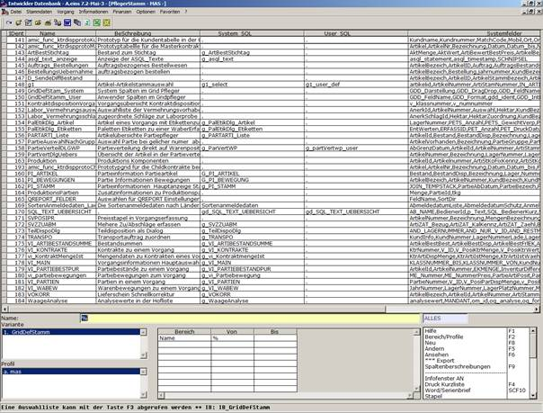

# Auswahl einer Griddefinition

<!-- source: https://amic.de/hilfe/_auswahleinergriddefi.htm -->

Wählen Sie eine bestehende Griddefinition aus der Liste aus. Sie können nach dem Namen in der Liste suchen, indem Sie die Filterfunktion benutzen und mit den in A.eins üblichen Suchkriterien den Namen eingeben (z.B. ‚Auftrag%‘ für alle Definitionen, die mit ‚Auftrag‘ beginnen).
