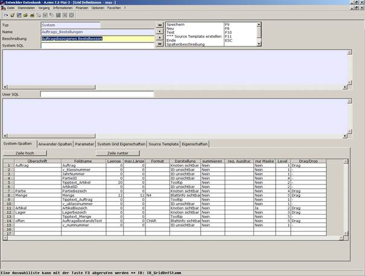

# Bearbeitungsmaske Registerkarten

<!-- source: https://amic.de/hilfe/_bearbeitungsmaskereg.htm -->

Im unteren Bereich finden Sie 6 Registerkarten.

Siehe auch:

- [System-Spalten](./system_spalten.md)
- [Anwender-Spalten](./anwender_spalten.md)
- [Parameter](./parameter.md)
- [System-Grid Eigenschaften](./system_grid_eigenschaften.md)
- [Source-Template](./source_template.md)
- [Eigenschaften](./eigenschaften.md)
- [Tree-Eigenschaften](./tree_eigenschaften.md)
