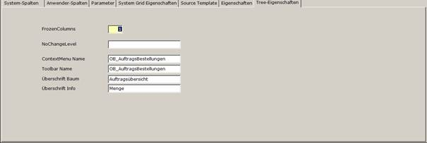

# Tree-Eigenschaften

<!-- source: https://amic.de/hilfe/_ treeeigenschaften.htm -->

### Frozen Columns

Dieser Eintrag kann in zwei verschiedenen Zusammenhängen verwendet werden:

- Der Wert Frozen Columns bedeutet im Regelfall, dass n Spalten festgehalten werden, wenn man über die Spalten scrollt. Z.B. beim Eintrag von 2 wird werden die ersten beiden Spalten eingefroren so das sie bei der Betätigung des Scroll Balkens sichtbar bleiben

  So können Sie die Übersichtlichkeit einer Anzeige erhöhen, wenn z.B. in der ersten Spalte ein Name und in den weiteren Spalten scrollbar Adressen und weitere Daten stehen.

- Der Wert Frozen Columns wird im Zusammenhang mit der Darstellung von Baumstrukturen verwendet, um anzugeben, bis zu welchem Level der angezeigte Baum geöffnet sein soll. Alle Werte eines höheren Levels werden als „eingerollte“ Information dargestellt. Enthält die Ergebnismenge der anzeigenden Prozedur ein Feld des Namens „GDS_Frozen_Cols“, so wird diese Voreinstellung nicht verwendet, sondern eine Zeilenindividuelle Darstellung benutzt.

### NoChangeLevel

Dieser Wert wird im Zusammenhang mit der Darstellung von Baumstrukturen verwendet, um den Namen einer Spalte im Resultset anzugeben, die Informationen darüber enthält, ab welchem Level der Baum im Zielframe nicht neu aufgebaut werden muss.

**Beispiel:**

Beim Klick auf einen Eintrag im Quellfrage (z.B. Artikel) wird im Ziel-Frame eine Liste mit Lieferanten dieses Artikels aufgebaut. Die verwendete Prozedur wertet die Partie nicht aus. Es ist also nicht notwendig, den Ziel-Frame beim Klick auf die Partie(n) des Artikels neu zu laden. Im Resultset kann also der Level des Artikels in diesem Fall in das Feld gesetzt werden, dessen Name hier eingetragen ist.

### ContextMenuName

Dieser Wert wird im Zusammenhang mit der Darstellung von Baumstrukturen verwendet. Es ist der Name der Optionbox, in der die Kontextmenus für die Frameanzeige definiert werden kann.

### Toolbar Name

Dieser Wert wird im Zusammenhang mit der Darstellung von Baumstrukturen verwendet. Wenn es sich bei dieser Beschreibungsstruktur um die Beschreibungsstruktur des Quell-Frames handelt, so wird hier der Name der Optionbox angezeigt, die Toolbar-Elemente für diese Vorgangsklasse enthalten.

### Überschrift Baum

Diese Überschrift wird über dem Baum des Frames dargestellt

### Überschrift Info

Diese Überschrift wird über der zweiten Spalte des Frames über den Blattinformationen dargestellt.
