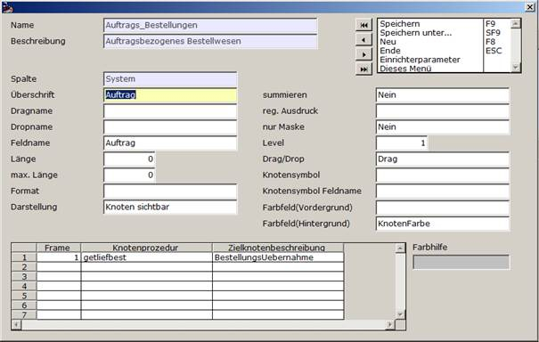

# Bearbeitungsmaske Spaltenbeschreibungen

<!-- source: https://amic.de/hilfe/_bearbeitungsmaskespa.htm -->

In den System- und Anwenderspalten finden Sie eine Liste von Einträgen. Diese können Sie in der Liste mit den wichtigsten Werten versehen. Wenn Sie die Option „Spaltenbeschreibungen“ wählen, so können Sie diese Werte für jede Zeile editieren.

Dabei sind nicht immer alle der im Folgenden benannten Felder sichtbar bzw. notwendig.

### Spalte

- System gibt an, dass es sich um eine vom Entwickler vorgegebene Spalte handelt, die vom Anwender nicht editiert werden kann.
- Anwender gibt an, dass es sich um eine vom Anwender definierte und editierbare Spaltendefinition handelt.

### Überschrift

Dies ist die Überschrift für die Spalten.

Die Überschrift wird im Zusammenhang mit Baumdarstellungen bei Blattinformationen als Bezeichner des Wertes angezeigt. In Knoten hat die Überschrift keine Bedeutung, in Blattinformationen soll sie eingetragen sein.

### Dragname

Dieser Wert wird nur im Zusammenhang mit Baumdarstellungen verwendet.

Wird ein Element angeklickt, abgelegt oder verändert, so sollen Informationen an eine definierte Knotenprozedur gegeben werden. Die Namen der Parameter, in die die Werte geschrieben werden sollen, werden hier festgelegt. Wird der Inhalt dieses Feldes leer gelassen, so wird dieser Wert nicht an eine Prozedur übertragen.

Ist das Feld vom Typ „Blatt Abfragbar“, und wird der Wert im Blatt verändert, so wird der ursprüngliche Wert mit dem hier angegebenen Parameternamen übergeben.

### Dropname

Dieser Wert wird nur im Zusammenhang mit Baumdarstellungen verwendet.

Wird ein Element mit Drag&Drop abgelegt oder geändert, so sollen Informationen an eine definierte Knotenprozedur gegeben werden. Die Namen der Parameter, in die die Werte geschrieben werden sollen, werden hier festgelegt.

Ist das Feld vom Typ „Blatt Abfragbar“, und wird der Wert im Blatt verändert, so wird der geänderte Wert mit dem hier angegebenen Parameternamen übergeben.

### Feldname

Dies ist der Name des Datenfeldes im Resultset einer Prozedur oder des SQL. Die Daten aus diesem Feld des Prozedurergebnissatzes werden mit diesem Eintrag näher beschrieben. Dies ist ein Pflichtfeld.

### Länge

Spaltenbreite

### max. Länge

maximale Länge der Daten in der Spalte. Bei „0“ besteht keine Begrenzung

### Format

Hier sind die gängigen Aeins-Formate wie I4 für Ganzzahlen, D4 für Zahlen mit 4 Nachkommastellen oder CHAR für Texte einzutragen. Ein Eintrag ist nur bei Werten notwendig, die angezeigt werden sollen.

Wird diese Angabe frei gelassen, ist das Format der Anzeige von der Datenbank abhängig.

### Darstellung

Mit der Darstellung wird festgelegt, welchem Zweck dieser Eintrag dient. Es sind folgende Einträge möglich:

  <table>
    <tbody>
      <tr>
        <td>
          
<strong>Nr</strong>

        </td>
        <td colspan="2">
          
<strong>Bezeichnung</strong>

        </td>
        <td>
          
<strong>Beschreibung</strong>

        </td>
      </tr>
      <tr>
        <td>
          
0

        </td>
        <td>
          
Unsichtbar

        </td>
        <td colspan="2">
          
Dieser Wert wird nicht angezeigt. Diese Option kann verwendet werden, um Werte an eine Speicherprozedur zu übergeben, die für die Identifikation des Datensatzes, nicht aber für Anzeige benötigt werden. Dies ist zum Beispiel der Fall bei Einträgen, die einen Drag- oder Dropname enthalten.

        </td>
      </tr>
      <tr>
        <td>
          
1

        </td>
        <td>
          
Sichtbar

        </td>
        <td colspan="2">
          
Dieses Feld ist sichtbar, kann jedoch nicht editiert werden

        </td>
      </tr>
      <tr>
        <td>
          
2

        </td>
        <td>
          
Eingebbar

        </td>
        <td colspan="2">
          
Dieses Feld ist sichtbar und kann editiert werden

        </td>
      </tr>
      <tr>
        <td>
          
3

        </td>
        <td>
          
betretbar

        </td>
        <td colspan="2">
          
Dieses Feld kann betreten, jedoch der Inhalt nicht abgeändert werden.

        </td>
      </tr>
      <tr>
        <td>
          
4

        </td>
        <td>
          
Knoten

        </td>
        <td colspan="2">
          
Dieser Wert wird nur im Zusammenhang mit Baumdarstellungen verwendet.

          
Dieses Element wird als Knoten angezeigt. Es beinhaltet einen anzuzeigenden Inhalt wie einen Text oder eine Nummer

        </td>
      </tr>
      <tr>
        <td>
          
5

        </td>
        <td>
          
Blatt

        </td>
        <td colspan="2">
          
Dieser Wert wird nur im Zusammenhang mit Baumdarstellungen verwendet.

          
Dieses Element ist eine Information am Ende des Baumes. Deshalb wird sie Blatt genannt. Die Information wird auf der rechten Seite neben dem Blatt dargestellt, während die oben erwähnte Überschrift als Bezeichner im Baum steht. Diese Information kann nicht editiert werden.

        </td>
      </tr>
      <tr>
        <td>
          
6

        </td>
        <td>
          
Tooltipp

        </td>
        <td colspan="2">
          
Dieser Wert wird nur im Zusammenhang mit Baumdarstellungen verwendet.

          
Wird die Maus über ein Element bewegt, das den gleichen Level hat, wie dieser Eintrag, so wird ein Hinweistext im HTML-Format dargestellt, der in diesem Feld steht. So sind für jede Spalte auch zusätzliche Informationen anzeigbar, die erst beim Ansteuern des Knotens mit der Maus sichtbar werden.

        </td>
      </tr>
      <tr>
        <td>
          
7

        </td>
        <td>
          
Blatt mit Darstellung

        </td>
        <td colspan="2">
          
Dieser Wert wird nur im Zusammenhang mit Baumdarstellungen verwendet.

          
Hier handelt es sich um ein Blatt, dessen Anklicken auf den Zielframes eine Anzeige auslöst. Dies ist zum Beispiel verwendbar, wenn im Zielframe ein Dokument dargestellt werden soll.

        </td>
      </tr>
      <tr>
        <td>
          
8

        </td>
        <td>
          
Unsichtbare ID

        </td>
        <td colspan="2">
          
Dieser Wert wird nur im Zusammenhang mit Baumdarstellungen verwendet.

          
Hier handelt es sich um eine ID, die im Fall einer Aktion an eine Prozedur übergeben wird. Die ID wird nicht angezeigt.

        </td>
      </tr>
      <tr>
        <td>
          
9

        </td>
        <td>
          
Blatt Abfrage

        </td>
        <td colspan="2">
          
Dieser Wert wird nur im Zusammenhang mit Baumdarstellungen verwendet.

          
Im Prinzip wie ein Blatt in 5, jedoch lässt sich dieser Wert nachträglich mit einem Doppelklick editieren.

        </td>
      </tr>
      <tr>
        <td>
          
10

        </td>
        <td>
          
MIME-Inhalt

        </td>
        <td colspan="2">
          
Dieser Wert wird nur im Zusammenhang mit Baumdarstellungen verwendet.

          
Der Inhalt des Feldes, das hier benannt wird, soll in einem Browser statt in einem Baum dargestellt werden.

          
In der Beschreibungsstruktur ist außer diesem Eintrag nur EIN weiterer Eintrag mit dem MIME-Typ zulässig.

        </td>
      </tr>
      <tr>
        <td>
          
11

        </td>
        <td>
          
MIME-Typ

        </td>
        <td colspan="2">
          
Dieser Wert wird nur im Zusammenhang mit Baumdarstellungen verwendet.

          
Der Inhalt des Feldes, das hier benannt wird, gibt an, von welchem Typ der Inhalt ist, der in einem Browser dargestellt werden soll.

          
In der Beschreibungsstruktur ist außer diesem Eintrag nur EIN weiterer Eintrag mit dem MIME-Inhalt zulässig.

        </td>
      </tr>
    </tbody>
    <tbody>
      <tr>
        <td></td>
        <td></td>
        <td></td>
        <td></td>
      </tr>
    </tbody>
  </table>

Die Darstellungsangabe ist ein Pflichtfeld. Eine andere Auswahl als die aus der obigen Liste führt dazu, dass dieses Feld nicht ausgewertet wird.

### summieren

Dieses Feld wird Summiert (nicht bei Baumdarstellungen)

### reg Ausdruck

Der Name des zu verwendenden regulären Ausdruckes (nicht bei Baumdarstellungen)

### Nur Maske

Wenn das Feld nicht durch das System SQL u. das User SQL befüllt werden soll (nicht bei Baumdarstellungen)

### Level

Dieser Wert wird nur im Zusammenhang mit Baumdarstellungen verwendet.

Diese Zahl gibt an, auf welchem Level des Baums die Information dargestellt wird. Level 1 ist dabei die oberste Ebene, alle dazu gehörigen Elemente sind in Level 2 usw. Beispiel :

| Level | Wert |
| --- | --- |
| 1 | Auftrag |
| 2 | Position |
| 3 | Partie |
| 4 | Menge |
| 4 | Jahrgang |

Die letzten beiden Informationen stehen im gleichen Level. Das ist nur dann erlaubt, wenn die Information als Blattinformation im letzten Level dargestellt wird.

### DragDrop

Dieser Wert wird nur im Zusammenhang mit Baumdarstellungen verwendet.

Hier werden Informationen darüber vorgehalten, ob das Element dieses Levels gezogen werden darf (DRAG) oder ob auf dem Element in diesem Level etwas abgelegt werden darf (DROP).

| Nr | Bezeichnung | Beschreibung |
| --- | --- | --- |
| 0 | Darf nix | Hier darf weder gezogen noch abgelegt werden |
| 1 | Darf DRAG | Dieses Element darf gezogen werden |
| 2 | Darf DROP | Auf diesem Element darf ein anderes Element abgelegt werden |
| 3 | Darf DRAG & DROP | Dieses Element darf gezogen und hier dürfen andere Elemente abgelegt werden |

Diese Information muss in einem sichtbaren Element (Knoten oder Blatt) hinterlegt sein. Einträge in Zeilen des gleichen Levels werden nicht berücksichtigt.

Diese Angabe ist eine Pflichtangabe für jeden Eintrag in den Baumdarstellungen.

### Knotensymbol

Dieser Wert wird nur im Zusammenhang mit Baumdarstellungen verwendet.

Hier kann der Name eines Icons aus der A.eins-Icon-Liste angegeben werden. Das Icon wird bei Elementen diesen Levels angezeigt. So zum Beispiel ein Geldstück beim Preis, einen Sack bei Menge und ein Regal bei Lager.

Diese Information muss in einem sichtbaren Element (Knoten oder Blatt) hinterlegt sein.

Einträge in Zeilen des gleichen Levels werden nur bei Blattinformationen berücksichtigt.

Diese Voreinstellung kann durch das einen Eintrag überschrieben werden, der in der Ergebnismenge der Prozedur steht.

### Knotenicon Feldname

Dieser Wert wird nur im Zusammenhang mit Baumdarstellungen verwendet.

Soll abweichend von dem Knotensymbol, das für die einzelnen Spalten des Ergebnissatzes festgelegt wurde, ein individuelles Knotensymbol für einen Eintrag angezeigt werden, so kann der Feldname in dem das Knotensymbol bezeichnet wird, hier eingetragen werden. Da diese Zuweisung für diesen Feldnamen individuell ist, können so auch mehrere individuelle Knotensymbole pro Ergebnissatz abgelegt werden.

### Farbfeld Vordergrund

Dieser Wert wird nur im Zusammenhang mit Baumdarstellungen verwendet.

Soll der Eintrag in einer besonderen Text-Farbe gekennzeichnet sein, so kann hier der Name des Datenfeldes hinterlegt werden, in dem diese Farbe zu finden ist.

Die Angabe der Farbe muss als RBG-Wert erfolgen mit „/“ getrennt, also zum Beispiel „255/0/0“ für ROT oder „0/0/0“ für schwarz.

Um eine Farbe zu ermitteln, die Sie später verwenden wollen, können Sie mit Hilfe des Farbdialogs eine Farbkombination bestimmen.

Diese soll hier NICHT gespeichert werden. An dieser Stelle wird nur der Name des Feldes eingetragen, das im Ergebnissatz der Prozedur die Farbe angibt!

Der Standardwert, wenn dieses Feld leer ist oder das benannte Datenbankfeld keinen Inhalt hat, ist schwarz.

Diese Information muss in einem sichtbaren Element (Knoten oder Blatt) hinterlegt sein. Einträge in Zeilen des gleichen Levels werden nicht berücksichtigt.

### Farbfeld Hintergrund

Dieser Wert wird nur im Zusammenhang mit Baumdarstellungen verwendet.

Soll der Eintrag in einer besonderen Hintergrund-Farbe gekennzeichnet sein, so kann hier der Name des Datenfeldes hinterlegt werden, in dem diese Farbe zu finden ist.

Die Angabe der Farbe muss als RBG-Wert erfolgen mit „/“ getrennt, also zum Beispiel „255/0/0“ für ROT oder „0/0/0“ für schwarz.

Um eine Farbe zu ermitteln, die Sie später verwenden wollen, können Sie mit Hilfe des Farbdialogs eine Farbkombination bestimmen.

Diese soll hier NICHT gespeichert werden. An dieser Stelle wird nur der Name des Feldes eingetragen, das im Ergebnissatz der Prozedur die Farbe angibt!

Der Standardwert, wenn dieses Feld leer ist oder das benannte Datenbankfeld keinen Inhalt hat, ist weiß.

Diese Information muss in einem sichtbaren Element (Knoten oder Blatt) hinterlegt sein. Einträge in Zeilen des gleichen Levels werden nicht berücksichtigt.

### Framedarstellung

Diese Tabelle wird nur im Zusammenhang mit Baumdarstellungen verwendet.

Wird auf dem Quellframe ein Element angeklickt, so soll sich in dem Zielframe ein Baum aufbauen. Für den Zielframe muss ebenso eine Prozedur und eine Beschreibungsstruktur eingerichtet werden.

Da es mehrere Zielframes geben kann, ist im Listenfeld des Gridstammpflegers die Möglichkeit gegeben, für jeden der Frames diese Daten festzulegen. Framenummer 0 bezeichnet dabei den Quellframe, 1 den ersten Frame usw.

Der Eintrag in diese Liste mit der „eigenen“ Framenummer, also der Framenummer, in dem die Daten mit der zu bearbeitenden Beschreibungsstruktur dargestellt werden, bedeutet dass diese Prozedur verwendet werden soll, um Änderungen oder Verschiebungen innerhalb des Frames zu speichern.

Angegeben werden also

- Die Framenummer
- Die Knotenprozedur
- Die Zielknotenbeschreibung

### Knotenprozedur

Die hier eingetragene Prozedur wird in 3 Szenarien aufgerufen:

- Wird ein Element dieses Levels angeklickt, so soll in dem Zielframe eine Anzeige stattfinden. So zum Beispiel eine Liste der bereits bestehenden Bestellungen dieses Artikels oder der Lieferanten, die diesen Artikel liefern. Die Daten werden mit Hilfe dieser Prozedur ermittelt. (Datenprozedur)
- Beim Ablegen (droppen) auf diesem Element wird die Prozedur zur Speicherung der Daten aufgerufen. (Speicherprozedur)
- Beim Ändern eines Wertes im Blatt wird die Änderungsinformation zum Speichern an diese Prozedur übergeben. (Speicherprozedur)

Diese Information muss in einem sichtbaren Element (Knoten oder Blatt) hinterlegt sein. Einträge in Zeilen des gleichen Levels werden nicht berücksichtigt.
