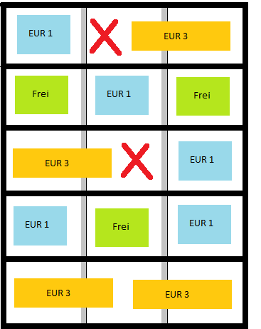

# Anwendung von LokalitätenGruppe

<!-- source: https://amic.de/hilfe/_lokalitaetengruppeanwendung.htm -->

Eine Gruppe von Lokalitäten fasst Lokalitäten zusammen.

Das findet in erster Linie Anwendung bei Regalfächern, die mehrere Regalplätze haben. Die Regalplätze werden als Lokalitäten eingerichtet, die Gruppe fasst dieses Regalfach zusammen.

Die Einrichtung ist optional!

Anwendungsgebiet kann zum Beispiel die Belegung von Lagerplätzen mit übergroßen Ladeträgern sein:

Angenommen, das Lagerfach umfasst 3 Palettenplätze für EUR1-Paletten 80x120cm. Nun soll in eines der Fächer ein Ladeträger des Typs EUR3 120x120cm eingelagert werden. Dadurch ist der daneben liegende Lagerplatz belegt.

Das Anfahren von Regalplätzen, die teilweise von nebenstehenden Paletten genutzt werden, ist nicht möglich.

Damit diese Regeln beachtet werden, müssen in den Ladeträgertypen die Breiten ebenso gepflegt sein, wie die Breite der Lokalitätsgruppe und die Gruppe und Index in den Lokalitäten.
