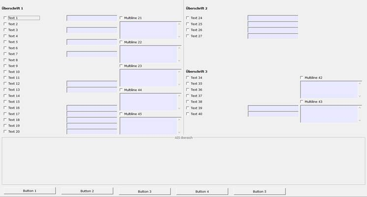
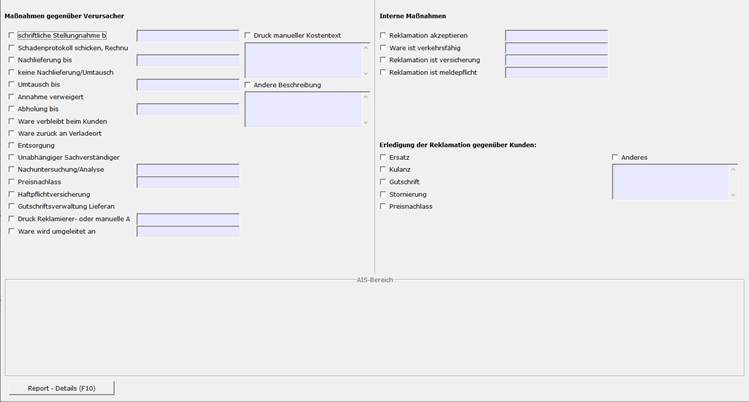

# Reklamationsmaßnahme (SPA 1040)

<!-- source: https://amic.de/hilfe/_SPA_1040.htm -->

In diesem Steuerparameter werden die Texte für die Reklamationsmaßnahmen hinterlegt, sowie das Verhalten der eingebbaren Felder gesteuert.

Folgende Einstellungen sind möglich. Ist dieser Steuerparameter nicht eingereicht, so wird ein Standard Profil gezogen,

| Feld | Bedeutung |
| --- | --- |
| Datentyp | Auf diesem Feld wirkt das Anwenderformat AF_REKLMASS. Mit diesem Format wird das Verhalten der einzelnen Felder gesteuert. 0(keine): Das dazugehörige eingebbare Feld wird nicht angezeigt 1(Text): Das Feld ist ein Textfeld 2(Datum): Das Feld ist ein Datumsfeld 3(Integer): Das Feld ist ein ganz Zahl Feld 4(Numeric): Das Feld ist ein numerisches Feld 5(JaNein): Das Feld ist ein FS-Format mit den Werten Ja und Nein Ab 100: Hier können eigene FS- und AF-Formate genutzt werden. Eintrag erfolgt analog zu Nr. 5 |
| Feldnummer | In diesem Feld wird die Feldnummer angeben. Bislang werden die Zahlen von 1 bis 45 unterstützt. |
| Text | In diesem Feld wird der anzuzeigende Text für die jeweilige Auswahlbox eingetragen. |

Ansicht der Nummerierten Felder:

Auslieferung

