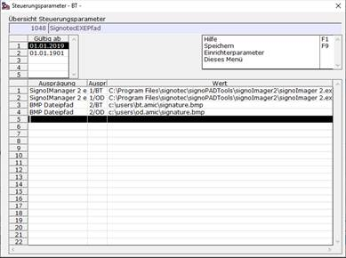
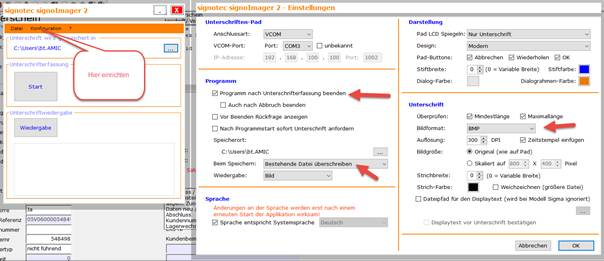
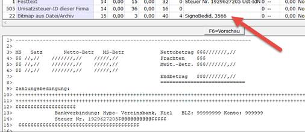

# Signierung eines Beleges (SPA 1048)

<!-- source: https://amic.de/hilfe/_SPA_1048.htm -->

Bevor ein Beleg zum Sofortdruck aufgerufen wird, kann diesem eine Unterschrift per Signotec (elektronische Unterschrift) zugeordnet werden. Das Signotecc System wird im Program Files Ordner installiert, hier gibt es dann eine SignoIManager 2.exe Datei, deren Pfad userspezifisch zugeordnet werden muss. Es ist jeweils der Merkmalstyp und das Bedienerkürzel anzugeben, getrennt durch einen Schrägstrich (/).

Als zweites muss noch angegeben werden, in welches Pfad (incl. Dateiname) die Unterschrift gespeichert werden soll. Es sind hier NUR BMP Dateien zugelassen, siehe dazu auch die Signotec Einrichtung.

Zusätzlich muss dann im Formular der Bereich 22 (Bitmap) eingebaut werden, im Textschlüssel ist dann SignoBedid, 3566 einzutragen,

Es wird dann während der Laufzeit die an diesem Arbeitsplatz gefundene (und als BMP gespeicherte) Unterschrift dem Formular zugeordnet, und wenn gewünscht auch sofort archiviert.
