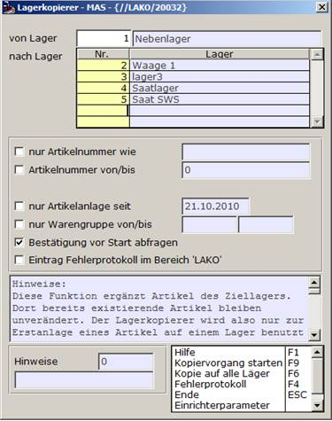

# Lagerkopierer (LAKO)

<!-- source: https://amic.de/hilfe/_lagerkopiererlako.htm -->

Hauptmenü > Stammdatenpflege > Allgemeine Stammdaten > Lagerkopierer

Direktsprung **[LAKO]**

Mit Hilfe des Lagerkopierers können Artikel auf neu angelegte Lagerorte kopiert werden. Dies dient nur zur Erstanlage der Artikel, vorhandene Artikel bleiben erhalten!

Es können Artikel von einem auf ein oder mehrere Läger kopiert werden.

  <table>
    <tbody>
      <tr>
        <td colspan="2">
          
<strong>Einstellungen</strong>

        </td>
      </tr>
      <tr>
        <td>
          
nur Artikelnummer wie

        </td>
        <td>
          
Es wird nur ein Artikel kopiert

        </td>
      </tr>
      <tr>
        <td>
          
Artikelnummer von/bis:

        </td>
        <td></td>
      </tr>
      <tr>
        <td>
          
nur Artikelanlage seit

        </td>
        <td>
          
Kopiert Artikel ab einem Anlagedatum

        </td>
      </tr>
      <tr>
        <td>
          
nur Warengruppe von/bis

        </td>
        <td></td>
      </tr>
      <tr>
        <td>
          
Bestätigung vor Start abfragen

        </td>
        <td></td>
      </tr>
      <tr>
        <td>
          
Eintrag Fehlerprotokoll im Bereich ‘Lako’

        </td>
        <td></td>
      </tr>
    </tbody>
  </table>

Erklärung siehe Hinweise!

#### Besonderheit

In dem Einrichterparameter „[Folgenden Bediener dürfen nur das Sortimentslager bearbeiten](../einrichterparameter/lagerkopierer_epa_lako.md)“ kann als Liste hinterlegt werden, welcher Bediener nur das Sortimentslager bearbeiten darf. Dieser Bediener kann dann kein anderes Lager auswählen.
