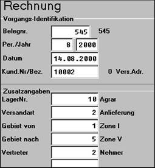
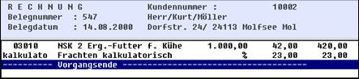

# Ablauf im Vorgang

<!-- source: https://amic.de/hilfe/ablaufimvorgang.htm -->

Die Frachtermittlung kann vollautomatisch ablaufen; nachfolgend wird am Beispiel der Rechnungserfassung ein Erfassungsablauf dargestellt, bei dem der Bediener Steuerungsmöglichkeiten erhält. Hierzu wurden mittels UFLD – Steuerung die Felder Lager, Versandart, Gebiet von, Gebiet nach im Rechnungskopf aktiviert und im Erfassungsbildschirm mittels Formulargenerator die Zu-/Abschlagszeile (Bereich 121) eingerichtet. Es ergibt sich dann folgender Ablauf:

**Diese Eintragungen führen bei der Positionserfassung zu folgendem Ergebnis:**

Bei der kalkulatorischen Frachtermittlung wird der Rechnungsbetrag durch die Fracht nicht verändert; sie wird lediglich intern geführt und kann zu Umbuchungen führen (s.u.). Eine echte Fracht dagegen erhöht den Rechnungsbetrag und führt zu Buchungen.

Durch Wahl einer anderen Versandart oder Zuordnung anderer Gebiete verändert sich die Frachtbelastung, so dass hiermit auch die Problematik von Rundtouren, wo nicht von festen Zuordnungen ausgegangen wird, gelöst werden kann.
