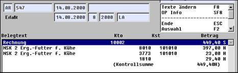

# Verbuchung

<!-- source: https://amic.de/hilfe/verbuchung.htm -->

Da es sich um eine kalkulatorische Umbuchung handelt, werden oben ermittelte Frachten in der Warenstatistik nicht berücksichtigt. Allerdings werden sie im Vorgang gespeichert und können von dort ausgewertet werden. Näheres dazu im Anhang.

Entsprechend der Erlöskennziffernzuordnung in der Frachttabelle erfolgt eine Verteilung in der Finanzbuchhaltung auf Warenerlös und Frachten:

Im Gegensatz zur kalkulatorischen Buchung wird bei der echten Frachtermittlung keine Umbuchung ausgelöst, sondern eine direkte Buchung gesteuert durch die Erlöskennziffer veranlasst. Auch in der Warenwirtschaft erfolgt eine Buchung, die in WBA in der Spalte Frachten sichtbar wird.
