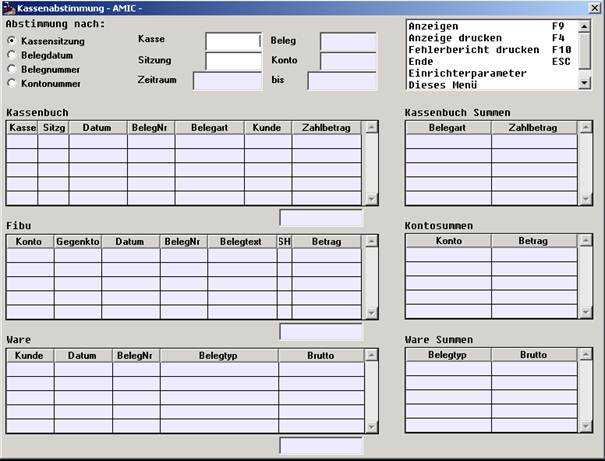

# Die Abstimmhilfe

<!-- source: https://amic.de/hilfe/dieabstimmhilfe.htm -->

Nach erfolgreicher Bereinigung der Mehrdeutigkeiten steht Ihnen dieselbe Maske als Abstimmhilfe in folgender Form zur Verfügung:

Die Abstimmungen nach Sitzung, Datum und Belegnummer beginnen aus der Sicht des Kassenbuchs und suchen die passenden Verbindungen in Ware und Fibu. Die Abstimmung nach Kontonummer (gemeint ist hier immer ein Kassenkonto) setzt in der Fibu auf und versucht von dort aus die Verbindungen zu Kassenbuch und Ware aufzuspüren.

Die Funktion „Anzeige drucken“ schreibt den gesamten Bildschirminhalt in eine Textdatei. Von dort aus können Sie drucken. Der Zwischenschritt über die Textdatei eröffnet mehr Möglichkeiten, wie etwa die Markierung von Teilbereichen oder die Suchfunktion.

Der Fehlerbericht schreibt ebenfalls Daten in eine Textdatei. Dabei werden Daten auf verschiedenste Anomalien untersucht, die durch Abbrüche entstanden sein können. Die Analyse der Daten kann in Teilen sehr aufwendig sein.
