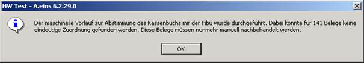
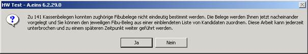
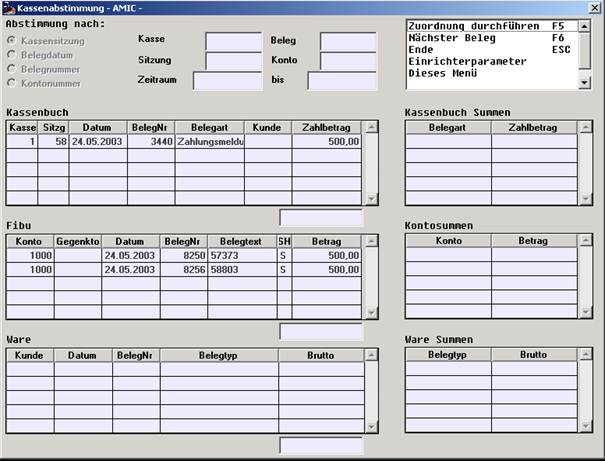
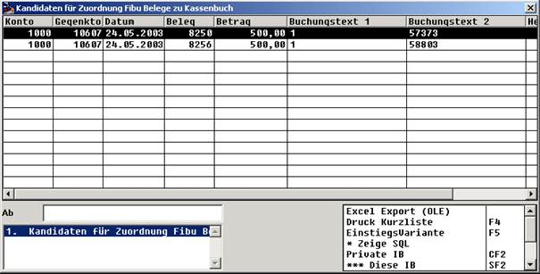

# Zweiter Schritt: Halbautomatische Zuordnung

<!-- source: https://amic.de/hilfe/zweiterschritthalbautomatische.htm -->

Gibt es nur eine mehrdeutige Zuordnung, so müssen die Mehrdeutigkeiten bei der ersten Kassenabstimmung aufgelöst werden.

Wenn Sie ersten Mal die Funktion Kassenabstimmung im Barverkaufsmenü aufrufen, präsentiert sich der Bildschirm mit folgender Meldung.

Als einzige Funktion wird Ihnen „Mehrdeutige Zuordnungen bereinigen“ angeboten.

Dieser Vorgang muss nicht notwendig in einem Stück abgehandelt werden. Sie können jederzeit unterbrechen. Beim nächsten Aufruf der Abstimmung fahren Sie fort.

Ihnen werden nun nacheinander je ein Kassenbeleg und die jeweiligen Kandidaten von Fibu-Belegen vorgelegt, die zu diesem Kassenbeleg passen könnten. In aller Regel haben Sie nicht allzu viele Belege zur Auswahl, denn je nach Belegart müssen mindestens Datum, Betrag und Kassenkonto passen.

In der Maske erkennen Sie nun die angebotenen Alternativen. Anhand der Angaben können Sie nun (etwa über eine zweite Verbindung) genauere Nachforschungen in der Kasse oder in der Fibu anstellen, welcher der beiden Fibu-Belege der richtige ist. In der Funktionswahl sehen Sie nun 2 neue Funktionen, nämlich zur Durchführung der Zuordnung des gewünschten Belegs und zum Weiterblättern auf den nächsten Problemfall.

Die Zuordnungsauswahl erfolgt über eine Itembox:

Wir haben zur Zuordnung gezielt die Itembox als Medium gewählt, weil Sie dort nötigenfalls auf dem Weg einer privaten Ableitung zusätzliche Information einbinden können, die ggf. für eine Entscheidung nützlich ist.

Im vorliegenden Beispiel wird einem die Entscheidung über den Buchungstext leicht gemacht.

Danach wird auf den nächsten Problemfall weiter geblättert.
