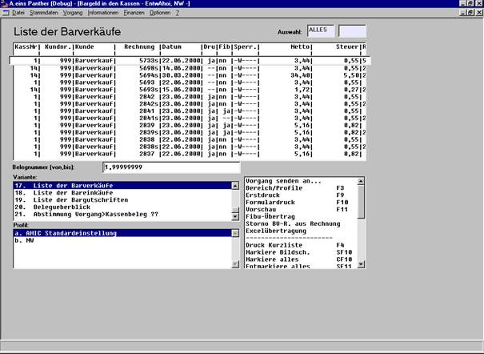
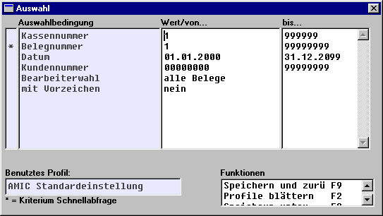
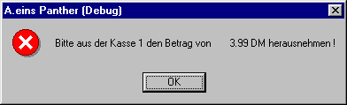

# Storno innerhalb des Kassenmoduls

<!-- source: https://amic.de/hilfe/_KassenStorno.htm -->

Im Pulldown-Menü Vorgang/Barvorgänge/Gesamtbarverkauf gibt es 3 neue Varianten:

Die Auswahl der Belege ist beschränkt auf von Kassen erzeugte Belege.

In diesen Varianten stehen Funktionen zur Verfügung, die sonst nur unter REB, GUB, bzw. ERB zur Verfügung stehen. Dabei ist die Profilierung abgrenzbar nach Belegnummer, Kassennummer, Datum, Kundennummer und Bearbeiter. Außerdem kann eingestellt werden, ob stornierte Belege mit umgekehrten Vorzeichen dargestellt werden sollen.

Neu sind die Funktionen Storno…

Wenn diese Funktion aufgerufen wird, passiert Folgendes (nachdem die Abfrage bzgl. Umwandeln mit Ja bestätigt wurde):

Bei angeschlossener Schublade geht diese auf

Die Folgemasken werden automatisch vorbelegt und durchlaufen

Es wird überprüft, ob der Arbeitsplatz, an dem der Storno durchgeführt wird, eine Kasse ist

Es wird überprüft, ob die Kasse eröffnet ist

Es wird überprüft, ob bei Storno von Barverkäufen genug Rückgeld vorhanden ist

Wenn c)-e) erfüllt sind, wird wie folgt weitergemacht:

Es wird ein Stornobeleg erzeugt, der auch im Belegüberblick zu sehen ist.

Es wird ein Zahlungssatz in Kassenwährung über den Betrag des Urbeleges erzeugt, den der Kassierer auszugleichen hat durch Geldbewegung innerhalb der Schublade

Die Kassenbestände werden gemäß diesen Betrag angepasst

Es erscheint eine Meldung, die den Kassierer auf den Betrag hinweist

Wenn c)-e) nicht erfüllt sind, wird mit einer Hinweismeldung abgeschlossen.

Auf dem Kassenbericht sind weitere Felder hinzugekommen, die Anzahl und Betrag bzgl. Storno Barverkauf,... anzeigen.

Der Kassenbestand wird immer an der Kasse angepasst, an der der Storno erzeugt wird.

Das Ganze ist unabhängig vom FiBu-Übertrag. Wenn der Urbeleg noch nicht übertragen ist, wird auch der erzeugte Stornobeleg nicht übertragen. Wenn der Urbeleg schon übertragen ist, wird auch der erzeugte Stornobeleg mit umgekehrtem Vorzeichen übertragen.

Vorbereitende Maßnahmen, um Storno-Barverkäufe, Storno-Bareinkäufe bzw. Storno-Bargutschriften zu erzeugen, sind entsprechende Einrichtungen in FRZ (bedenken, dass Kasse an der Unterklasse 9900 hängt), VRGD, FRM,... (Nummern- und Zählkreise sind wohl nicht nötig)
