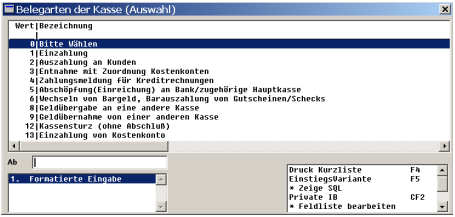

# Zahlungen mit der klassischen Zahlungsmaske

<!-- source: https://amic.de/hilfe/_ZHL_Zahlungsmaske.htm -->

Dieses Modul wird in allen Kassen verwendet. In der Marktkasse kann dieses Modul jedoch durch eine berührungsempfindliche Zahlungssteuerung überlagert werden.

Hierzu kann nach Aufruf der Funktion aus den unterschiedlichen unten angeführten Funktionen die für die Vorgangsbearbeitung benötigte Belegart ausgewählt werden.

Siehe auch:

- [Eingaben in der Zahlungsmaske](./eingaben_in_der_zahlungsmaske.md)
- [Mögliche Zahlungsvorgänge](./moegliche_zahlungsvorgaenge.md)
