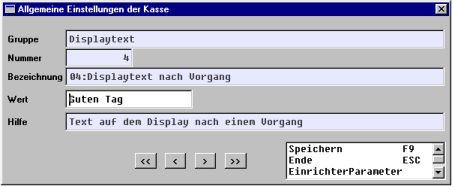

# Allgemeine Bemerkungen

<!-- source: https://amic.de/hilfe/allgemeinebemerkungen.htm -->

Durch die POS-Kasse werden dieselben Relationen befüllt wie beim Erfassen durch die Tresenkasse, so dass die Übersichten für beide Systeme gelten.

Da parallel gedruckt wird, sollte man auf diesen Drucker nichts umleiten, da der Druckkanal von dem zugehörigen Arbeitsplatz solange „besetzt“ ist wie man sich auf der POS-Maske befindet (die ja nicht verlassen werden muss, um den nächsten Barverkaufsvorgang zu beginnen!).

Wenn in FRZ bei der Klasse Rechnung und der Unterklasse Barverkauf erfassen bei Brutto-Vorgänge „Ja“ eingetragen ist, wird der eingetragene Preis als Bruttopreis interpretiert, wenn dort „Nein“ eingetragen ist, wird der eingetragene Preis als Nettopreis interpretiert.

Natürlich ist beim Barverkauf eine Bruttoerfassung zu bevorzugen und auch ein Zurückgreifen auf Bruttopreislisten.

Um einen Vorgang mit einem Minimum an Tastenkombinationen zu erfassen, sind folgende Einstellungen nötig:

Einrichterparameter EPA **Soll im Artikelfeld begonnen werden** auf „Ja“ stellen.

Einrichterparameter EPA **Soll ein gefundener Preis bestätigt werden** auf „Nein“ stellen.

Preispflege ist vollständig

Für jeden Artikel ex. ein EAN-Code

Dann sind nur folgende Routinen/Tasten im Standardfall auszulösen:  
    

einscannen / einlesen der Artikel, bis alle Positionen erfasst sind

durch F9 wird das Wechseln in den Bezahlmodus ausgelöst, der kassierte Bargeldbetrag wird eingegeben, die Schublade geht auf und der Betrag wird in die Kasse gelegt (evtl. natürlich noch der errechnete Rückgeldbetrag per Hand ausgegeben)

die Kassenschublade wird per Hand wieder geschlossen

**ACHTUNG:**

Nach Bestätigen eines ausreichenden Zahlungsbetrages besteht keine Möglichkeit mehr, den Vorgang abzubrechen.

In Sonderfällen (z.B. Scheck, Währung) müssen mehr Tasten bedient werden.

### Bemerkungen:

Das System ist bisher überwiegend in einer Hardwarekonstellation getestet worden, in der das EPSON-Display an einer COM-Schnittstelle angeschlossen wurde, der EPSON-Bondrucker an einer LPT-Schnittstelle und die Schublade am Drucker.

Nach Beenden eines Vorgangs, besteht die Möglichkeit, den Kunden über das Display zu verabschieden bzw. den nächsten zu begrüßen; d.h. der nächste Kunde sieht bis zur Erfassung des ersten Artikels nicht mehr den Rückgeldbetrag des letzten Kunden. Um dieses Feature zu erhalten, kann in den Kasseneinstellungen „Displaytext“, „4“ der anzuzeigende Wert eingetragen werden, der standardmäßig auf „Guten Tag“ eingestellt ist. Wenn dieses nicht geschehen soll, ist kein Wert einzutragen (d.h. dann wird die letzte Anzeige beibehalten). Dieser Eintrag in den Kasseneinstellungen gilt auch für die Tresenkasse (es gibt eine Displayanzeige beim Verlassen der Zahlungsmaske).  

