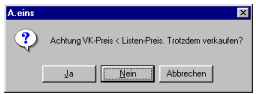
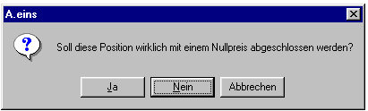
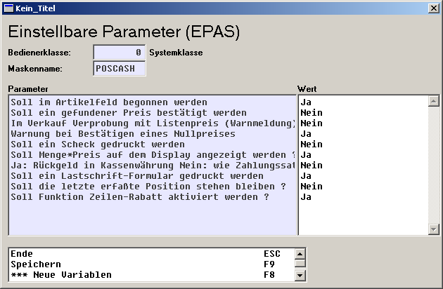

# EPAs

<!-- source: https://amic.de/hilfe/epas.htm -->

Folgende bedienerabhängige EPAS existieren auf der POS-Maske:

Sie sind innerhalb der Option Box mit der Funktion EPA Einrichter Parameter innerhalb der Maske aufrufbar

1. **Soll im Artikelfeld begonnen werden**

   (wie auf der bisher bekannten Maske für Positionserfassungen): wenn er auf „Ja“ steht, wird bei der Erfassung der einzelnen Positionen im Artikelfeld begonnen – die Menge kann dann nur noch durch Richtungspfeil nach oben geändert werden. Wenn er auf „Nein“ steht, wird im Eingabefeld der Menge begonnen.

   Dieser Parameter wird jetzt auch bei Änderung der Kundennummer und der Lagernummer ausgewertet.

2. **Soll ein gefundener Preis bestätigt werden**

   (wie auf der bisher bekannten Maske für Positionserfassungen): wenn er auf „Ja“ steht, gelangt man nach Bestätigen des Artikels generell in das Preisfeld, wo dieser evtl. korrigiert werden kann. Wenn er auf „Nein“ steht, wird der Artikel nach gefundenem Preis sofort weggeschrieben. Allerdings hat man in diesem Fall noch die Möglichkeit durch Auslösen der Funktion „Preis manuell ändern“ vor Bestätigung des Artikels dennoch in das Preisfeld zu gelangen, um so eine Preisänderung durchzuführen. Diese Funktion ist aber nur aktiv, wenn in der Parametergruppe ‚Kasse/Barverkauf‘ der SPA „Manuelle Preiseingabe bei Kasse möglich“ auf „Ja“ gesetzt ist. Wenn kein Preis bzw. ein Nullpreis durch die A.eins-Preisfindung gefunden wurde, gelangt man automatisch ins Preisfeld.

   3. 

4. **Im Verkauf Verprobung mit Listenpreis**

   (wie auf der bisher bekannten Maske für Positionserfassungen): wenn er auf „Ja“ steht, gibt es eine Warnmeldung, wenn der gefundene Preis nach unten geändert wurde. Wenn er auf „Nein“ eingestellt ist, wird ein nach unten geänderter Preis sofort akzeptiert.

5. **Warnung bei Bestätigung eines Nullpreises**

   (Neu, wie auf der bisher bekannten Maske für Positionserfassungen): wenn er auf „Ja“ steht, gibt es eine Warnmeldung, wenn ein Nullpreis bestätigt wird, bei „Nein“ wird auch ein Nullpreis sofort akzeptiert.

   6. 

7. **Soll ein Scheck gedruckt werden,**

   (wie auf der Zahlungsmaske) wenn er auf „Ja“ steht, wird nach Fertigstellung des parallel erzeugten Drucks und Abschluss des Bezahlvorgangs ein Scheck auf dem Schacht angefordert der in der Druckerzuordnung, der dann bedruckt wird. Um dieses Feature zu nutzen, sollte die Druckerzuordnung auf den Schacht eingestellt sein und der Drucker für den Barverkauf über die Vorgangsdruckklassen zugeordnet sein. (Achtung: wegen des Paralleldrucks wird nur das erste in den Vorgangsdruckklassen eingerichtete Formular für den Paralleldruck benutzt).

8. **Soll Menge\*Preis angezeigt werden:**

   wenn er auf Ja steht, wird auf dem Display der Gesamtpreis des Artikels angezeigt, der sich aus Menge\*Preis zusammensetzt. Wenn er auf Nein steht, wird wie bisher auch bei größerer Anzahl der Preis des Artikels pro Grundeinheit angezeigt. Dasselbe Feature existiert auch auf der Tresenkasse.

9. **Ja: Rückgeld in Kassenwährung, Nein:**

   wie Zahlungssatz: wenn dieser EPA auf Ja steht, wird der Rückgeldsatz standardmäßig in Kassenwährung angezeigt (vgl. Kasseneinstellungen, OptiGruppe Kasse), wenn er auf Nein steht wird er standardmäßig in der Währung des letzten Zahlungssatzes angezeigt (der ja über F12 wählbar ist); in beiden Fällen hat der Kassierer jedoch auch die Möglichkeit, die Rückgeldwährung auszuwählen durch SF7 (Währung Rückgeld), so dass das Rückgeld in der hierüber ausgewählten Währung angezeigt wird.

10. **Soll ein Lastschrift-Formular gedruckt werden**.

   Ist dieser EPA auf „Ja“ gestellt, wird das hinterlegte Formular auf dem in DRZ hinterlegten Drucker ausgedruckt. Das zugehörige Formular ist über OSQL lastschrift.sql aus dem SQL-Ordner einspielbar. Es wird nach Abschluss des parallel gedruckten Bons gedruckt.

11. **Soll die letzte erfasste Position stehen bleiben.**

   Ist dieses auf „Ja“ gestellt, wird der letzte erfasste Artikel standardmäßig voreingestellt und muss nur durch Return erneut erfasst werden. Ist er auf „Nein“ gestellt, werden nach dem Wegschreiben des Artikels die entsprechend gefüllten Felder mit Informationen über die letzte Warenposition wieder gelöscht, so dass derselbe Artikel erneut erfasst werden muss. (Feature ex. auch bei der Tresenkasse).

12. **Soll Funktion Zeilen-Rabatt aktiviert werden?**

   Ist dieser EPA auf Nein gesetzt, wird die Funktion des Zeilen-Rabattes nicht freigeschaltet.

