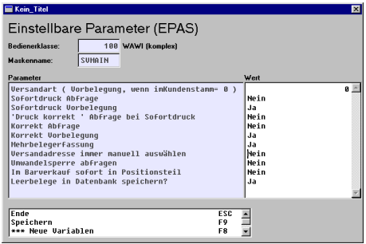

# EPAs

<!-- source: https://amic.de/hilfe/epas1.htm -->

Folgende EPAs werden bei den verschiedenen Masken der Tresenkasse ausgewertet:

- Auf der Hauptmaske der Vorgangserfassung ziehen folgende EPAs:
  - Durch entsprechende Einstellung kann man alle Abfragen abstellen, so dass sofort nach Validierung des Zahlungsbetrages der Vorgang ohne weitere Bestätigung abgeschlossen werden kann. Im Barverkauf gibt es folgende Sonderbehandlungen:
  - befindet man sich im Barverkauf, ist automatisch die Mehrbelegerfassung angeschaltet, nur über F10 gelangt man aus der Erfassungsroutine
  - befindet man sich im Bareinkauf / Barverkauf-Gutschrift, ist die Mehrbelegerfassung grundsätzlich deaktiviert; d.h. nach Abschluss des Beleges wird die Maske automatisch verlassen
  - wenn der EPA **Im Barverkauf sofort in Positionsteil** auf Ja gesetzt ist, wird man beim Barverkauf automatisch in den Erfassungsteil durchgeschaltet.

Auf der Maske Barverkauf/Rechnungen erfassen empfiehlt es sich, für die Bedienerklasse der Kassierer folgende EPA zu setzen (Verbesserung der Geschwindigkeit + der Sicherheit, da keine Bestätigungen mehr erfolgen müssen). Dieses bezieht sich insbesondere auf Korrekt-Abfragen und Sofortdruck-Abfrage, die abstellbar sind und auf Ja vorbelegt werden sollten.

