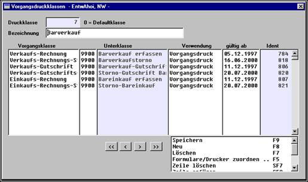
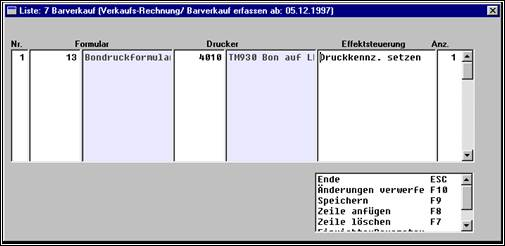
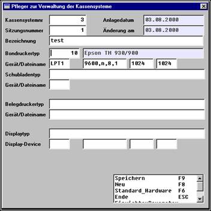
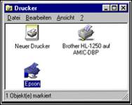
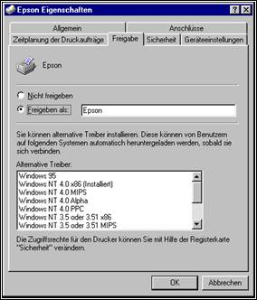
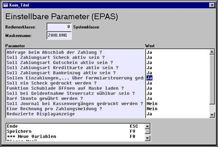

# Druckereinrichtung

<!-- source: https://amic.de/hilfe/_kasseunddrucken.htm -->

(Besonderheiten bzgl. Terminalserver sind fett geschrieben)

Wenn eine Kasse als Terminalserver eingerichtet ist, gibt es Besonderheiten bei der Einrichtung, deren Umsetzung einen reibungslosen Betrieb gewährleisten kann.

Diese Besonderheiten sind insbesondere auf die Ansteuerung des lokal angeschlossenen Bondruckers zurückzuführen.

Soweit noch nicht geschehen, sollte der zu verwendende Drucker mitsamt seinen Steuersequenzen in die entsprechenden Pfleger eingespielt werden. Für die Kasse stehen dabei mehrere SQL-Dateien zur Verfügung, die das Befüllen dieser Tabellen für den Anwender übernehmen, d.h. es besteht die Möglichkeit, über OSQL folgende Drucker einzuspielen (Bem.: Gewisse Modelle sind bereits auf der Basisdatenbank hinterlegt und müssen daher nicht eingespielt werden):

Epson_bon.sql: Für den Bondruckkanal eines EPSON TM930 Models

Epson_schacht.sql: Für den Bonschachtkanal eines EPSON TM930 Models

Oki_bon_sql: Für den Bondruckkanal eines OKI POS90 Bondruckers

Oki_schacht.sql: Für den Bonschachtkanal eines OKI POS90 Bondruckers

Sni_bon.sql: Für den Bondruckkanal eines SNI ND69 Bondruckers

Sni_schacht.sql: Für den Bonschachtkanal eines SNI ND69 Bondruckers

Star.sql: Für den Bondruckkanal eines Stardruckers (dort gibt es keinen Schacht)

Dabei ist dann nur eine freie Druckernummer einzugeben. Dabei entspricht der _bon.sql der Ansteuerung des Druckers für die Bonrolle und der _schacht.sql der Ansteuerung des Druckers für den Schacht.

In der A.eins-Druckansteuerung im Bereich Kasse gibt es mehrere Wege:

Druck von normalen Barverkäufen (über Direktsprung BVVE bzw. über POS-Kasse) auf dem normalen Bondrucker.

Druck von Belegen über Geldeinzahlungen, Einreichungen zur Bank, Zählbericht, ...

Druck von zusätzlichen Belegen über Geldeinzahlungen,... mit Formularen 51-55, die in FRZ hinterlegt sind auf dem Bonschacht – zusätzlich als „große Quittung“ zu b)

Druck von Schecks, EC-Lastschriften

Im Normalfall sieht die Ansteuerung wie folgt aus:

Es gibt einen Barverkaufskunden, bei dem die Vorgangsdruckklasse Barverkauf hinterlegt ist. In der Druckklasse Barverkauf ist dann die Ansteuerung des Druckers für den Vorgang Barverkauf zu hinterlegen.

Außerdem muss für entsprechende Vorgänge über F5 auch das richtige Formular hinterlegt werden:

Da es sich bei diesen Formularen um direkt aus dem Programm angesteuerte Formulare handelt, muss nur noch eingestellt werden, wohin diese Information gedruckt werden soll. Hierzu trägt man in der Kassensystemverwaltung die lokale Schnittstelle ein, an der der Drucker hängt (z.B. LPT1). Außerdem sind Baudrate, Parity und Stopbits einzutragen.

Bei einem Terminalserver als Kassenarbeitsplatz muss anstelle von LPT1 folgende Zeichenfolge eingegeben werden: **\\\\\\\\IP-Adresse\\\\Freigabename** des Druckers unter Windows. (z.B. **\\\\\\\\192.168.241.252\\\\Epson**) Der Drucker ist in der Systemsteuerung als Windows-Drucker zu installieren und der Freigabeknopf zu aktivieren.

Diese Formulare werden gedruckt, wenn auf der Zahlungsmaske der Einrichterparameter „Sollen Einzahlungen,... über Formularsteuerung gedruckt werden“ auf „Ja“ gestellt ist.

Dann werden die unter FRM 51-55 eingerichteten Formulare bei entsprechenden Zahlungen zusätzlich zu dem unter b) ausgedruckten Formularen auf den in DRZ eingetragenen Drucker gedruckt.

Um bei Zahlungsarten Scheck bzw. EC-Lastschrift zusätzlich einen Scheck bzw. eine Lastschrift auszudrucken, müssen entsprechende Formulare in FRM hinterlegt sein. Hierzu besteht die Möglichkeit, Beispielformulare über OSQL durch scheck.sql bzw. lastschrift.sql einzuspielen.

Dabei ist nur eine freie Formularnummer auszuwählen. Die Zuordnung, welches Formular aus FRZ aktuell gezogen werden soll, erfolgt in den Kasseneinstellungen in der Gruppe Formulare.

Im Programm werden diese dann auf den in DRZ zugeordneten Drucker gedruckt.

Wenn die Kasse ein Terminalserver ist, muss für den Druck der Situationen unter c) und d) in der DRZ ein Drucker ausgewählt werden, auf dem gedruckt werden soll, z.B. ein Drucker, dessen Queue auf einen lokal angeschlossenen Drucker verweist, der z.B. unter Windows freigegeben ist. Solch ein Drucker ist auch in der Druckerzuordnung in den Vorgangsdruckklassen auszuwählen. Alternativ wäre auch die Ansteuerung über Druckumleitungen für die Situation a), c) und d) möglich, die sich dann nur auf gewisse Bediener beziehen. Dieses ist durchzuführen, wenn mehrere Terminalserver als Kassenarbeitsplätze eingerichtet sind, da dann nicht die Verallgemeinerung aus den Vorgangsdruckklassen eingesetzt werden kann. Denn die Ansteuerung über die Vorgangsdruckklassen zieht nur, wenn alle Drucker der Arbeitsplätze über dieselbe Queue angesprochen werden können, was bei Terminalserver nicht der Fall ist.

**Außerdem ist es dadurch möglich, dass neben als Terminalserver eingerichteten Kassen auch „normale Kassen“ eingerichtet werden können, für die dann keine Druckumleitung nötig ist.**

Siehe auch:

- [Neuer Drucker mit IP-Adresse](./neuer_drucker_mit_ip_adresse.md)
- [Weitere Anwendungsmöglichkeit Kasse](./weitere_anwendungsmoeglichkeit_kasse.md)
