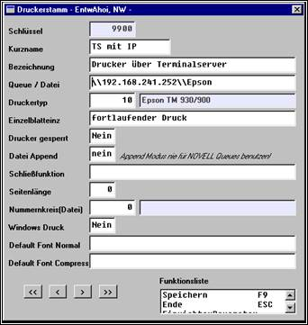
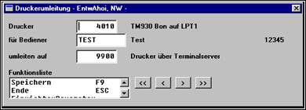

# Neuer Drucker mit IP-Adresse

<!-- source: https://amic.de/hilfe/neuerdruckermitipadresse.htm -->

Druckumleitung den in VRGD zugeordneten Drucker 4010 (siehe oben) für Bediener am Kassenterminalserver auf ihren lokalen Drucker:

