# Meldungen in der Aeins-Kasse (Hinweise auf Bedienungs-/Einrichtungsfehler)

<!-- source: https://amic.de/hilfe/meldungeninderaeinskassehinwei.htm -->

1\. Bei Aufruf „Barverkaufssystem Eröffnung/Abschluss

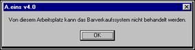

**Ursache:** Diesem Arbeitsplatz ist nicht das Recht zugestanden worden, das Gesamtsystem zu eröffnen.

**Abhilfe:** In der Ahoi.ini-Datei muss in der [ACASH2] – Sektion folgender Eintrag existieren: BVManager=Ja

ACHTUNG auf Groß/Kleinschreibung!

2\. Beim Versuch, das Barverkaufssystem abzuschließen

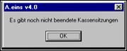

**Ursache:** Um das Gesamtsystem abzuschließen, müssen alle Kassensitzungen zuvor geschlossen worden sein.

**Abhilfe:** Alle Kassen abschließen.

3\. Beim Versuch, „Kasseneröffnung/Abschluss“ durchzuführen

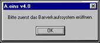

**Ursache:** Es wird versucht, eine Kasse zu eröffnen, ohne vorher das Gesamtsystem eröffnet zu haben.

**Abhilfe:** Das Barverkaufssystem eröffnen.

4\. Beim Versuch, „Kasseneröffnung/Abschluss“ durchführen

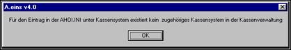

**Ursache:**

In der Ahoi.ini-Datei existiert kein Eintrag fürs Kassensystem oder für die in der Ahoi.ini-Datei eingetragene Nummer des Kassensystems ist in der Datenbank keine Kasse in der Kassenverwaltung bzw. Kassensystemverwaltung eingerichtet.

**Abhilfe:**

Überprüfen, ob folgender Eintrag in der [ACASH2]-Sektion der Ahoi.ini-Datei vorhanden ist:

Kassensystem=1

Überprüfen, ob für die in der ACASH2-Sektion eingetragene Nummer des Kassensystems entsprechende Kassen in der Kassensystemverwaltung bzw. Kassenverwaltung mit gleicher Nummer eingerichtet sind.

5\. Beim Versuch, eine Kasse abzuschließen

**Ursache:** Diese Kasse ist Hauptkasse und besitzt noch Unterkassen, die noch nicht abgeschlossen sind. Dabei soll jedoch gemäß SPA-Einstellung (Nummer 52 in der Gruppe Kasse/Barverkauf: Aut. Abschöpfung von Unterks an Hauptks) die zu dieser Hauptkasse gehörigen Unterkassen automatisch abgeschöpft werden, um dann z.B. nur auf der Hauptkasse eine Zählung durchführen zu müssen. Diese Beziehung zwischen Hauptkassen und Unterkassen ist in der Kassenverwaltung festgehalten. (Hauptkasse steht auf Nein)

**Abhilfe:** Da diese Meldung nur bei gesetztem SPA kommt (Versionen nach 4.3.xxx), vor dem Schließen der Hauptkasse erst alle Unterkassen schließen.

6\. Beim Versuch, einen Vorgang zu erfassen (Tresenkasse, POS-Kasse, Zahlung)

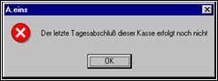

**Ursache:** In den Kasseneinstellungen steht in der Gruppe Allgemein mit Nummer 4 „Tagesabschluss erzwingen“ ein Ja. Dieser Eintrag bewirkt, dass man pro Tag mindestens einen Kassenabschluss durchführen muss. Ist dieses nicht geschehen, erfolgt beim ersten Vorgang des nächsten Tages obige Meldung. Dabei wird beim Maskeneinstieg geprüft, ob die aktuelle eröffnete Sitzung von heute ist.

**Abhilfe:** Kassenabschluss von gestern nachholen oder Eintrag in Kasseneinstellungen auf Nein stellen.

7\. Beim Versuch, einen Vorgang zu erfassen (Tresenkasse, POS-Kasse, Zahlung)

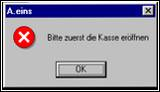

**Ursache:** Es wurde versucht, einen Vorgang zu erfassen, obwohl die Kasse geschlossen ist.

**Abhilfe:** Kasseneröffnung durchführen.

8\. Beim Versuch, die Zahlungsroutine zu durchlaufen

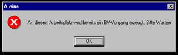

**Ursache:**

a) Es existieren zwei Arbeitsplätze, die denselben Eintrag für das Kassensystem in der AHOI.ini in der ACASH2-Sektion besitzen und gleichzeitig in dieselbe Kasse fakturieren; also muss der eine darauf warten, bis der andere seinen Vorgang abgeschlossen hat.

b) Der letzte Vorgang wurde nicht korrekt abgeschlossen und es existiert ein offener Beleg in dieser Kasse. (z.B. Druckproblem, Computerausfall, Reset gedrückt, ...)

c) Auf einem Arbeitsplatz existieren zwei Aeins-Icons (für unterschiedliche Bediener), die beide aufgerufen werden. Dabei melden sich die beiden Bediener auf der gleichen DB natürlich unterschiedlich an. Wenn jetzt zwischen den beiden Tasks hin- und hergeschaltet und so versucht wird, „gleichzeitig“ zwei Vorgänge über die Kasse zu erfassen, kann es zu obiger Meldung führen, wenn der Zweite in die Zahlungsmaske läuft. 

**Abhilfe:**

a) Sicherstellen, dass an allen Kassenarbeitsplätzen unterschiedliche Einträge in der ACASH2-Sektion für das Kassensystem hinterlegt sind (oder Warten, bis der laufende Vorgang abgeschlossen wurde)

b) Aufräumen des letzten Beleges wie folgt:

Anmelden unter dem letzten Bediener, der einen Beleg an dieser Kasse erfasst hat. Dann BVVE aufrufen, eine Position erfassen, über ESC in Zahlungsroutine laufen (es kommt eine Meldung wie unter 10.), dann den Erfassungsvorgang abbrechen.

**TIP**: Der letzte Bediener ist wie folgt über OSQL abfragbar:

select BelegBedNr from AcashBelg where BelegId=0. Das Ergebnis dieses OSQLs liefert die Bedienerid des letzten Bedieners, dessen Beleg noch im System hängt. (Bem.: Wenn man sich mit dem „richtigen“ Bediener anmeldet, werden innerhalb des Barverkaufes die Relationen von solchen „Leichen“ automatisch gesäubert.); evtl. muss hierzu in den Kasseneinstellungen der Wert unter Allgemein , „Tagesabschluss erzwingen“ kurzfristig auf „Nein“ gestellt werden.

c) Derjenige, der diese Meldung erhält, muss darauf warten, dass der andere seinen laufenden Kassenvorgang auf seinem „Icon“ beendet oder abbricht.

Durch Ausführung des SQL-Statements BelgAbbr. Dabei ist allerdings vorauszusetzen, dass es auf dem Kassenarbeitsplatz ausgeführt wird, an dem diese Meldung erscheint und dass man unter dem Bediener angemeldet ist, der den letzten Kassenvorgang erzeugt hat (select BedienerId from AcashBelg where BelegId=0 and BelegKs=1 [ BelegKs gemäß AHOI.INI-Eintrag], SQL existiert erst ab 07.09.99); alternativ reicht es, per OSQL folgendes auszuführen

 jpl BelgAbbr(0,1,9900,700,:BEDIENERID)

9\. Beim Eintritt in die Zahlungsmaske

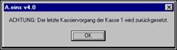

**Ursache:**

a) Aufräumen eines hängenden Beleges wie unter 8 b) beschrieben

b) Bei der Tresenkasse sollen Positionen nacherfasst werden, obwohl die Zahlungsroutine schon durchlaufen wurde. Der Kunde soll dann natürlich nur den durch diese neuen Positionen neu ermittelten Zahlungsbetrag bezahlen, die für die teilweise erfassten Positionen geleisteten Zahlungen werden zurückgesetzt.

c) Die Zahlungsroutine wurde durchlaufen, Zahlungen wurden erfasst. Jetzt wird der Beleg abgebrochen und damit auch nicht gedruckt.

**Abhilfe:** Keine, es wird nur ein sauberer Zustand wiederhergestellt, allerdings sollte man sicherstellen, dass derselbe Bediener nicht zweimal A.eins öffnet und über ALT-TAB hin- und herwechselt. Man darf nämlich pro Kasse nur einmal zurzeit in der Zahlungsmaske aktiv sein.

10\. Während der Zahlungsroutine

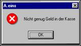

**Ursache:** Es befindet sich nicht genug Bargeld zur Auszahlung an den Kunden in der Kasse. (z.B. bei Geldausgabe)

**Abhilfe:** Durch Geldeinzahlung/Geldübernahme der Kasse wieder Bargeld zuführen

11\. Generell, während versucht wird, Kassenvorgänge zu tätigen

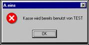

Bem.: Diese Meldung erscheint, wenn versucht wird, in die POS-Kasse zu fakturieren, und zwar vom selben logischen Arbeitsplatz aus, d.h. hier wird verhindert, dass man in diese Maske kommt, wenn man auf diesem Arbeitsplatz durch doppeltes Öffnen des Aeins-Icons oder von einem anderen Arbeitsplatz mit demselben Eintrag des Kassensystems in der Ahoi.ini-Datei fakturieren will, solange bereits auf dieser logischen Kasse Vorgänge erzeugt werden. (Abhilfe: wie unter 9a) bzw. 9c)) (Realisiert über Lockeintrag in AcashStmdKsse für diese logische Kasse). Wenn z.B. an einem Arbeitsplatz mehrere Icons offen sind und versucht wurde, zeitgleich POS-Vorgänge zu erfassen gibt es eine Fehlermeldung bzgl. der Druckaufbereitung.

**Lösung:** Warten, bis Kassierer TEST seine Kassiervorgänge an diesem logischen Arbeitsplatz beendet hat (Lockeintrag in Relation AcashStmdKsse), denn es darf nur einen geben (pro logischer Kasse).

Obiger Lockmechanismus wurde auch auf die Funktionen Kasseneröffnung/Abschluss, Finanzvorgänge und über die Tresenkasse erfasste Vorgänge erweitert und bedingt sich wechselseitig.

12\. Beim Versuch, die Kasseneröffnung durchzuführen:

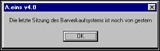

Lösung: In den Kasseneinstellungen ist unter Allgemein, 3 „BV-Abschluß erzwingen“ ein Ja eingetragen. Dieser besagt, dass man vor Eröffnen einer Kasse zuerst am selben Tage das Barverkaufssystem selbst eröffnen muss (evtl. muss hierzu dann erst einmal der Abschluss des BV-Systems vom Vortag nachgeholt werden. Natürlich kann man die Einstellung auch wieder auf Nein setzen. (Ein ähnlicher Mechanismus existiert bereits, wenn Kassenvorgänge verhindert werden, wenn nicht am heutigen Tag die aktuelle Sitzung eröffnet wurde.
