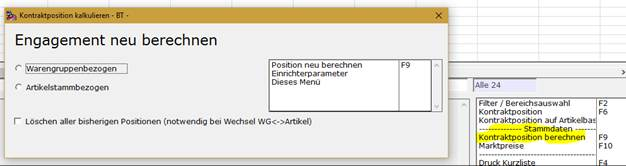

# Sonderberechnung

<!-- source: https://amic.de/hilfe/sonderberechnung.htm -->

Ist für den heutigen Tag die Position noch nicht berechnet worden, so kann mit der Funktion:  

die tagesaktuelle Position berechnet werden.
