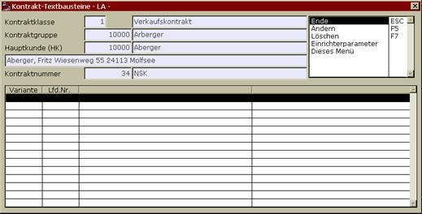

# Textbausteine

<!-- source: https://amic.de/hilfe/_textbausteine.htm -->

Die Textbausteine stehen in enger Beziehung zu den Ausdruckvarianten. Dort werden für die verschiedenen Anforderungen im Kontraktbestätigungsschreiben, etc. Texteingabemöglichkeiten zur Verfügung gestellt, die hier den individuellen Anforderungen des konkreten Kontraktes angepasst werden. Natürlich ist es sinnvoll, die Vorbelegung in den Kontraktvarianten möglichst vollständig zu erfassen, umso weniger muss hier ergänzt oder korrigiert werden:

Hier wird auch die Bedeutung des Musterkontraktes sichtbar. Für den Standardvorfall „Getreidekontrakt“ sind alle Standards inklusive der Texte sinnvoll vorbelegt, nur Änderungen müssen vorgenommen werden. Soll dies beim Text geschehen, wird er aufgerufen und geändert:
