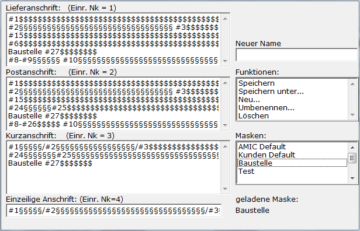

# Adressmaske

<!-- source: https://amic.de/hilfe/_anschriftenmaske.htm -->

Hauptmenü > Stammdatenpflege \> Konstanten Kundenstamm > Anschriftmaske

Direktsprung **[KUAN]**

Die Darstellung der Kunden-/Lieferantenanschriften kann individuell gestaltet werden. Nach Anwahl der Funktion wird folgender Bearbeitungsbildschirm angeboten:

In den vier Feldern auf der linken Seite werden Grundeinstellungen der Anschriften­gestaltung angezeigt, die in der Formulareinrichtung für die Adressblöcke verwendet werden. Auf diese Einstellungen kann beim Ausdruck zugegriffen wer­den, indem bei der Formulargestaltung bei der Einbindung der Anschrift in der Spalte Nk der Parameterwert 1,2,3,4 eingetragen wird. Wenn man eine neue Adressmaske erstellt, muss man dieser einen Name geben, der anschließend rechts in Liste und „Masken“ zu finden ist. Um diese individuelle Anschrift einem Kunden oder Lieferanten zuzuordnen trägt man diese im Anschriftenstamm auf dem Reiter Zusätze und dort unter „Adressmaske für Druck“ ein.

Die Zeichen in den Anzeigefenstern haben folgende Bedeutung:

**#1 - #43:**

Felder aus dem Kunden-/Anschriftstamm, die ausgedruckt werden können

**$$:**

Die Anzahl der $ - Zeichen reserviert exakt diesen Platz für das auszudruckende Feld. Ist das Feld kleiner, werden Leerzeichen gedruckt, ist das Feld länger, wird abgeschnitten

**§§:**

Die Anzahl der § - Zeichen reserviert maximal diesen Platz für das auszudruckende Feld. Ist das Feld kleiner, wird der Platz freigegeben, ist es größer, wird abgeschnitten.

**Beispiel:**

**#3$$$$$$$$$$$$$$$$$$$** 

Reserviert ein Feld für den Namen mit genau 21 Zeichen Länge. Wenn der Name kürzer ist, verbleibt der Rest leer.

**#3§§§§§§§§§§§§§§§§§§§**

Reserviert ein Feld für den Namen mit genau 21 Zeichen Länge. Wenn der Name kürzer ist, werden die Zeichen freigegeben.

**Aufbau einer Anschrift:**

Mit Eintragung der Platzhalter #1 - #40 sowie der Feldlängen mittels **$** und **§** wird das Anschriftenfenster gestaltet. Mit **F3** werden Eingabemöglichkeiten angezeigt:

#1 Anrede

#2 Vorname

#3 Name

#4 Partner 1

#5 Partner 2

#6 Straße

#7 Postfach

#8 Staat

#9 Postleitzahl zur Straße

#10 Ort zur Straße

#11 Ortsteil zur Straße

#12 Postleitzahl zum Postfach

#13 Telefon

#14 Telefax

#15 – 20 Zusatz 1- 6 

#21 Gebietsnummer

#22 Empfänger Zahlungsträger

#23 Empfänger Zahlungsträger Teil 2

#24 Text Postfach, wenn Postfach vorhanden

#25 Postfach oder Straße. Das bedeutet, wenn das Postfach eingetragen ist, dann wird dieses genommen ansonsten die Straße.

#26 Postleitzahl zum Postfach oder zur Straße. Das bedeutet, wenn die Postleitzahl zum Postfach eingetragen ist, dann wird diese Postleitzahl genommen ansonsten die Postleitzahl zur Straße.

#27 Adresse ID

#28 Vorname+Name

#29 Email Adresse

#30 Mobiltelefon

#31 Staatbezeichnung lang

#32 Email Adresse2

#33 Mobiltelefon2 

#34 Adresse ILN

#35 Geburtstag

#36 Kreis

#37 Regierungsbezirk

#38 Bundesland

#39 Titel

#40 Zusatz

#41 Ort zum Postfach

#42 Ort zum Postfach oder zur Straße. Das bedeutet, wenn Postfach und Ort zum Postfach eingetragen sind, dann wird dieser Ort genommen ansonsten der Ort zur Straße.

#43 Ortsteil zum Postfach oder zur Straße. Das bedeutet, wenn das Postfach eingetragen ist, dann wird **kein** Ortsteil genommen ansonsten der Ortsteil zur Straße.
