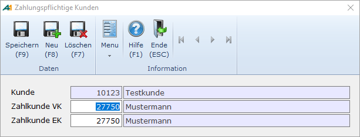

# Zahlungspflichtige Kunden

<!-- source: https://amic.de/hilfe/_zahlungspflichtiger.htm -->

Hauptmenü > Stammdatenpflege > Konstanten Kundenstamm > Zahlungspflichtige Kunden

oder Direktsprung **[KUZ]**

Auf dem Konto des Zahlungspflichtigen werden die Rechnungen in der Finanzbuchhaltung verbucht. Üblicherweise handelt es sich um den Rechnungsempfänger, dann ist hier keine Eintragung erforderlich. Nur wenn sich Rechnungsempfänger und Zahlungspflichtiger unterscheiden, erfolgt also eine Eintragung. Dies trifft auch auf oben beschriebenen Fall der abweichenden Rechnungsanschrift zu.

In obigem Beispiel wird also der Lieferschein an „Testkunde“ geschickt, die Rechnung erhält „Mustermann“ und gezahlt wird von „Mustermann“. Alle Statistiken der Warenwirtschaft verbleiben bei „Testkunde“.
