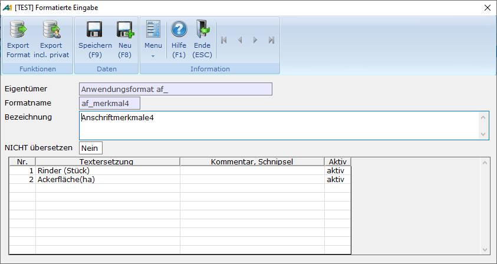

# Format pflegen SF5

<!-- source: https://amic.de/hilfe/_formatpflegensf5.htm -->

Hier kann man den Formatpfleger zu den Merkmalen 1-4 aufrufen. Dafür muss man vorher ein Merkmalfeld betreten haben. Danach wird immer das Format für das zuletzt betretene Merkmal aufgerufen.

