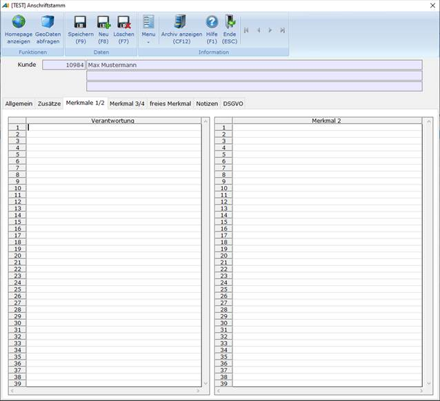
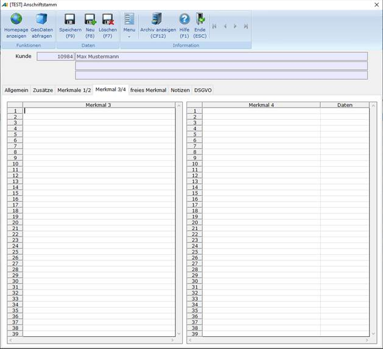
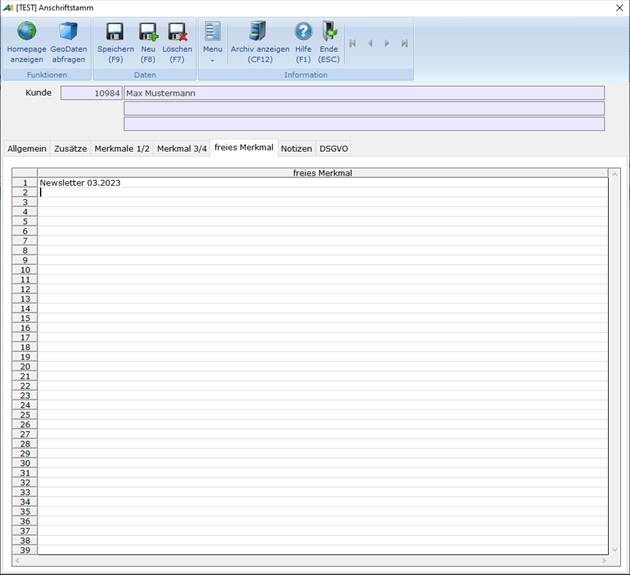

# Merkmale

<!-- source: https://amic.de/hilfe/_merkmale.htm -->

Für Anschriften können mehrere Merkmale hinterlegt werden. Man kann mit Hilfe dieser Merkmale über ***Bereich/Profile*** **F2** Auswahllisten eingrenzen.

Für Merkmal 1-3 können in den Formaten „af_merkmal1“, „af_merkmal2“ und „af_merkmal3“ beliebige Merkmale hinterlegt werden.

Merkmal 4 wird in Kombination mit einem numerischen Datenfeld abgespeichert. Auch hier können wieder im Format „af_merkmal4“ Merkmale hinterlegt werden (z.B. Ackerfläche (ha), Rinder (Stück)) Entsprechend müssen dann im Datenfeld z.B. 100,00 (für die Ackerfläche in ha) oder 50,00 (für die Anzahl der Rinder) angegeben werden. Dadurch besteht die Möglichkeit, die Anschriften z.B. nach der Größe der Betriebe einzuordnen.

Außerdem gibt es noch ein freies Merkmal, in welches man beliebige Texte hineinschreiben kann, z.B. „Weihnachtspost 2005“ (Eine Art Merker, an wen 2005 dieser Brief gesendet wurde).

Das Befüllen dieses Feldes soll später auch aus einem Stapel möglich sein, an den man z.B. einen Serienbrief geschrieben hat.

Zugehörige EPAs:  
„Hauptadresse verliert Merkmal, wenn für mind. einen Ansprechpartner hinterlegt“ (Standardmäßig vorbelegt mit ‚NEIN’).

Stellt man diesen EPA auf ‚JA’, dann wird bei einer Kundenhauptanschrift ein vorhandenes Merkmal gelöscht, wenn dieses Merkmal ebenfalls für einen Ansprechpartner gespeichert wird. Damit stellt man sicher, dass z.B. ein Infobrief nur direkt bei den zuständigen Ansprechpartnern landet und nicht auch noch zusätzlich an die Hauptadresse geht. (Anmerkung: Die Verarbeitung für die Bildung von Stapeln für Serienbriefe nach ausgewählten Merkmalen wird demnächst in A.eins eingebaut.)

Merkmal 1/2 Tabkartenbezeichnung

Merkmal 3/4 Tabkartenbezeichnung

Freies Merkmal Tabkartenbezeichnung

Mit diesen 3 EPAs kann man selbst bestimmen, wie die Register für die Merkmale in der Anschriftenmaske heißen sollen.

Überschrift Merkmal 1 -4

Überschrift Daten

Überschrift freies Merkmal

Mit diesen 6 EPAs kann man selbst bestimmen, wie die Überschriften für die einzelnen Merkmale in der Anschriftenmaske heißen sollen.
