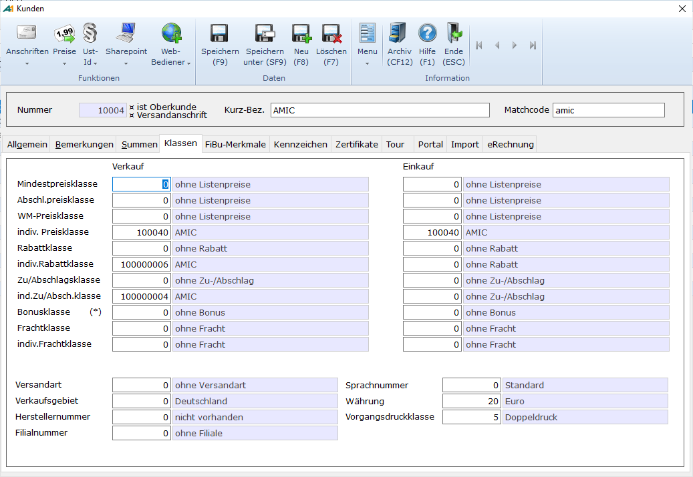

# Gruppen / Klassen

<!-- source: https://amic.de/hilfe/_gruppenklassen.htm -->

Folgende Eingaben sind möglich, wobei die Klassenzuordnungen für Ein- und Verkauf unterschiedlich angelegt werden können:

**Listenpreisklasse**

Gibt an, welcher Preisklasse der Kunde zugeordnet ist. In Zusammenhang mit der <strong>"Preisfindung auf der Grundlage von Preislisten"</strong> wird dann die dieser Preisklasse zugeordnete Preisliste gezogen.

**Mindestpreisklasse**

Hier kann dem Kunden eine Mindest-Preisklasse zugeordnet werden.  
In Zusammenhang mit der Preisfindung auf der Grundlage von Preislisten wird dann die dieser Preisklasse zugeordnete Preisliste gezogen.  
    

**Abschlagspreisklasse**

Innerhalb der Rohwarenabrechnung besteht die Möglichkeit der Abschlagzahlungen. Hier kann der Kunde / Lieferant einer Abschlagklasse zugeordnet werden.

**WM – Preisklasse**

Spezielle Abrechnungen in der Rohware benötigen Weltmarktpreise. Hier erfolgt die Zuordnung von Kunden / Lieferanten und der entsprechenden Preisklasse.

**Individuelle Preisklasse**

Für einzelne Kunden oder Kundenklassen können im Artikelstamm Individualpreise hinterlegt werden. An der hier eingetragenen Nr. erkennt A.eins, ob und welcher Preis gegriffen werden soll.

**Rabattklasse**

Wenn in Abhängigkeit vom Kunden Rabatte gewährt werden sollen, so ist hier die Rabattklasse einzugeben. Sie kann sich individuell auf diesen Kunden oder eine Klasse von Kunden beziehen. Bei der Anlage des Rabattes (siehe "Rabatt") wird die Klasse eingetragen sowie die Artikelgruppe (die im Artikelstamm hinterlegt ist), so dass die Beziehung zwischen Kunden und Artikel eindeutig ist.

**Individuelle Rabattklasse**

Bei der Vergabe von Individualrabatten wird hier automatisch die Zuordnung angelegt.

**Zu- / Abschlagsklasse**

Wenn in Abhängigkeit vom Kunden Zu- und Abschläge gewährt werden sollen, so ist hier die Zu- / Abschlagsklasse einzugeben. Sie kann sich individuell auf diesen Kunden oder eine Klasse von Kunden beziehen. Bei der Anlage des Zu- / Abschlags **(siehe "Zu- / Abschläge")** wird die Klasse eingetragen sowie die Artikelgruppe (die im Artikelstamm hinterlegt ist), so dass die Beziehung zwischen Kunden und Artikel eindeutig ist.

**Individuelle Zu- /Abschlagklasse**

Bei der Vergabe von individuellen Zu-/Abschlägen wird hier automatisch die Zuordnung angelegt.

**Bonusklasse**

Z.Z. nicht aktiv

**Frachtklasse**

Die Eintragung hier ergibt die Zuordnung der gewünschten Frachtklasse.  
Im Normalfall wird es die Fälle **" keine Fracht "** und **" Standardfracht "** geben.  
Wenn jedoch einzelne Kunden abweichend vom üblichen Vorgehen abgewickelt werden sollen, ist hier eine andere Klasse zuzuordnen. Siehe auch **"Frachtwesen**

**Individuelle Frachtklasse**

Bei der Vergabe von individuellen Frachtklassen wird hier automatisch die Zuordnung angelegt.

**Vertretergruppe**

Verweis auf die zugeordneten Vertreter. Siehe hierzu auch **"Vertretergruppe"**.

**Steuergruppe**

Die dem Kunden zugeordnete Steuergruppe. Auslandskunden wird so z.B. die Steuergruppe **"Auslandskunde"** zugeordnet, bei der die Mehrwertsteuerermittlung entfällt und eine Auswertung nach Auslandsumsätzen möglich wird.

**Fakturiergruppe**

Steuerungskennzeichen bei der Fakturierung, z.B. um die automatische Erstellung von Monatsrechnungen für bestimmte Kundengruppen zu ermöglichen.

**Versandart**

Wenn ein Kunde standardmäßig mit einer bestimmten Versandart beliefert wird, z.B. **"frei Haus"**, so kann diese hier eingetragen werden. Sie dient dann als Vorschlagswert bei der Fakturierung, wo sie ggf. überschrieben werden kann.

**Verkaufsgebiet**

Für statistische Auswertungen - aber auch die Vertreterabwicklung - kann eine Unterteilung des Verkaufsgebietes in Regionen vorgenommen werden. Diese Regionen können dann den Kunden /Lieferanten zugeordnet werden.

**Herstellernummer**

Falls ein Kunde auch Hersteller eines Produktes ist, das im Sortiment geführt wird, dann kann hier die Herstellernummer eingetragen werden. Üblicherweise wird dies jedoch über den Lieferantenstamm erfolgen.

**Filialnummer**

Nummer der Filiale, der dieser Kunde fest zugeordnet worden ist. Eine Abwicklung über andere Filialen ist dann **nicht** mehr möglich.

**Sprachnummer**

Korrespondenzsprache mit diesem Kunden. Hierüber kann u.a. das Formularwesen und der Artikeltext gesteuert werden

**Währungstyp**

Die Währung, in der die Geschäfte mit dem Kunden abgewickelt werden. Hierbei kann ein Währungstyp nur aus den Währungen gewählt werden, für die auch ein Währungskurs hinterlegt ist.

**Vorgangsdruckklasse**

Mit der Verwendung von Vorgangsdruckklassen kann auf Kundenebene die Aufbe­rei­tung von Formularen gesteuert werden. Es wird für die Kombination eines Kunden mit einer Vorgangsunterklasse die Druckaufbereitung eingestellt.

Anzuwenden ist diese Funktionalität zum Beispiel für folgende Problemstellungen:

Für einen Kunden sollen spezielle Belege gedruckt werden

Für Sammelrechnungen soll ein spezieller Drucker (Papier) benutzt werden

Bei bestimmten Formularen soll parallel ein Zweitdruck erfolgen (Ladeschein)

Um in A.eins Folgebelege zu drucken gibt es die Möglichkeit der Einrichtung von Unterklassen in den Vorgangsdruckklassen. Hierbei stehen die Daten, die im "führenden" Vorgang zur Verfügung sind, auch in den Vorgangsunterklassen zur Verfügung.

In Verbindung mit einer entsprechenden Formularerstellung und – Zuordnung können so die unterschiedlichsten Darstellungsformen der Vorgangsdaten erreicht werden.  
Mit dem Direktsprung **[VRGD]** gelangt man in den Auswahlbildschirm, wo die bereits eingerichteten Vorgangsdruckklassen angezeigt werden. Hier können Vorgangs­unterklassen mit verschiedenen Formularen eingerichtet und verschie­denen Druckern zugewiesen werden.

Vorbedingungen einer Realisierung von Folgebelegen mit Hilfe der Vorgangs­druck­klassen sind dabei:

Zu den gewünschten Vorgangsklassen (z.B. Barverkauf, Rechnung) u.a. muss eine Vorgangsdruckklasse eingerichtet sein.

Die Drucker müssen im Druckerstamm eingerichtet und eventuelle Formulare eingelegt sein.

Die entsprechenden Formulare müssen im Formulareinrichter eingerichtet und in der Formularzuordnung zugeordnet sein.

Die Eingabe erfolgt in folgenden Schritten:

Als erster Schritt erfolgt die Einrichtung der einzelnen Belege unter dem Direktsprung **[VRGD]**, wo die Vorgangsdruckklassen mit der Funktion ***Neu*** angelegt werden.  
Durch Eingabe von weiteren Vorgangsklassen (hier Lieferschein) können dann dem "angebundenen" Kunden je nach Vorgangsklasse (Angebot, Lieferschein, Rechnung) unterschiedliche Folgebelege zugewiesen werden (siehe auch Anbindung an Kunden).

Innerhalb dieser Eingabemaske werden dann der aktiven Druckklasse (die, auf der der Cursor steht) mit der Funktion Formulare/Drucker zuordnen **F5** die Formulare und Drucker zugeordnet.  
Wobei das sonst normal auch gedruckte Formular inklusive Angaben zum Drucker mit anzugeben ist, bevor dann die anderen zu druckenden Formulare ausgewählt werden können.

Als letztes ist die Vorgangsdruckklasse dann innerhalb des Kundenstamms im Eingabefenster Gruppen/Klassen anzubinden.  
    

Wird dann der Kunde mit der hinterlegten Vorgangsdruckklasse in dem entsprechenden Beleg ausgewählt (Bsp. Rechnung), so wird dann zusätzlich auf dem ausgewählten Drucker das angegebene Formular ausgedruckt (im Beispiel das Formular Bankeinzug).
